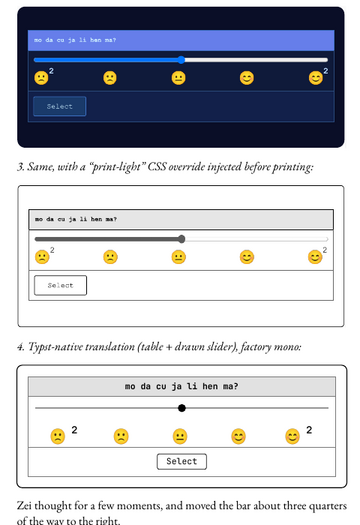
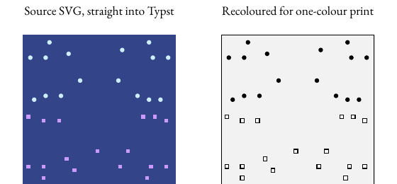

# Snowmoon (Vitalik Buterin) — can the factory ingest it? Assessment, 2026-09-28

Source: https://vitalik.eth.limo/snowmoon/ (index = front matter; 32 chapter
pages under `html/chapter-N.html`). Nothing was ingested; the 33 HTML files are
parked in `scratch/snowmoon/` (gitignored) for the analysis below.

## Verdict in three lines

1. **The prose maps cleanly** onto the 13 factory styles + option-C custom
   styles (`docs/reviews/CUSTOM-STYLES-MARKERS-2026-09-22.md`). HTML is just
   another pandoc reader, so the route is the one already decided for Markdown:
   *convert to a template-conformant `.docx`, then the normal pipeline* — not
   "teach five `.docx`-only stages a new format" (`WORD-FREE-AUTHORING-2026-09-19.md` §1).
2. **It is the best test case we have seen for the style-absorption idea**: the
   page's CSS is literally a stylesheet with eight classes, and the dialogue is
   coloured *per fictional character* — 22 hues, 2,541 spans — which is exactly
   the "semantics disguised as presentation" that option C is designed to keep
   (as a named character style) while dropping the look.
3. **Two things do not fit any factory style and dominate the book**: 140
   `device-view` panels (in-world screens: tables, sliders, buttons, emoji,
   56 SVG game boards) and 8 `dz-card` conlang placards in a calligraphic font.
   Under option C these are "admin-designed snippets" — but at ~4–5 per chapter
   they are the novel's central device, not an edge case. **Update, same day:**
   they are figures, and two programmatic routes render them without
   per-panel work — see §Panels as figures below.

Also: it is not a short novella. **~102,800 words** across 32 chapters
(1,500–4,400 each; 4,572 of those words are inside device panels). Roughly
330–360 pp at trade-paperback density before the panels are sized.

## What the source is made of

One inline `<style>` per page (core + a "veridia plugin" block), no external
CSS, no images (`` = 0), no `<h2>`, chapter titles are just "Chapter N".

| Source construct | Count | Factory mapping | Fit |
|---|---|---|---|
| Index page: title, chapter list, License (GPL v3 + a paragraph of legal theory), AI-usage declaration, 爱-usage declaration | 1 page | Front matter. Title/author → spec (author is implicit from the domain, not on the page). Chapter list → generated Contents. The three declarations → Copyright page (`Copyright` style) or a `[[preface]]`-tier front piece; the licence text is unusual (GPL, not CC) and should be carried verbatim. No dedication, epigraph, subtitle, ISBN, © year. | Good |
| `<h1>Chapter N</h1>` | 32 | Heading 1 | Exact |
| `div.dateline.chapter-open` — *Place, Country · 3724 Snowmoon 3* under each H1 | 32 | Custom paragraph style **Dateline**, based on Heading 3 (or Epigraph). Structure only; the factory sets it. | Good — option C as designed |
| `div.dateline.scene-break` — a date (sometimes place) mid-chapter | 12 | Custom style **Scene Dateline**, based on Heading 3. Jenna, 28 Sep: our `break` is a visual device only; this one carries story information, so it is a heading variant and fits the stylesheet as is — no template gap. | Good |
| `<hr>` (plain) | 73 | Section Break | Exact |
| `<p>` prose | ~3,000 | Normal / First Paragraph (first-after-heading/break rule already in the filter) | Exact |
| `<em>` / `<b>` | 125 / 13 | native italic / bold | Exact |
| `<blockquote>` — song verses in caps, two lines | 30 | Verse (not Block Quote — they are lyrics). Note the source is malformed: first line is bare text, second is a `<p>`; pandoc copes. | Good |
| `<ul>` | 11 | pandoc lists → Typst lists; factory has no list style today | Fair |
| `<sup>` (some nested `<sup><sup>`) | 10 | native superscript; nested ones are inside device panels | Fine |
| **`<span style="color:oklch(0.7 0.15 H)">…</span>` around dialogue** | **2,541 spans, 22 hues** | One **character** custom style per hue (`speaker-h93`, `speaker-h347`, …; the author can rename to Zei/Fin/Bai). Based on `none` → prints as plain roman; EPUB keeps a class so colour can survive on screen. This is exactly option C's rule — *the author owns what a thing is, the factory owns how it looks* — but 22 declaration rows by hand is too many: an HTML importer must **derive the declarations from the stylesheet** and offer them for naming. | **Good — and the case that justifies the importer** |
| `div.device-view` (`wide-`/`narrow-`/`wide- device-view-left`) — dark monospace panels: 56 hold only an inline `<svg>` board, 49 only a `<table>`, 18 only text, 17 a table with `<button>`/`<input type=range>`/emoji rows (69 tables in all, none outside panels) | **140** (71 wide, 57 narrow, 12 wide-left) | No factory style. Option C: admin-designed snippet — a boxed monospace Typst block (`#device-panel[...]`, wide/narrow). Tables inside are fine; sliders/buttons need a static print convention (`[ Select ]`, a glyph slider); SVGs go through pandoc as images → Typst `image()` (rasterise or keep SVG; Typst renders SVG). One blinking `<b style="animation: blinker…">` must be flattened. | **Weak — the design job** |
| `div.dz-card.dz-mono` — Dzegoban text-as-object, TeX Gyre Chorus (free, GUST licence), per-word colour chips and `white-space:nowrap` groupings | 8 | Custom style based on Code Block or Verse + a designed snippet for the calligraphic face; add TeX Gyre Chorus to `typesetting/fonts`. Colour chips → drop in print, keep in EPUB. | Fair |
| `nav.chapter-nav`, dark-mode toggle, `wc-exclude` | chrome | strip | n/a |

## How this maps to the style-absorption plan

What we have today (all verified in the 19 Sep note): pandoc's Markdown path
(d2) produces byte-identical Typst via `pandoc -t docx --reference-doc=<project
template>`, and pandoc's docx writer honours `custom-style="Name"` on Divs and
Spans. pandoc's **HTML reader** yields Divs with *classes* and Spans with
*style attributes*, not `custom-style` — so the missing piece is one small
Lua filter (or python pre-pass) between them:

```
HTML pages ─► pandoc html reader ─► [absorb-stylesheet.lua] ─► pandoc docx writer
                                          │  class → custom-style             (reference-doc = project template,
                                          │  inline colour → character style   declared styles present)
                                          │  chrome stripped
                                          ▼
                              proposed transmittal Custom Styles rows  ─►  normal pipeline
                              (name · based on · purpose · count · sample)  (Inspect, book map, markers,
                                                                              print, EPUB — untouched)
```

The "absorb" step is the same for any source with a stylesheet (HTML/CSS,
InDesign-exported HTML, Scrivener, Substack/Ghost exports): **read the class and
inline-style inventory, propose one declaration row per distinct class/colour
with counts and a sample, let the author pick the parent and name it.** The
transmittal already has the declaration UI; Inspect already has the
`observed_style`/`undeclared_custom_style` vocabulary. Snowmoon exercises every
cell of that grid:

- paragraph class → paragraph custom style (datelines);
- inline colour → character custom style with base `none` (speakers) — proves
  the `none` base earns its place;
- container class that no parent expresses → "renders as its parent until the
  studio designs it, and the transmittal says so" (device panels, dz-cards).

What it does *not* map to: honouring the CSS typography (option A/B were
rejected on 22 Sep and this file confirms why — the web face is system-UI on a
violet gradient, the panel colours are screen-only, `oklch()` is meaningless
on a one-colour interior).

## Effort, if we did it

| Piece | Size | Notes |
|---|---|---|
| Fetch + stitch 32 chapters, strip chrome, build front matter from index | S | Shell/python; front matter authored by hand from the three declarations |
| `absorb-stylesheet` pre-pass: class/colour inventory → proposed declarations + `custom-style` rewrite → `.docx` via reference-doc | S–M | The reusable part; generalises to any HTML source. Keep it a script first (`scripts/html-to-template-docx.py`), decide later whether upload accepts `.html`/`.zip` (same open question as `.md`, decision 4 of 20 Sep: CLI/API only) |
| Section Break that carries text (scene datelines) | S | Template + lua + epub css |
| Character style base `none` end-to-end (Typst identity fn, EPUB class) | S | Already decided, check it is wired |
| **Device panels as figures** (§ below): batch Chrome render with a print-light stylesheet → vector SVG → `image()`; SVG boards recoloured and passed straight to Typst | **S–M, mostly script** | 140 instances in one batch. A Typst-native `#device[...]` preset is the nicer M follow-up (live text, factory mono); the figure route is the fallback that works today. Display face for Dzegoban: TeX Gyre Chorus (free) |
| Licence page for GPL v3 text | S | Copyright style; verbatim |

Total without the panel design: about a day, all of it reusable. With it: a
studio design pass first.

## Recommendation

- Treat Snowmoon as the **fixture** for the stylesheet-absorption importer, not
  as a book to rush through: it has the richest class/colour inventory we've
  seen, is GPL-licensed (we may transform it, and must publish the pipeline we
  use — which we do anyway), and is long enough to exercise the book map,
  running heads and Contents at scale.
- Build the absorb step as a script on the Markdown-(d2) pattern; do not add an
  HTML upload path yet.
- Put "device panel" and "placard" on the designed-presets list (or ship the figure route first) next to
  `tweet-block` / `ascii-block` — same family (text-as-object) and the same
  pricing logic (studio design time).
- Open questions for Jenna: (1) per-speaker colour — see §Speaker colour
  below; (2) device panels — figure route now, native preset later?; (3) do we
  want the GPL condition in our own catalogue copy.

## Panels as figures — experiments (28 Sep, `scratch/snowmoon/figs/`)

Jenna's question: screenshot them on the fly, or an SVG / programmatic
transformation? They are meant to function as figures. Tried four routes on
four real panels (a vote table, the emoji slider, a Minpentai board, a
message table) and set them in a 5.5×8.5 Typst page with EB Garamond body:



| Route | How | Result |
|---|---|---|
| 1. Screenshot | `google-chrome --headless=new --screenshot` at 3× DPR → PNG → grayscale | Works, but raster; the page's `fadeIn` animation must be disabled or the capture is washed out; dark panel = solid ink field. Least good. |
| 2. Print-to-PDF → SVG | wrap each `.device-view` in a page whose `@page size` is set from its bounding box, `--print-to-pdf`, `pdftocairo -svg` → Typst `image()` | **Vector**, faithful layout, Courier New + Noto Color Emoji embedded; 1 s per panel, 140 panels in a batch. Text becomes paths (not searchable) — fine for a figure. |
| 3. Same + print-light CSS | inject an override stylesheet before printing: white panel, hairline border, grey table head, black text, greyscale slider | **Reads as a device on paper.** This is the "absorb the stylesheet" idea applied to *output*: the source's `.device-view` rules are replaced by ours, programmatically, for every panel. Narrow panels need a width rule (source is 50 % of 635 px; the vote table wrapped) — a knob, not a problem. |
| 4. Typst-native | pandoc's HTML reader already yields the inner `<table>` as a Table; a Lua filter wraps `Div.device-view` in `#device[...]`; `<input range>`/`<button>` need a pre-pass to placeholders; factory mono (JetBrains Mono) | Best-looking, live text, factory fonts, EPUB-symmetric. Hand-written here; automating is the M item (17 panels have controls, 123 are table/text/SVG only). |

SVG boards (56 panels, `rect`+`circle` only, three fills): pass straight to
Typst (`image("board.svg")` renders natively) after a regex recolour — board
`#348` → light grey with a hairline, team `#cef` → solid black, team `#c9f`
→ hollow black. Two teams stay distinguishable in one colour:



**Read:** route 3 for the 84 table/text/control panels and the SVG recolour for
the 56 boards gives a complete, one-colour, vector book with zero per-panel
work today; route 4 is the upgrade when the `#device` preset gets designed.
EPUB needs none of this — the panels are already HTML+CSS; keep them (with a
light/dark-aware version of the same override).

## Speaker colour — thinking, not deciding

Facts: 22 hues, all `oklch(0.7 0.15 h)` — same lightness and chroma, only hue
varies. Every coloured line also has a prose attribution ("Zei asked"), so the
colour is a reading aid, not the only carrier of who speaks. The source site is
dark-first (see Jenna's screenshot); at L = 0.7 on a *white* page the contrast is
~3:1, below body-text legibility — so even the web version is not tonally safe.

- **EPUB — keep, but make it fail gracefully.** Because the hues share L and C,
  a greyscale reader collapses all 22 to one identical grey: dialogue reads as
  uniformly lighter than narration, nothing is lost that plain text has. Do it
  properly: `[data-custom-style^="speaker-"]` in `epub-styles.css`, L ≈ 0.45
  under light scheme, 0.75 under dark, `@media (monochrome)` → `color: inherit`.
  Not wired yet: `docx-to-epub.lua` has no character-style handling; pandoc
  emits `<span data-custom-style="…">` on its own, so this is CSS plus a test.
- **Print — one-colour interior: collapse to roman.** `none`-based character
  styles already do this: `customstyles.go` emits `#let speaker-h93(content) =
  content` and Inspect describes it as "plain text (no change)" — that is the
  wiring; there is simply no example in the fixtures because Fotis/Toby never
  declared a `none` style. Snowmoon would be the first. No typographic
  substitute scales to 22 speakers, and the attributions carry the meaning.
- **A colour-PDF toggle is cheap, the product decision is not.** Typst has
  `oklch()`; the toggle is a spec flag that turns the identity function into
  `text(fill: oklch(…), content)` — an afternoon, and the same flag could
  colour the device panels. But a colour interior is a different POD product
  (3–4× unit cost, different preflight), and the factory currently promises
  one-colour print. Suggest: park it as an IDEAS row ("interior: one-colour |
  colour" on the spec, off by default), and let the EPUB be where the colour
  lives. Revisit if a second colour-dependent manuscript shows up.
