<!-- exported 2026-09-19 22:46 UTC by scripts/punchlist-export.py; source scratch/run/CHECKLIST.md + notes.json -->

# Punch list 3 · Sat 19 Sep → workshop (Mon 21 / Tue 22) → talk (Wed 23)

Legend: **YOU** = Jenna's turn · **ME** = Shelley's turn · **BOTH** = look together.
Ticked = done · ◐ = in progress. Click a box to cycle ☐ → ☑ → ◐. **note** opens a reply box under any item (⌘↵ saves; paste screenshots straight in) — I read those back. Bottom bar adds a new item to the Inbox (top). Refreshes every 15 s (pauses while you type).

Previous lists archived at `/admin/runs/` (list 2: 35 of 55 ticked → `PUNCHLIST-2026-09-18-list2.md`). Item numbers carry over so note threads stay attached. Checkpoint: `checkpoint-2026-09-18-pre-workshop-v2`.

**Freeze:** Sat 19 – Sun 20 fix / test / clean allowed (build → `go test ./srv/` → restart → one factory smoke as `pinstitute`). Mon 21 – Wed 23 hotfix-only. Store flips to live Stripe by timer **Wed 23 Sep 00:00 HKT**.

## 0 · Inbox — new items, untriaged (Shelley moves them into a section)

- [~] 0.10 new: https://desertant.com/press/ -- using this page as a model, can you draft a similar page for me in the factory? I also really like the… — DRAFT LIVE at /press (1cbe387); warm bg #FBFAF4 live app-wide; YOU fill the [bracketed] bits (bio, entity, founded, city); assets done

  > **shelley** · 2026-09-19 12:37 UTC  
  > Draft is up: https://jdbbs.exe.xyz/press — same skeleton as Desert Ant’s (lede · About · Facts · Products · Brand assets · The studio), in our chrome. Everything on it is true today except the orange [bracketed] bits, which are yours to fill: one sentence of biography if you want it, legal entity (or delete the line), founded year, city. Their “Independent research” block I left out — we don’t have third-party numbers yet; if you have a quote or two (Bringhurst, a press stat), that’s where they’d go. Wordmark SVG and a 1200×630 social card are the missing assets; I can generate both from the favicon outlines when you want them.
  >
  > The colour: done, and it’s live app-wide. Background went from our cool #FCFDFD to their #FBFAF4, and the hairlines/progress tracks moved to the same warm axis so nothing looks blue against it. Text and the cyan are unchanged. For scale: Anthropic’s cream is #F0EEE6 — ours is now about a fifth of the way there from white, which is the “hint, not tint” you asked for. Hard refresh to see it; if it reads as too much or too little on your screen, say and I nudge one value.

  > **shelley** · 2026-09-19 12:40 UTC  
  > Brand assets are no longer “to follow”: wordmark SVG (paper and ink versions, plus [jdbb] alone) and a 1200×630 social card are generated from the JetBrains Mono outlines and linked on the page; the page also carries the og:image so a pasted link shows the card. Left for you: the four orange placeholders.

- [~] 0.14 new: I'm tempted to go back to using a domain I've owned for many years, jdbb.net, as my main contact for this project. … — ideas posted; chat; no build

  > **shelley** · 2026-09-19 12:49 UTC  
  > Ideas only, as asked. Two separate things: where mail goes OUT from (the factory’s automated sends) and where people write TO you (contact address). They don’t have to be the same domain, and today they aren’t: sends go from factory@mail.jdbb.studio (Resend, set up yesterday, with SPF/DKIM so they land), and Reply-To on every one of them is j@djinna.com.
  >
  > Options for the contact side:
  > 1. Keep sending from mail.jdbb.studio; make j@jdbb.net (or hello@) the public contact and Reply-To. Cheapest: point jdbb.net’s MX at whatever already hosts your mail (Fastmail/Google/iCloud+ all take custom domains; you already own the name, so it’s a DNS change and an alias — an hour). Nothing on our side changes except one env var for Reply-To and the address on /press, /factory, the footer.
  > 2. Send from jdbb.net too (factory@jdbb.net) — add jdbb.net as a second Resend domain, three DNS records, and switch PRODCAL_MAIL_FROM. Half an hour, but only worth doing if you want one domain everywhere. Warm-up caution: a fresh sending domain right before the workshop is the one thing I’d not do this week.
  > 3. jdbb.studio as an inbox — it is only a sending subdomain today; receiving there means an actual mailbox provider or Resend’s inbound (which forwards to a webhook, not a mailbox — fine for the factory to read replies programmatically, wrong for you as a person).
  >
  > Redirects: web-side is easy — jdbb.net → jdbbs.exe.xyz is one exe.dev proxy/DNS setting, and both names can serve the site. Mail-side “redirect” is just forwarding, also easy.
  >
  > My pick: 1 now (after the workshop, as you say), and decide on 2 after you’ve seen a few weeks of real mail. Happy to chat whenever; nothing is built.

- [x] 0.18 new: tested our doc editor for the first time. https://jdbbs.exe.xyz/admin/docs/?file=factory.html -- check my commit, and if all looks good, add to your next push? "committed 07ecd3f"  ·  _added Sat 15:44 UTC_

  > **shelley** · 2026-09-19 15:44 UTC  
  > Checked 07ecd3f — one paragraph in “How it runs — who does what”: “visible part of the factory” / “programs installed on the factory’s server” reads better than the old wording, and the five canonical links (python-docx, Pandoc, Lua, Typst, EPUB3) are all correct URLs. HTML parses clean. It was already live (public docs are served from disk), and it’s now pushed to GitHub (`jdbbs-public` main = 07ecd3f). Nothing to fix. First edit through /admin/docs worked end to end — commit message and all.

- [x] 0.24 new:  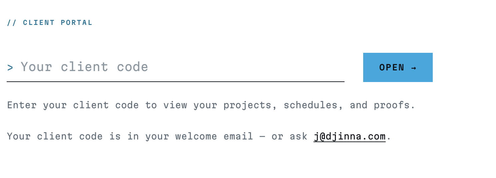 the client portal section on the main landing page just feels like a distraction from the flow of the narrative. Let's look for where we should move this to. wdyt?  ·  _added Sat 17:00 UTC_

  > **shelley** · 2026-09-19 17:02 UTC  
  > Agree. The page is now a story — studio → the product → the pipeline proving it → capabilities — and a sign-in form in the middle is a side door in the living room.
  >
  > Where it should go: **its own page, /portal**, one field, same masthead. Reasons:
  > - Customers don't arrive at the portal from the home page anyway; they arrive from the welcome / Factory Pass email link, which goes straight to /{client}/. The form is for the person who lost the email — a utility, not part of the pitch.
  > - Every other public page already links "Client portal" in its nav (pointing at /#portal today); it just becomes /portal. Footer gets the same link. Nothing is less findable.
  > - The home page loses ~200 px and the narrative runs hero → card → readout → capabilities → footer without a break.
  >
  > The alternative (keep it on / but move it to the bottom, above the footer, as a one-line "Clients: enter your code" strip) is less good: it still costs a form on the landing page and it's where nobody looks.
  >
  > If you say /portal I'll build it now: ~15 min, tiny static page + route + Pages row, nav/footer links updated, the landing section removed.

  > **jenna** · 2026-09-19 17:04 UTC  
  > portal, after next compaction!

  > **shelley** · 2026-09-19 17:05 UTC  
  > Got it — /portal is first up after the compaction, then 0.25.

  > **shelley** · 2026-09-19 17:16 UTC  
  > Live: /portal — same masthead and footer, the shared public nav (Client portal is now underlined as the current page), one field, Open → /{client}/. The landing page section is gone; / now runs hero → Factory Pass card → readout → capabilities. Client portal is linked from every public page's nav and every footer. Registered in Pages. Ticking.
  >
  > 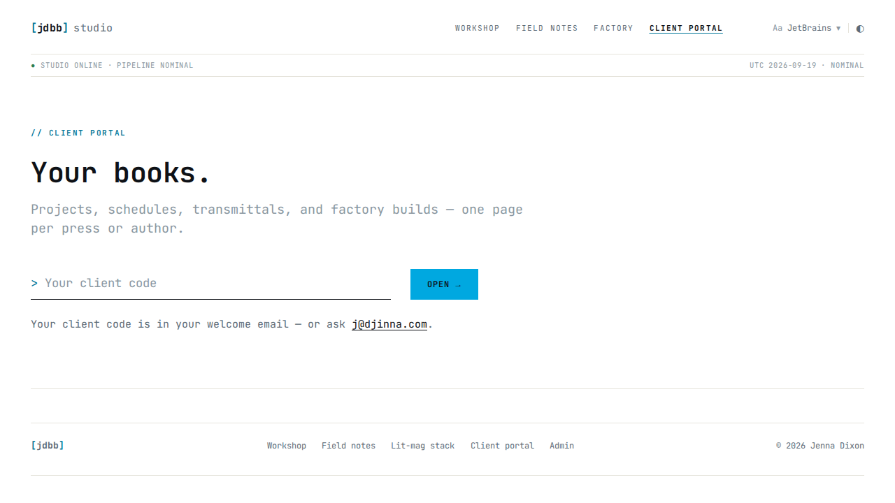
  >
  > 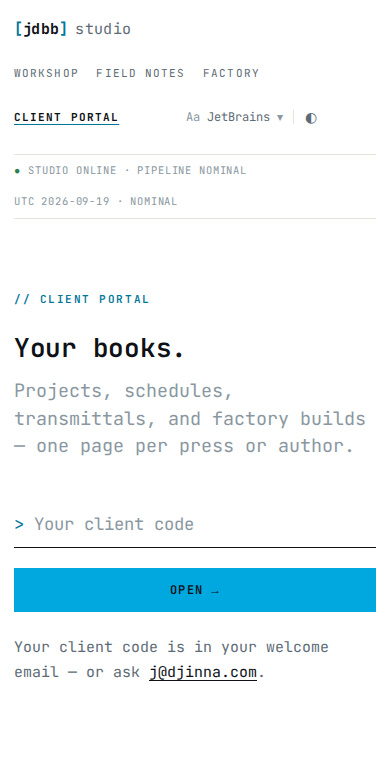

## 1 · This weekend — ME (from list 2, decided)

- [x] 0.17 **One-page factory (C)** — transmittal becomes section 1 of `/{client}/{project}/factory/`; step strip = in-page anchors; finish button “Continue to 2 · Upload →”; transmittal URL redirects; TRANSMITTAL leaves the top nav. Comps `comp-017-C-*`. Fresh session, plan first.

  > **jenna** · 2026-09-19 14:39 UTC  
  > "CONTINUE TO THE FACTORY →" on our ms transmittal is part of what's confusing -- the transmittal is part of the factory. It's the first part of the factory flow.

  > **shelley** · 2026-09-19 14:43 UTC  
  > Three comps, all mock-ups on the live pages (nothing changed). Agree the “Continue to the Factory” label is the tell — in every option below the transmittal is step 1 *of* the factory and the button says “Continue to 2 · Upload →”, and the top nav loses its separate TRANSMITTAL entry (just YOUR BOOKS · FACTORY).
  >
  > **A — Factory widens to match (image 1).** The factory takes the same 1240 shell and header as the transmittal; steps 2–5 stay stacked in a ~720 reading column on the left, and a right-hand rail carries what the transmittal decided (status, trim, type, front matter, rights, edit link), the latest build and the pass. The transmittal keeps its own page but both pages now share the same width, masthead and step strip, so the jump is gone. Medium effort; also gives the factory a use for its blank right half.
  >
  > **B — Transmittal narrows to match (image 2).** The transmittal becomes one ~720 column like the factory: same header with a “// TRANSMITTAL” kicker, sections stacked instead of two-up (the two-field rows stay two-up inside). Smallest change; the form gets about twice as long to scroll.
  >
  > **C — One page (images 3–4).** The transmittal *is* section 1 of the factory page: factory header (“// FACTORY · Obliquities · 1 of 3 builds left”), the strip, then “// 1 · TRANSMITTAL” with its History/Print/Email/Word template actions on the section rule, the two-column form, and its finish block closing with “Continue to 2 · Upload →”. Steps 2–5 follow below; the strip becomes in-page anchors. One URL for the whole flow; the transmittal URL redirects there. Biggest change, most coherent.
  >
  > My pick: A now (ready for Monday), C as where this goes after the workshop. Which?
  >
  > 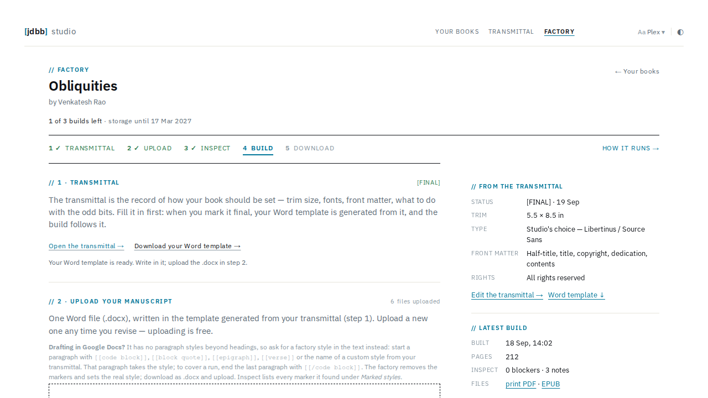
  >
  > 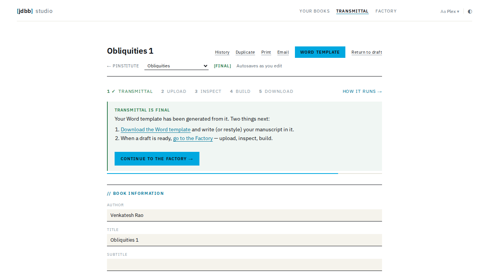
  >
  > 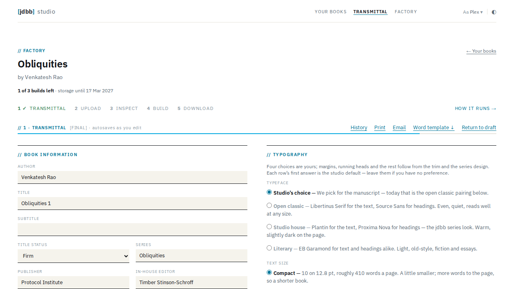
  >
  > 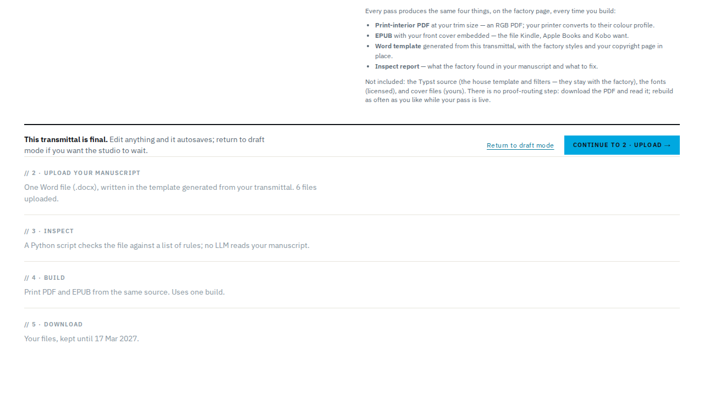

  > **jenna** · 2026-09-19 14:55 UTC  
  > Good notes, I think we just bite the bullet and do C now.

  > **shelley** · 2026-09-19 15:35 UTC  
  > Landed and deployed (72c4214). The transmittal is now section 1 of the factory page: `// 1 · TRANSMITTAL [DRAFT|FINAL] · autosaves as you edit` with History · Print · Word template ↓ · Mark Final/Return to draft on the right (Duplicate and Email show for admin only). Finish block reads “Continue to 2 · Upload →” and scrolls to step 2; the step strip mirrors the status live (1 current while draft, ✓ once final). Old `/transmittal/` links 302 to `…/factory/#transmittal`, emails/portal/admin links follow, TRANSMITTAL is out of the top nav. Steps 2–5 unchanged.
  >
  > Checked: draft state (pinstitute/perception), Mark Final ↔ Return to draft (mcheck), Print (section 1 only), History panel, redirect landing, customer sign-in gate → mount (magic link, mcheck), 390 px mobile. Screenshots below.
  >
  > 
  > 
  >
  > 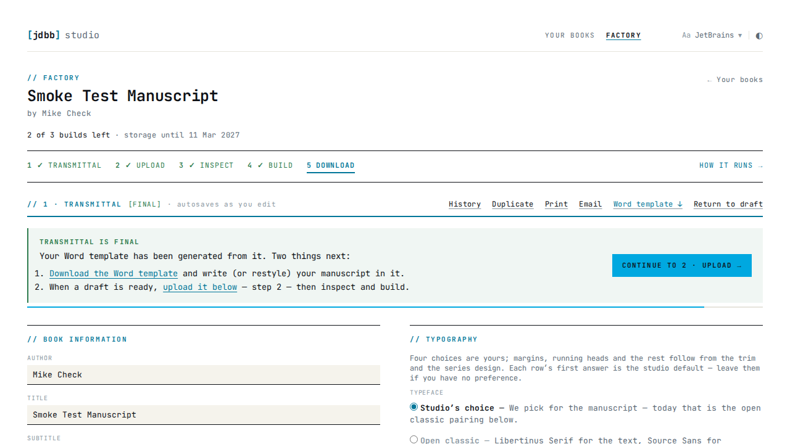
  >
  > 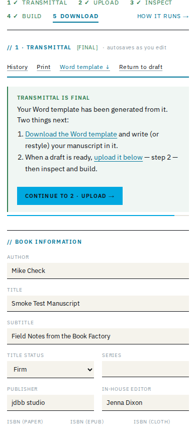

- [x] 0.8 **Typography sampler** (part 1 of 0.8) — 3-pairing sample PDF built straight from Typst + click-to-enlarge chips under the Typeface row; helper session building; then note + tick here. Part 2 (defaults, “Your own” break mark) is live.

  > **shelley** · 2026-09-19 12:25 UTC  
  > Part 1 done and live — the defaults. Diagnosis from your Obliquities PDF: every book was getting the same margins (¾″ all round, whatever the trim) and a stored leading of 2pt, which on a 6×9 gave an 85-character line set 10 on 8.6 — tighter than solid. That’s the “pretty bad”. Bringhurst: 45–75 characters, 66 ideal; leading ~120–135 %; bottom margin deeper than top, inner narrower than outer.
  >
  > Now derived from the trim: 6×9 → inside 0.88″, outside 0.75″, top 0.8″, bottom 1.0″; 10.5pt on 13.4 (computed from the typeface’s cap height, so it holds when the face changes); 1.25em indent; small trims keep 10pt. Obliquities lands at ~70 characters a line and reads like a book. Your next build picks it up; page count goes 77 → ~110, which is the honest number.
  >
  > Part 2 — putting choices back on the transmittal. Proposal, deliberately few, each a radio row with a one-line description:
  > • **Typeface**: 3 pairings from TYPOGRAPHY_PAIRINGS.md (e.g. Plantin + Proxima “studio house”, Libertinus + Source Sans “open classic”, EB Garamond + … “literary”) + “studio’s choice”.
  > • **Text size**: Compact · Standard · Generous (10/12.5, 10.5/13.5, 11/14.5 — one knob, shown as “roughly N words a page”).
  > • **Section breaks**: white space · breve · ornament.
  > • **Paragraphs**: indented (default) · block with space between (for essays/nonfiction).
  > Alignment stays justified+hyphenated (a real choice only for poetry, which the Verse style already handles). Anything else stays studio-side in the spec. Then a review pass over a real build for each pairing. I’d hand this to a fresh session/subagent — half a day.

  > **shelley** · 2026-09-19 12:42 UTC  
  > Part 2 is now in progress (a subagent is building it while I keep the list moving): four radio rows on the transmittal — Typeface (Open classic = Libertinus/Source Sans · Studio house = Plantin/Proxima · Literary = EB Garamond · studio’s choice), Text size (Compact/Standard/Generous), Section breaks (space/breve/ornament), Paragraphs (indented/block). Report here when it lands; I’ll want your eye on the three sample spreads.

  > **shelley** · 2026-09-19 13:09 UTC  
  > Part 2 landed (2f205eb, 21bbdc2, 6c45b6d): the transmittal has a // TYPOGRAPHY section with four rows — Typeface (Studio's choice / Open classic Libertinus+Source Sans / Studio house Plantin+Proxima / Literary EB Garamond, now vendored, OFL), Text size (Compact/Standard/Generous), Section breaks (space/breve/ornament), Paragraphs (indented/block). First answer in each row is the default. Two pipeline fixes came out of it: Word “Body Text” paragraphs no longer become hundreds of #block wrappers, and the specialised template path is actually used (stray Proxima in the open-classic pairing gone). Spreads for the three pairings are in scratch/typo/ — I'll pull them onto a page for you next if you want to compare before Monday. Ghosts' free builds are used up (3/3) doing this; further test builds need a refund or another test project.

  > **jenna** · 2026-09-19 14:47 UTC  
  > 1/Feels like it would be pretty helpful to roll out a sampler PDF that had, let's say, four pages showing each of the main styles. Chap opener + 3 pp so they can see a full spread with running heads. I suppose no reason not to build out a pretty full sampler, take a first swing at that? And let's include small chips that people can click on to enlarge, in addition to giving them a link to download the PDF with the full sampler. 
  > 2/ for "Section breaks" let's add a field for their own break character choice?

  > **shelley** · 2026-09-19 14:55 UTC  
  > 2/ Done, live: Section breaks has a fourth choice, “Your own”, which opens a small centred field (up to 24 characters, placeholder * * *). Goes through everywhere — print PDF, EPUB, the Word template’s Section Break sample, the transmittal email summary. Empty falls back to the breve.
  > 1/ Sampler PDF + click-to-enlarge chips under the Typeface row: in progress with a helper (built straight from Typst, no credits used). Will report here when it lands.

  > **shelley** · 2026-09-19 15:13 UTC  
  > 1/ Sampler live. On the transmittal, under Typeface: three small page previews (Open Classic · Studio House · Literary), same chapter set three ways; click one to enlarge, or “Download the full sampler (PDF)” — 20 pages, 6×9, built straight from Typst (typesetting/scripts/build-sampler.sh, fonts subset-embedded only). All three parts of 0.8 done → ticked.

- [x] 5.20 **Typst 0.13 upgrade on the VM** — today (Jenna, 19 Sep) after 0.17: side-by-side build, swap binary keeping 0.12 for rollback, factory smoke; unlocks `par(costs:)` for 5.5

  > **jenna** · 2026-09-19 15:12 UTC  
  > why post workshop? let's do it today?

  > **shelley** · 2026-09-19 15:13 UTC  
  > No technical reason — it was parked for the freeze (swapping the typesetting engine two days before attendees build). Just checked: the 0.13.1 binary already on the VM compiles Ghosts with no warnings, same 117 pages as 0.12. So yes, today: after 0.17 lands I'll (1) build the last pinstitute book with 0.13 side by side and diff page counts + text, (2) swap the binary keeping 0.12 as `typst-0.12` for a one-line rollback, (3) run the factory smoke. If the diff shows anything odd I'll stop and show you. Moving 5.20 to §1.

  > **shelley** · 2026-09-19 15:39 UTC  
  > Done. `/usr/local/bin/typst` is now 0.13.1; the old binary is kept as `/usr/local/bin/typst-0.12` (rollback = `sudo cp -p /usr/local/bin/typst-0.12 /usr/local/bin/typst`, no restart needed — the server calls `typst` per build). Checked: `typst fonts` lists the same 59 families; Ghosts compiles to the same 117 pages; `go test ./srv/` green (pipeline tests included); live factory rebuild of the mcheck smoke book → ready, 17 pp, PDF says Creator: Typst 0.13.1, EPUB fine. I smoked on mcheck rather than pinstitute: Obliquities has 1 of 3 builds left and a rebuild would have spent it. (mcheck is now 2 of 3.) Next: 5.5 — `par(costs:)` runt control in the series template + sampler rebuild.

- [x] 0.19 new: on /factory let's move rights and copyright to the bottom of the left column so that they balance better. At least it looks to me like those are the ones to move. Also feels like format and typography should be closer together. Maybe format should even move to the top of the right column. wdyt?  ·  _added Sat 16:08 UTC_

  > **shelley** · 2026-09-19 16:12 UTC  
  > Measured at 1280 (mcheck/book-001): left column 2660 px, right 4425 px — right is 1.7× taller, so your eye is right.
  > Sections: Book Info 531 · Checklist 1018 · Illustrations 625 · Cover 377 | Typography 1841 · Rights 202 · Copyright page 1227 · Format 713 · What you get 298.
  >
  > Moving only Rights + Copyright page left over-corrects (left 4089 / right 2996). What balances *and* reads as two ideas:
  >
  > LEFT — the book and who owns it: Book Information → Manuscript Checklist → Illustrations → Rights → Copyright page   (3712)
  > RIGHT — how it looks and what comes out: Format → Typography → Cover → What you get   (3373)
  >
  > So: your two moves, Format to the top of the right column as you suggested, plus Cover crosses to the right (it's a design item; it was only on the left for height). On phones the columns stack in that order, which reads well too. Doing it now unless you'd rather keep Cover left — it's one line to change back.

  > **shelley** · 2026-09-19 16:19 UTC  
  > Live (1799e24). Columns now 3747 / 3338 px. Left: Book Information → Manuscript Checklist → Illustrations → Rights → Copyright page. Right: Format → Typography → Cover → What you get. 

  > **jenna** · 2026-09-19 16:24 UTC  
  > Really good. Good tick :)

- [x] 0.20 new: on ms transmittal, "Manuscript Checklist" Batch editing would be really helpful. Can we add simple tick boxes? To be clear, a select-all box would not be useful, I don't think. Let me know what you think before building this out?  ·  _added Sat 16:10 UTC_

  > **shelley** · 2026-09-19 16:12 UTC  
  > Agree it's worth doing before Monday; it's the one table people will sit and click through. Two ways to read "tick boxes":
  >
  > A · Tick grid (my pick). Replace the Status dropdown with three tick cells per row — In ms · Later · Not in — one click sets the row (radio behaviour, so it can't be two things). Every row is one click instead of open-menu-then-choose, and you can run down a column ticking. No select-all. Date box still appears only when Later is ticked.
  >
  > B · Select + apply. A tick box at the left of each row plus a little bar: "Set ticked rows to: In ms · Later · Not in". Two-step, and the ticks are a second state to manage.
  >
  > A is faster for a 20-row list and has nothing new to learn; B only wins if you'd often set the *same* status on scattered rows, which the tick grid also handles in the same number of clicks. Say A, B, or something else and I'll build it Sunday morning (it's transmittal JS/CSS only — no build/pass/store/email code, inside the freeze rules).

  > **jenna** · 2026-09-19 16:26 UTC  
  > ok A is a big improvement on the pulldown we have now
  > (I was thinking B but your A a better solution to the slow many pulldowns)
  > Build now or get it ready for our next post-compaction?

  > **shelley** · 2026-09-19 16:30 UTC  
  > A is live (c. 16:35). Header: Component · In ms · Later · Not in · Expected date. One click per row; the date box wakes when Later is ticked; the generated rows have two boxes (Included / Leave out) with a dash under Later. Keyboard works (they're radios underneath). 20 typed rows + 6 back matter. Ticked — say if the box size or the column labels want tuning.  390 px: 

- [x] 0.21 small clean up: https://jdbbs.exe.xyz/admin/ still shows calendars  ·  _added Sat 16:12 UTC_

  > **shelley** · 2026-09-19 16:19 UTC  
  > Live (1799e24). /admin/: the Calendar link per project is now Factory (Transmittal → factory/#transmittal); the task-count stats (Total tasks / Completed / In progress) and the per-project "0/0 tasks done · 0%" bar are gone — stats are Projects · Transmittals · Final · Draft · Open access; Status filter offers Has transmittal / final / draft / none; "Least complete" sort dropped; New Project subtitle no longer says calendar. Ticked. 

- [x] 0.22 https://jdbbs.exe.xyz/admin/ still a bit messy?    ·  _added Sat 16:28 UTC_

  > **jenna** · 2026-09-19 16:29 UTC  
  > 1/Factory and Transmittal are now redundant, delete Transmittal
  > 2/snapshot and activity also seem redundant, and only send emails. I don't remember what we were thinking when we first created those two items. It was a long time ago. What do you suggest now, and if needed, show me some comps instead of building straightaway?

  > **shelley** · 2026-09-19 16:30 UTC  
  > Confession: I'd already done both before your note landed, so the comp is the live page — one commit brings anything back.
  >
  > 1/ Transmittal link gone. 2/ Snapshot + Activity gone from the row. They were calendar-era: Snapshot emailed a schedule/budget/tasks digest, Activity a files+journal digest for the last N days — both read the calendar tables nobody fills in now. The endpoints still exist (EMAIL_SYSTEM.md rows 2–3 annotated), nothing deleted server-side.
  >
  > Row now: Factory · Style sheet · Set password · Rename URL · Archive.
  > 
  >
  > Two things I'd still change, not built, your call:
  > - "Set password" → customers sign in by magic link now; the password path is the legacy gate. I'd keep it but rename "Password gate" so it reads as the exception it is.
  > - The project-path line (http://…/snitkey/book-001/) points at the old calendar SPA root. Suggest it shows the portal URL (/snitkey/) or the factory URL instead, since those are what you'd copy for a customer.

- [x] 0.23 new: I like a quiet sales approach, but burying the sales page in the factory pass link is a little bit too quiet. Thoughts?  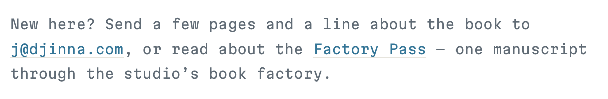 — comps A/B/C on the item, awaiting pick

  > **shelley** · 2026-09-19 16:51 UTC  
  > Agree — and it's quieter than you think: the home page is the *only* public page whose top nav doesn't say Factory (the others have Workshop · Field notes · Factory · Client portal). So from `/` the sole way in is that one underlined word in the small-print line. Also the lede still sells "shared production calendars", which we retired this week.
  >
  > Three levels, comps not built (browser mock-ups):
  >
  > **A — nav only.** Add "Factory Pass" as the first nav item. Still quiet, but findable from every page. 1 line.
  >
  > **B — nav + a CTA row** replacing the "New here?" line: a filled `FACTORY PASS · $549 →` button, an outlined `EMAIL A FEW PAGES` beside it, and a muted one-liner ("one manuscript → EPUB + print PDF · 3 builds · no software to learn"). Lede reworded: "…manuscript transmittals, and a book factory that turns one Word file into an EPUB and a print-ready PDF". Still one screen, no marketing block; the price does the loudness.
  > Now: 
  > B: 
  >
  > **C — B plus a product card** between the hero and the pipeline readout (what's included in four lines, the price, Redeem/Buy). That's the point where it stops being a studio page with an offer on it and becomes a storefront — I'd hold C until after the workshop and see who arrives.
  >
  > My vote: B now (hero is the one place first-timers actually look; the readout below it already proves the factory is real), C later if the workshop brings strangers. Say A/B/C and I'll build it — ten minutes.

  > **jenna** · 2026-09-19 16:53 UTC  
  > I only see one comp. What am I missing?

  > **shelley** · 2026-09-19 16:54 UTC  
  > Fair — I'd only drawn B (the other image was "now"). Here are all three, same page, same scroll:
  >
  > **A — nav only** (Factory Pass added first in the top nav; hero untouched)
  > 
  >
  > **B — nav + CTA row** (buttons replace the "New here?" line; lede says book factory, not calendars)
  > 
  >
  > **C — B + product card** between the hero and the pipeline readout (four inclusions, price, Redeem / Read more)
  > 
  >
  > Same vote: B now, C if strangers show up after the workshop.

  > **jenna** · 2026-09-19 16:57 UTC  
  > kk I see the comps in the main thread now, but we'll remind you that we had agreed you would drop the comps in here since they're hard to find in the main flow. You only dropped partial links, which I can't click on or anything else this time.

  > **jenna** · 2026-09-19 16:58 UTC  
  > let's delete this line altogether. People will know to contact me if they have questions.
  >
  > 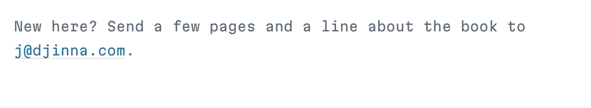

  > **shelley** · 2026-09-19 17:00 UTC  
  > Live on https://jdbbs.exe.xyz/ (c. 17:05): the card above the readout, price a third smaller (34 → 23 px), both hero buttons gone, "New here?" line gone. Factory Pass is also first in the top nav, and the lede now says book factory instead of production calendars. Stacks to one column on a phone.
  >
  > Sorry about the comps — you were right twice. Notes here are plain text, so my ![…] image markup showed as literal brackets; the runpage now renders those as pictures and turns URLs into links, so the earlier comps (and this one) show properly on reload. Ticking.
  >
  > 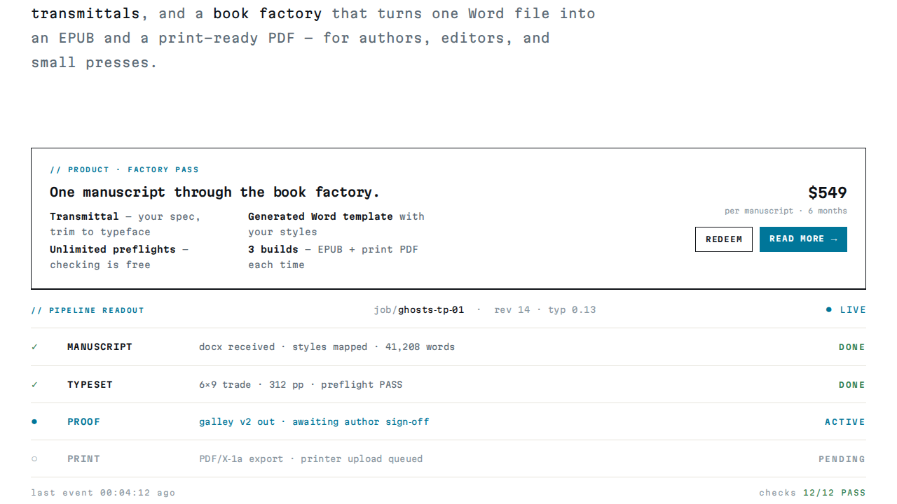
  >
  > 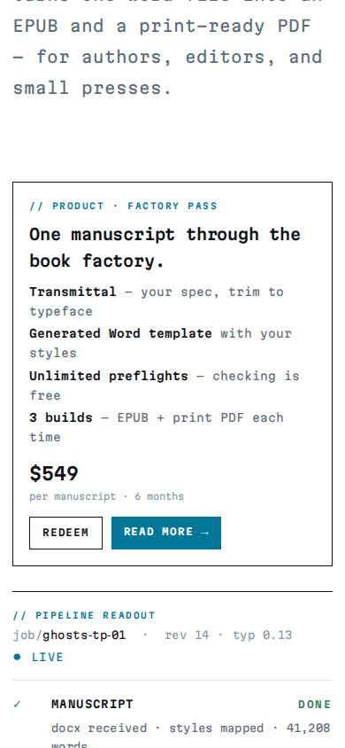

  > **shelley** · 2026-09-19 17:02 UTC  
  > Tightened (live): hero bottom padding 64 → 0, card 36 px below the lede, card padding trimmed. Lede → card → readout now reads as one column.
  >
  > 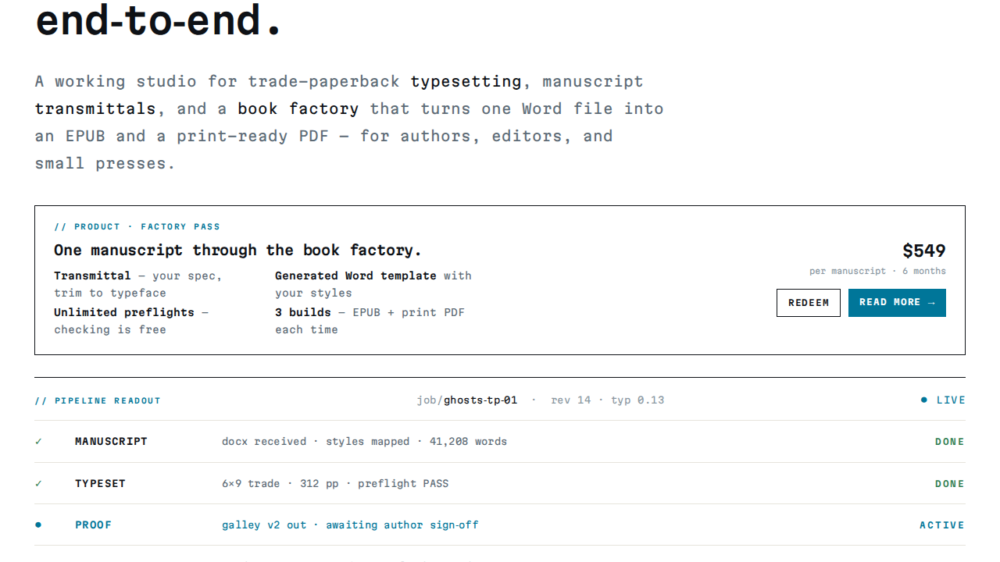

- [~] 0.25 **Word-free authoring — is Word still the only way to kick off the factory?** Friday test: neither tester had Word; Pages renamed styles on export, Word for the web felt janky. 0.6 only listed workarounds (Word online / LibreOffice / Docs + `[[style]]` markers). Today: honest survey of alternatives as of Sep 2026 (Docs with markers as a first-class path? Markdown/plain-text template? Pages export fixer? LibreOffice template? a browser editor of our own?), what each costs in fidelity and support, and a recommendation. Deliverable: short decision note + posted summary. (Jenna 2026-09-19 17:20)

  > **shelley** · 2026-09-19 17:05 UTC  
  > Found it: it was 0.6 (Thu 20:13) — but that only listed workarounds (Word for the web, LibreOffice, Docs + [[style]] markers, a 365 trial), it never asked your real question: does the factory still need Word at all? Logged here as its own item; I'll take it on after the compaction and post a decision note rather than a patch.

  > **jenna** · 2026-09-19 17:05 UTC  
  > nice, good plan

  > **jenna** · 2026-09-19 17:12 UTC  
  > can you tackle 0.25 in parallel with 0.24?

  > **shelley** · 2026-09-19 17:25 UTC  
  > Decision note: docs/reviews/WORD-FREE-AUTHORING-2026-09-19.md (on GitHub; full evidence in scratch/wordfree/). Short answer: the factory does not need Word. It needs a .docx whose paragraphs carry the template's 13 style names — Inspect (python-docx), the book map (styles.xml), the [[style]] pre-pass and pandoc's docx+styles reader all key on the style *name*, nothing else. Tested today on the VM, no builds, no credits:
  > - Google Docs + [[style]] markers: byte-identical Typst to the Word baseline; live Inspect on the zoo project came back 0 high, markers listed, book map right. Already works; only documentation is missing. Caveat: no inline (character) styles, and authors never see the styles before the proof.
  > - LibreOffice Writer: opens the template .docx with all 13 styles intact; round trip through ODT and back gave byte-identical Typst. Free, offline, all platforms. Documentation only.
  > - Word for the web: Friday's upload (book 21) kept every template style name — the file was fine, the editor was the janky part.
  > - Apple Pages: renaming Heading 1→Heading alone loses every chapter and trips two high Inspect findings. A 30-line normaliser fixes it in simulation, but I couldn't get a real Pages export (not in the DB) — need one file from the tester before building it.
  > - Markdown: pandoc's fenced divs feed the same Lua filter, and md → template .docx → normal pipeline was byte-identical. S for a CLI script; M to accept .md at upload. Right for the API audience, not for workshop authors.
  > - Our own browser editor: L, recommend against — it would only exist to emit the same 13-style .docx the tools above already produce.
  > Monday (freeze on): say "you need a .docx in the template's styles, not Word"; order = Word/Word online → LibreOffice → Docs + markers; say avoid Pages for now. The /factory and /workshop pages are public docs, so the "No Word? Three ways in" box from 0.6 is copy, not code — your yes and it's twenty minutes.
  > Next month: document Docs+markers as first-class (S) and run markers before the book map in Inspect (one-line nit); get one Pages file and add the normaliser (S); Markdown→template script for the CLI crowd (S).
  > Decisions for you: 1) Monday framing + the three-ways box, go? 2) advertise Docs+markers, or keep as workaround? 3) Pages: chase the tester's file, or drop Pages? 4) Markdown: CLI only, or accept .md on the factory page? 5) confirm no browser editor this year.

  > **jenna** · 2026-09-19 17:53 UTC  
  > Good notes, but watching the two folks work through the factory yesterday afternoon made clear that applying our Word template that is exported (applying the styles in the template that we export onto their document) is non-trivial. The additional factor is that Google Docs doesn't allow any custom styles, so there's no way to grab those.
  >
  > I think if they have an existing document, we need to be more proactive with coaching on a good round trip: either importing the factory styles into their current document or bringing their text over safely into our template. Both ways seem more fragile than I'm comfortable with. Think some more about that.
  >
  > Actually, now that you mention LibreOffice Writer, maybe we offer more export choices and stop doubling down on Word. I'll stop thinking aloud now. Let's discuss this a little bit more before we do anything else.

  > **shelley** · 2026-09-19 17:54 UTC  
  > Agree with the diagnosis, and I think it points somewhere cleaner than "more export formats."
  >
  > **The fragile thing is moving style *definitions* between documents.** Both round trips you describe do that: importing our 13 styles into their file (Word's Organizer is hostile, LibreOffice's Load Styles is one dialog but still a step, Docs simply can't), or pasting their text into our template (either loses italics or drags their formatting along). Every editor makes this hard because it's genuinely a cross-document operation. No amount of coaching makes it not fragile.
  >
  > **What the pipeline actually needs is much smaller than "our template."** I checked the test file from this afternoon: a document with *only* Word built-ins — Normal, Heading 1/2/3 — plus `[[quote]]` / `[[verse]]` / `[[epigraph]]` markers where needed builds byte-identical Typst to the templated Word file, and Inspect on the zoo project came back clean. So for an existing manuscript the whole contract is:
  > 1. chapter titles → Heading 1 (every editor has it: Word, Docs, Pages, LibreOffice)
  > 2. sub-heads → Heading 2
  > 3. the handful of special blocks → type `[[quote]]` (or verse, code, epigraph, dedication, caption…) at the start of the paragraph
  > 4. export .docx → Inspect (free, no credit) tells you what it found.
  >
  > Markers move *intent as text*. They survive copy-paste, email, Docs, Pages, Word online — anything. Nothing has to be imported anywhere. That's the robust primitive, and it's already live.
  >
  > **So the reframe:** the template stops being *the* way in and becomes a convenience for people starting fresh (it shows the styles; nice in Word or LibreOffice). For everyone with an existing document: "Heading 1 for chapters, a marker for anything special, export, Inspect." One page, one slide. Pages becomes usable with the 30-line normaliser (its "Heading" → Heading 1, "Body" → Normal) — post-freeze, once we have a real export.
  >
  > **On offering more export choices:** cheap and I'd do it — .docx and .odt of the template (LibreOffice headless converts it; the .ott styles carry over, verified today), and a Docs "make a copy" starter with the markers demonstrated in place since Docs can't hold the styles. But I'd frame them as three starters, not three ways to move styles. Not "stop doubling down on Word" so much as "stop making the template the gate."
  >
  > **Honest costs:** markers are visible in the manuscript until the build removes them (authors may find that odd — it's a one-sentence explanation). No inline character styles by marker (italics/bold pass through as-is, which is fine; small caps would need the template). And Inspect should run the markers pass *before* the book map so its report matches the build — one-line fix, post-freeze.
  >
  > **Monday, copy only (freeze):** a "Bring your manuscript" checklist — the four steps above — on /factory and the workshop page, with the marker list; template offered as .docx (+ .odt if you like) under "starting from blank." I can draft the copy tonight for your read; nothing publishes till you say.
  >
  > Where I'd like your steer: (a) does the "template is optional, Heading 1 + markers is the contract" framing sit right with you for the room Monday? (b) .odt export of the template — yes? (c) want the draft checklist tonight?

  > **jenna** · 2026-09-19 22:06 UTC  
  > this is pretty great news 
  > > 1. chapter titles → Heading 1 (every editor has it: Word, Docs, Pages, LibreOffice)
  > 2. sub-heads → Heading 2
  > 3. the handful of special blocks → type `[[quote]]` (or verse, code, epigraph, dedication, caption…) at the start of the paragraph
  > 4. export .docx → Inspect (free, no credit) tells you what it found.
  > Go ahead and take a swing at A, and maybe in small type we can offer B, the ODT export, for folks who really do want to use Word. It's interesting to think of a small, one-book-at-a-time kind of place versus a larger small publishing company that might want to push a book a week through the pipeline. I'd like to be able to accommodate both.

  > **shelley** · 2026-09-19 22:11 UTC  
  > A + B are live:
  > - /factory#bring — "Bring your manuscript — from any editor": the four steps, the marker list (only names the pre-pass actually resolves: quote, verse, epigraph, code, break, signature, [[/quote]] to close a run), export instructions per editor, then small type: template as .docx or .odt for people starting blank; Docs can't hold styles so use markers; Pages honest note ("run Inspect and tell us"). Last paragraph is the book-a-week case: markers are plain text, so a press's house style guide can say "[[quote]] before every extract" and any author in any editor produces a file the factory reads; API link for scripted intake.
  > - /workshop#bring — "What to bring — and what you don't need", same four steps, short, linking to the factory page.
  > - The transmittal handoff card (after Mark Final) now leads with "Already have a draft? Heading 1 / Heading 2 / [[quote]]… No template needed." and offers the template second: .docx · .odt (small).
  > - .odt is real: /api/projects/{id}/word-template?format=odt converts the generated template with the LibreOffice already on the VM (tested on mcheck: 46 KB, all 13 styles present). One small pipeline addition on a freeze day, additive only, tests green.
  > Not changed: "How a build works" step 2 now says "from any editor that saves Word files" instead of "Write in Word, in your template". Factory app's drop zone still says "Drop your Word file here" — that's the file type, fine.
  > On one-book vs book-a-week: the contract is the same for both; what differs is who applies it. For the solo author, the page. For a press, a one-paragraph house rule + the API. If you want, a short "For presses" page later (post-freeze) could give them the style guide paragraph verbatim to paste into their author guidelines.
  >
  > 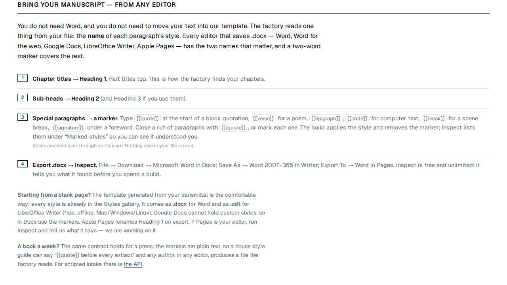
  >
  > 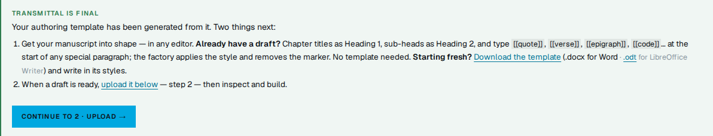

- [x] 0.26 Client portal card row: Factory / Transmittal duplicative, Snapshot + Activity obsolete → card now Factory → · Style sheet only. Factory step strip is a persistent eyebrow (sticky) with a "you are here" marker. (Jenna 2026-09-19 ~22:30)

  > **shelley** · 2026-09-19 22:46 UTC  
  > Both live.
  > 1/ Portal card row is now just FACTORY → · STYLE SHEET. Transmittal, Snapshot and Activity are commented out in the markup (same treatment as Calendar on the 18th) — the email modal code is untouched, nothing in the email system changed.
  > 2/ Yes, and it was cheap: the step strip is now sticky at the top of the factory page as you scroll (it carries its own rule; the hr under it is gone). I added one more thing while there: a scroll-spy — the step whose section is under the strip gets a dark underline ("you are here"), while the accent underline still marks where the work is (state). So on a project that's ready to download but you're re-reading the transmittal, you see 1 TRANSMITTAL (dark) and 5 DOWNLOAD (accent) at once. Anchor jumps land 60 px below the strip so headings aren't hidden.
  >
  > 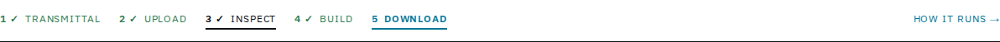
  >
  > 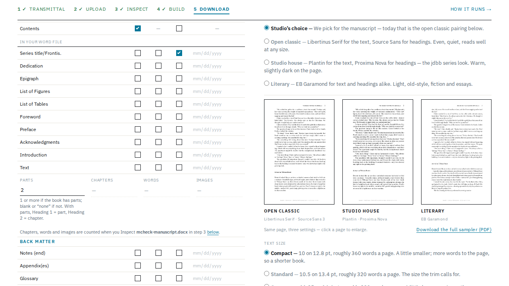

## 2 · Your side — YOU

- [ ] 2.8 Today's book with colour images: run Inspect, tell me what it says about the images and how the print PDF's grey looks (5.15 landed; Ghosts had nothing to test on)

## 3 · P2 — talk deck from Venkat's "Have your factory call my factory" — BOTH

- [ ] 3.2 YOU — cut / reorder / add beats
- [ ] 3.4 BOTH — run-through in the browser; timing
- [ ] 3.5 ME — push; link in the handoff

## 4 · Workshop watch (Mon 21 / Tue 22) — BOTH

- [ ] 4.1 `/admin/factory/` (Floor) on a second screen; Shelley session open with `factory-tail`
- [ ] 4.2 Attendees free via hand-granted passes (New pass form) — no coupons, no $0 checkouts (form + attendee login verified Fri, 2.5)
- [ ] 4.3 Watch for `build failed`, `401` bursts (password confusion), builds "queued" (> 2 at once)
- [ ] 4.4 Tue night: confirm `systemctl list-timers prodcal-store-live.timer` still armed; Wed 00:00 HKT check the go-live email arrived and `/api/public/store/config` says live

## 5 · Queued — ME unless marked

- [~] 0.9 new: I'd like to at least start building out how someone else can hit the book factory from their own factory via our API. I have, today, three customers, and i… — plan on the item: A) three passes on this VM (15 min, need names); B) bearer token + CLI/Python recipe, fresh session

  > **shelley** · 2026-09-19 12:25 UTC  
  > First think, in plain terms. Two very different things are hiding in this item, and I’d separate them:
  >
  > **A. Portals for your three customers (Monday-showable).** This is *not* new code. ProdCal is already multi-tenant: each customer is a client slug with a portal at /{client}/ and a Factory Pass per project. So “a portal for each of the three” = three passes on this VM, today: Admin → Store → New pass (name, email, project). Each gets /{client}/{project}/factory/ with transmittal, Inspect, builds. One VM, one codebase, always in sync because it *is* the app. Handing it to them = sending the login. I can set all three up in fifteen minutes if you give me names + emails + working titles; you did one earlier today (snitkey). Separate VMs would mean three copies to keep in sync and three sets of licensed fonts — worse, not better.
  >
  > **B. “Hit the book factory from their own factory” — the API.** The Factory Pass API already exists and is documented (docs/API.md, docs/specs/FACTORY-PASS-API-2026-09-03.md): upload a .docx, POST /api/books/{id}/convert, poll, download PDF/EPUB, all against a project the pass owns. What’s missing for an outside program (or an outside agent) to use it:
  >  1. **A token instead of a browser login.** Passes authenticate via a cookie; a program needs `Authorization: Bearer <pass token>`. Small server change; the pass already has a secret.
  >  2. **A one-page “build a book from the command line” recipe**: curl upload → convert → poll → download, plus the same as a 30-line Python script. This is the demo for Monday: “here is a book being built from a terminal, no browser.”
  >  3. **Machine-readable Inspect and build errors** (both exist as JSON already; document them).
  >  4. Later: webhooks when a build finishes; a spec/transmittal PUT so the caller can set trim/title without the form.
  >
  > Plan: fresh session, starts from a copy of the API doc, does 1+2 today (2–3 h), demo = the Python script building Ghosts on project 14. It touches srv/auth for the bearer path and adds docs; it won’t collide with what I’m doing here (transmittal, template, filters). A is a 15-minute task in either session — send me the three names.

  > **shelley** · 2026-09-19 12:42 UTC  
  > B is in progress (subagent): Bearer-token alias, a one-page curl recipe, and a stdlib-only Python script that uploads → builds → downloads. A still needs the three names/emails/working titles from you.

  > **shelley** · 2026-09-19 12:49 UTC  
  > B landed (ba069b6): `Authorization: Bearer <project token>` works on every factory endpoint; docs/API-CLI-RECIPE-2026-09-19.md is the one-page curl recipe; scripts/factory-cli.py (stdlib Python, ~60 lines) does upload → build → poll → download, or inspect. Tested end to end on Ghosts. This is your “their factory calls our factory” demo for Monday: a book built from a terminal, no browser. A (the three passes) still needs names.

  > **jenna** · 2026-09-19 15:52 UTC  
  > This all sounds great. Not sure what I can look at to see what we've got. Is this something we add to the factory sales page, or is it a separate page that we link to? Not sure how to present this option on the website. Also, I want to add it into what I use for the workshop on Monday and Tuesday, and my session on Wednesday. Help me think this through?

  > **shelley** · 2026-09-19 15:55 UTC  
  > **What exists to look at (nothing public yet):** the recipe `docs/API-CLI-RECIPE-2026-09-19.md` (on GitHub; I can render it at a URL) and `scripts/factory-cli.py`. The demo is a terminal: `python3 scripts/factory-cli.py build ghosts.docx` → PDF and EPUB land in the folder, no browser.
  >
  > **Website — my recommendation: both, but unequal.** The `/factory` sales page is written for an author; keep it that way and add one short section near the foot, after “How it runs”: *“Have your own factory? The book factory is an API. Everything the page above does, a program can do — upload, inspect, build, download — with one token.”* → link. The link goes to a **separate page, `/factory/api`**: the recipe rendered as a public doc (same treatment as `/factory` itself — a file in jdbbs-public, so you can edit it in the doc editor). Reason: the API audience is a publisher’s tech person or someone’s agent, not the author reading the price; give them their own page and keep the sales page short. I can put both up Sunday (one small route + one HTML file; no risk to the app).
  >
  > **Workshop Mon/Tue:** participants live in the browser factory. The API earns *one* 90-second moment at the end of the build session: “this is the same factory” — I run the CLI on a manuscript on screen, the PDF appears, and the point lands: the web page is just one door into it. Nothing for them to do.
  >
  > **Wednesday session:** it’s the closing argument of the *machine factory* idea: the swim-lane diagram on `/factory` (“How it runs”) shows four lanes; the API slide says *any* of the top-lane work can be done by a program or an agent, and here are the four calls. One slide of the curl recipe, one slide of the diagram. If the Index add-on PDF lands today, that’s the third slide: a machine-drafted index, reviewed by a human.
  >
  > Say yes and I’ll do the page + section Sunday morning, and hand you a 6-line demo script for the terminal moment.

  > **jenna** · 2026-09-19 16:33 UTC  
  > yes but let's go now, no need to wait for tomorrow (why do you keep saying that lol)

  > **shelley** · 2026-09-19 16:41 UTC  
  > Gone now (c. 17:05). Three pieces, all live:
  >
  > 1/ **https://jdbbs.exe.xyz/factory/api** — public page, the whole recipe: what you need (id, token, pass), then the six calls with real responses (pass → upload → inspect → build → poll → download), a one-screen version, the Python script, "also callable", and an error table. Public-tier chrome like /factory/terms; listed in Pages. Dark mode + 390 px checked.
  >  
  >
  > 2/ **/factory** has a new section above Redeem — "Have your own factory? It's an API" — three sentences and a "Read the recipe →" link.
  > 
  >
  > 3/ **Terminal demo for the room**: `scripts/factory-demo.sh` — prints each command in colour before it runs, so people read along. `TOKEN=… P=14 scripts/factory-demo.sh ms.docx` does pass → upload → inspect (free, ~5 s). Add `--build` to spend a credit and watch it poll and download both files (~15 s for the sample chapter). I ran it against prot/zoo (id 14, the CLI test project — 6 credits left, token in scratch/zoo-token.txt) — never against pinstitute. The Python script is also downloadable at /factory/api/factory-cli.py.
  >
  > Left as [~] until you've read the page; then 0.9A (three passes) still needs the customer names from you.

- [ ] 5.17 **About the Book Factory** text (was 0.8) — YOU pick A / A′ / B and edit the placeholders (drafts are on this item's notes); then ME: transmittal checkbox → colophon on the copyright page and/or back-matter page, off by default

  > **shelley** · 2026-09-18 17:19 UTC  
  > Drafts are ready for your read (not ticking until you have): docs/brand/ABOUT-THE-BOOK-FACTORY-2026-09-18.md — also in the repo on GitHub. Three lengths: A colophon for the copyright page (78 w), A′ one line after the typesetting credit (26 w), B a back-matter page headed “About the Book Factory” (~490 w). Voice: plain third person, says what happened to the book, no adjectives; the URL is the only sell. Once you pick and mark up the wording I wire it as a transmittal checkbox (off by default): copyright-page colophon, or back-matter page, or both. The one-liner, so you can judge the voice here: “Set from the author's Word file by the jdbb studio book factory, print and EPUB from one source, no hand-composed pages. jdbbs.exe.xyz/factory”

  > **shelley** · 2026-09-18 17:59 UTC  
  > Sorry — I left these in a repo file, which you can’t open from this page. Here they are in full. Three lengths; the numbers are true of every build today (thirteen styles, ~9 s).
  > A. Colophon (copyright page, small type) — 78 words
  >  This book was made in the jdbb studio book factory. The author wrote it in Word, in a template of thirteen named styles generated from a one-page transmittal; the factory read the file, reported what it found, and set the print interior and the EPUB from that single source, in licensed type, with no hand-composed pages. Corrections are rebuilt the same way, so every copy of this edition is set from the same file. jdbbs.exe.xyz/factory
  >
  > A′. Colophon, shortest (one line after the typesetting credit) — 26 words
  >  Set from the author's Word file by the jdbb studio book factory, print and EPUB from one source, no hand-composed pages. jdbbs.exe.xyz/factory
  >  ---
  >
  > B. Back-matter page — "About the Book Factory" — 486 words
  >  **About the Book Factory**
  >  This book was not typeset in the usual sense. No one placed its pages by hand. It was built by the jdbb studio book factory, a small machine for turning a Word file into a book, and this page says how, because the method is part of what you are holding.
  >  The author wrote in Word, in a template the factory generated for this title. The template has thirteen named paragraph styles and nothing else: Normal, First Paragraph, three levels of heading, Block Quote, Epigraph, Verse, Code Block, Section Break, Copyright, Signature and Glossary Entry. Every paragraph in the manuscript carries one of those names. That is the whole contract between writer and factory. There is no software to learn and nothing to install; the work of authorship stays in the tool the author already used.
  >  Before the writing began, the author filled in a transmittal: a short form that records what the book is and how it should be set. The page size. The front matter — a dedication, an epigraph, a foreword — and its order. The copyright page, which the factory composes from the transmittal rather than asking anyone to type it. Special characters, mathematics, custom styles the book needs. The transmittal is the specification; the template is generated from it; the finished book follows it.
  >  When a draft was ready, the author uploaded it and the factory inspected it: a machine read of the file that reports which styles were used, where the file departs from the template, how many images it found and how large each will print, where the chapters begin. The report is the factory's reply. The author fixes what it flags and uploads again, for as long as it takes.
  >  Then the build. From that one Word file the factory produces two things at once: a print-ready interior PDF at the trim size on the transmittal, and an EPUB with the author's cover embedded. The interior is set in the studio's house design — a typographic system of margins, type sizes, running heads and spacing worked out once and applied to every book that passes through — in fonts the studio licenses for print. The two editions come from the same source, in the same pass, so they cannot drift apart.
  >  This matters after publication. A book set by hand is finished when the typesetter stops; a correction means opening the files again and hoping the lines still fall where they did. A book from the factory is set from its source every time. Fix the Word file, rebuild, and every page is composed afresh, in seconds. The edition you hold is one build of a file that can be built again.
  >  The factory is the work of jdbb studio, a one-person book studio that published books the ordinary way for thirty years before deciding that the ordinary way was mostly waiting. It is offered to anyone with a manuscript and a few hours. If you have written something and would like it to become a book like this one, the factory is at **jdbbs.exe.xyz/factory**.
  >  ---
  >  #
  > Notes for Jenna
  >  - "thirty years" and "one-person" in the last paragraph are placeholders for whatever is true; cut the sentence if you'd rather not do biography here. - "thirteen named paragraph styles" is true as of today (Signature and Glossary Entry added 2026-09-18). If the count changes, this line and the colophon change with it. - "in seconds" — a full build of a 250-page book is ~9 s on the VM; true. - The page is ~490 words; at 6 × 9 it fills one recto with air. If you want it on one page in Small trim, cut paragraph 4 (Inspect) to two sentences. - Suggested placement: last page of back matter, after About the Author, so the book ends on the author and then the maker.

- [x] 5.5 P3 **H&J / composition quality** in the print PDF — Typst 0.12 levers checked, nothing to change before Monday; scorer in `typesetting/scripts/compscore.py`; runts need Typst 0.13 `costs` (Wed 24+); still to do: compare against an InDesign-set page (YOU supply) — **19 Sep:** VM on Typst 0.13.1, `costs: (runt: 200%, hyphenation: 70%)` shipped in the series template, sampler rebuilt; scores on the note. Open: InDesign page comparison.

  > **shelley** · 2026-09-18 14:11 UTC  
  > Scorer landed: `python3 typesetting/scripts/compscore.py book.pdf --list` counts loose lines, runts, widows/orphans, hyphen runs, stacks and rivers per book. Ghosts today: 27 loose, 42 runts, 0 widows/orphans, ~90 rivers over 2395 lines.
  >
  > The lever that actually fixes runts (Typst’s `costs`) needs Typst 0.13; we run 0.12. I tried 0.13 in scratch: runts 42 → 29 (−31%), and the template compiles after a one-line fix (landed, no output change on 0.12). But 0.13 also changes spacing around lists and on the Contents page, which shifts lines on ~30 pages of Ghosts — a page-by-page check on two books before it can go live. Recommendation: do the upgrade Wed 24 or after, not before attendees build. Full note: docs/reviews/P3-COMPOSITION-2026-09-18.md. Still want one InDesign-set page from you to run the same scorer on. Side-find: Ghosts ch.1 has 26 stray `>` from a quoted email in the .docx — Inspect should flag that (small, will add).

  > **shelley** · 2026-09-18 17:37 UTC  
  > Checked what else 0.12 can do, so 5.5 is not just waiting on the upgrade. Answer: nothing worth touching before Monday. Ghosts’ 27 “loose” lines are all 0.50–0.58 em — a hair over the yardstick, 1.1 per 100 lines, no hyphen stacks, no widows/orphans. That is clean composition; a compositor would leave it. Obliquities (same scorer, your existing PDF, no build spent) is looser: 3.5 per 100 lines, median 0.53 em, max 0.79, because the protocolized trim gives a ~3.4 in measure at the same 10 pt. The honest fix there is design — 9.5 pt or a hair less margin — a choice for the series spec, not a factory default to flip two days out. The 6 “orphans” it reports are numbered-list first lines (scorer sees the hanging number as a new column) — false positives, I’ll tighten the scorer. Runts remain the only real defect and that is the 0.13 `costs` lever, Wed 24+. Leaving 5.5 in progress for the InDesign page whenever you have one; otherwise it is done for the workshop.

  > **jenna** · 2026-09-19 15:16 UTC  
  > good notes here -- review these notes and compare with the sampler you're making for us? None of our existing projects are "real" yet so zero cost to us if text shifts from Typst 0.13

  > **shelley** · 2026-09-19 15:17 UTC  
  > Agreed — with no real projects yet the reflow is free, so 0.13 goes in today (5.20) and 5.5 gets its lever. Plan when I get there (after 0.17): swap to 0.13.1; add the runt/widow `costs` setting to the series template (0.13-only syntax, so it lands with the swap); rebuild the sampler with 0.13 and run compscore on both versions of the sampler pages + Ghosts so you can see the before/after numbers on the same pages; sampler PNGs/PDF on the transmittal get regenerated from the 0.13 build so what customers see is what the factory now sets. I'll post the scores here.

  > **shelley** · 2026-09-19 15:42 UTC  
  > Scores are in (`compscore.py`, Ghosts 117 pp / 3,109 body lines). 0.12 → 0.13 alone changes nothing: identical counts, same 117 pages. The new `costs` knob is what moves things:
  >
  > | build | loose | runts | widows | hyph×3 | rivers |
  > |---|---|---|---|---|---|
  > | 0.12 = 0.13 default | 525 | 145 | 23 | 0 | 102 |
  > | runt 200% | 546 | 129 | 23 | 0 | 100 |
  > | **runt 200% + hyphenation 70%** (shipped) | 485 | 128 | 23 | 1 | 110 |
  > | runt 200% + hyphenation 50% | 443 | 128 | 23 | 3 | 117 |
  >
  > So: 12% fewer single-word last lines and 8% fewer loose lines, at the price of one three-in-a-row hyphen stack in the whole book. Pushing hyphenation cheaper (50%) buys more even spacing but stacks hyphens 3× and adds rivers, so I stopped at 70%. Widows didn't move — Typst already guards them; the 23 the scorer counts are two-line paragraphs it can't help.
  >
  > Sampler rebuilt under 0.13.1 with the new costs: runts 20 → 14, loose 18 → 16; chips/pages/PDF regenerated and deployed (page-house looks clean — no runts on the sample page). Commit on GitHub. The knob is `costs:` in the series-template config, so it can be tuned per book if one fights it. Still open on this item: your InDesign-set page for comparison.

  > **jenna** · 2026-09-19 16:50 UTC  
  > "Still open on this item: your InDesign-set page for comparison" -- I'm going to skip this step. Go ahead and delete it, but for the sampler, is there a link I should be looking at? Unclear.

  > **shelley** · 2026-09-19 16:51 UTC  
  > InDesign comparison struck; ticking 5.5 — the 0.13 `costs` lever is shipped and scored, nothing else is open.
  >
  > The sampler: it's the **Typeface row of any transmittal** — three chips (House / Classic / Literary); click one and the full page opens. Direct links:
  > - PDF, all three pairings: https://jdbbs.exe.xyz/static/samples/typography-sampler.pdf
  > - the three pages as images: /static/samples/page-house.png · page-classic.png · page-literary.png
  > - e.g. in situ: https://jdbbs.exe.xyz/mcheck/book-001/transmittal/ → Format → Typeface.
  >
  > Those are the 0.13 build with the runt/hyphenation costs on, i.e. exactly what the factory sets now.

- [ ] 5.12 Jev (typesafe.ai) pilot — heading classification behind a flag, per `docs/reviews/TYPESAFE-REVIEW-2026-09-18.md` (agreed 2026-09-18; post-workshop)
- [~] 5.13 Index as a factory add-on — listed as coming soon on /factory; phase 1 (Typst index piece, LLM drafting, anchoring) running in parallel on branch `index-addon` (brief `scratch/briefs/index-addon-2026-09-19.md`); phase 2 UI after 0.17 — per `docs/reviews/INDEX-ADDON-FEASIBILITY-2026-09-18.md`

  > **jenna** · 2026-09-19 15:13 UTC  
  > 1/ add Index as a coming-soon add-on 2/ let's start it today: can you draft a prompt I can pass to it's own session or you give to a subagent so that it can proceed in parallel safely?

  > **shelley** · 2026-09-19 15:18 UTC  
  > 1/ Done — /factory lists 'Index · coming soon' in the Add-ons table (live now; price 'tbd'). 2/ Started: brief at scratch/briefs/index-addon-2026-09-19.md, subagent `index-addon` (conv cYBS6TS) running in parallel. Safety: it works in a git worktree on branch `index-addon` (/home/exedev/prodcal-index), never touches main, the live service, the DB or the API; no factory UI (that's phase 2, mine, after 0.17); develops on Ghosts only — it will ask here before touching Obliquities. Deliverables: Typst index piece (flagged), LLM drafting pass via the VM's keyless LLM gateway, marker anchoring, a design note docs/reviews/INDEX-ADDON-DESIGN-2026-09-19.md, and a report. I'll post its summary here when it lands. If you'd rather drive it from your own session instead, the brief file is the prompt — paste it in.

  > **jenna** · 2026-09-19 15:49 UTC  
  > Do you have an update from the subagent? If we're close, I'd like to go ahead and push this today, but I haven't seen anything to review yet.

  > **shelley** · 2026-09-19 15:54 UTC  
  > Update from the branch (`index-addon`, worktree, nothing on main yet):
  >
  > - **Piece 1 done and committed (b67e4b0):** `#index[term]` markers + an `index-page()` back-matter function in the series template, with a fixture (`typesetting/test/index-fixture.typ`) compiling identically under Typst 0.12 and 0.13. That’s the typesetting half — the thing that turns markers into a real index with page numbers.
  > - **Piece 2 in progress:** the drafter — Go tools that read a manuscript, ask the LLM for a candidate term list (headwords, subentries, cross-refs), and anchor the terms back into the Typst source as markers. `srv/indexer/typtext.go` and `llm.go` compile; `cmd/indexdraft` / `cmd/indexanchor` are scaffolded. The internal LLM endpoint is confirmed answering.
  > - **Remaining:** finish the two tools, run them on Ghosts to produce a sample index PDF, write `docs/reviews/INDEX-ADDON-DESIGN-2026-09-19.md`.
  >
  > “Push today” — honest answer: the **Ghosts sample index** (a PDF you can read) is realistic today, and that’s the thing worth reviewing: is the index any good? Wiring it into the factory (the SKU, a “Draft my index” step, review UI) is phase 2 and stays post-workshop under the freeze — it touches builds and the store. So today = a PDF to judge and the design doc; I’ll post both here when the subagent lands them. If the index reads well, you can talk about it Wednesday as a working thing, not a promise.

  > **shelley** · 2026-09-19 16:22 UTC  
  > Ghosts sample index is ready to judge (branch `index-addon`, nothing merged, production untouched).
  >
  > - PDF, 105 pp, index on pp. 101–105: /img/513-ghosts-indexed.pdf
  > - Pages as images:    (p103–105: /img/513-index-p103.png …p105)
  > - Draft: 209 entries (155 headings, 64 subentries, 21 *see*, 24 *see also*); 380 anchors → 377 placed, 3 unmatched (reported, not guessed). Body reflow from the markers: 1 paragraph in 100 pages.
  > - Cost: $0.43 and 5 min for a 24k-word book on Sonnet; Opus ≈ $2. Replayable offline for tests.
  > - Design note: docs/reviews/INDEX-ADDON-DESIGN-2026-09-19.md (on the branch) — marker syntax, index.json schema, phase-2 API/UI/SKU sketch.
  >
  > Visible flaws on p.101 to fix before anyone sees it as a product: a long code-style heading (AmaStore_L47_…) doesn't break and runs into the gutter; a couple of *see also* cross-refs look like they should be merged ("artificial ghosts" ↔ "beaings"); and an indexer would prune some near-duplicates (AI mediators / AI systems / artificial intelligence). Those are prompt + template polish, not architecture.
  >
  > What I need from you: read pp. 101–105 as an editor and say (a) is the *kind* of index right — conceptual, Chicago-style, with subentries and cross-refs — and (b) is it worth a SKU at all, or a studio add-on you run by hand? Nothing further this weekend either way; the branch waits post-workshop.

- [ ] 5.19 Tuned per-image grey conversion + proof sheet as a ~$100 add-on (from 5.15; post-workshop)
- [ ] 5.9 4 vCPU bump — only if the workshop shows build queueing (load test: CPU-bound)
- [ ] 5.21 Plantin MT Pro **Bold** missing on the VM (see `docs/IDEAS.md`) — YOU supply the OTF; never committed

## 6 · Ideas log (`docs/IDEAS.md`) — BOTH decide, then queue or kill

- [x] 6.1 Per-client interactive stylesheet instances (accept/reject seeded from the universal fiction/nonfiction stylesheet)

  > **jenna** · 2026-09-18 00:19 UTC  
  > Seems like this shouldn't be too bad to do since we trimmed down our universal fiction/non-fiction style sheets. Do you agree?

  > **shelley** · 2026-09-18 00:33 UTC  
  > Agree — the trimmed universal sheets make this ~half a day: a per-project table of accept/reject rows seeded from the universal sheet + the existing /stylesheet UI pointed at it. Queue post-workshop (5.10?).

  > **jenna** · 2026-09-18 01:08 UTC  
  > I'm going to make a big deal about style sheets in both senses (for the workshop and in my presentation to the symposium), and disambiguating style sheets (like in Microsoft Word) and the style sheets we mean here (lke whether to use the Oxford comma or not) feels worth doing now and handling exposing the UX in the client dashboard. In the workshop, I think I'd encourage them to accept all of our defaults for efficiency, but also to allow them to add or edit. Am I crazy?

  > **jenna** · 2026-09-19 15:47 UTC  
  > did you reply to this question? if so it didn't land here in the punch list

  > **shelley** · 2026-09-19 15:48 UTC  
  > No, I never answered this one — your 01:08 note came after my reply and got lost at the session handoff. Sorry.
  >
  > Not crazy. The framing is right and the pedagogy is right (accept our defaults, then add/edit). The question is only *how much* lands before Monday, because a per-client accept/reject instance is new feature work inside the freeze. Two sizes:
  >
  > **A. Workshop-ready, low risk (Sunday, ~2–3 h, no schema):** the trimmed universal sheet already exists as a page (`/housestyle`, 62 rules, fiction/nonfiction/both). I put a **Style sheet** card on the client portal and a line in the transmittal that says plainly: *“Your book follows the jdbb house style sheet unless you tell us otherwise”* → link → and a free-text **Exceptions & additions** box right there (Oxford comma yes/no, spellings, names). Plus a short disambiguation paragraph at the top of `/housestyle`: Word *styles* (Heading 1, Body Text — what the template gives you) vs the editorial *style sheet* (the decisions a copyeditor keeps — this page). Participants accept-all by doing nothing, and can add. Nothing new can break.
  >
  > **B. Full 6.1 (post-workshop, ~1 day):** per-project copy of the 62 rows seeded from house_style, each row accept / reject / edit, add-a-rule, shown in the portal; whatever participants typed into the Exceptions box on Monday migrates into their instance. Same model as the PI review tool (`stylesheet_items`), so it’s known work.
  >
  > My recommendation: A tomorrow, B the week after. If you’d rather have B by Monday I can do it Sunday, but it means a new table + UI going live the morning of the workshop with only my own testing behind it — I’d rather not. Your call; say A or B and I’ll start.

  > **jenna** · 2026-09-19 15:54 UTC  
  > B feels doable? and we still have a bunch of time today, Saturday. We just need to be careful about crashing with whatever else we keep going on this afternoon but you have seemed really strong on staging our improvements.

  > **shelley** · 2026-09-19 15:55 UTC  
  > B it is. Starting now, staged so nothing collides with the index or 0.9 work:
  > 1. Schema (new table only, seeded from the 62 house-style rows per project on first open — no changes to existing tables).
  > 2. API under `/api/projects/{id}/stylesheet` (client-scoped like the transmittal).
  > 3. Portal: a **Style sheet** card per book + the page: each rule accept / reject / edit, add a rule, “Accept all” at the top, plus the Word-styles-vs-style-sheet paragraph.
  > 4. Tests → build → restart → smoke on mcheck; nothing touches builds or the store, so the worst case is the new page being wrong, not the factory.
  > I’ll post screenshots here as it comes together.

  > **shelley** · 2026-09-19 16:19 UTC  
  > B is live: /mcheck/book-001/stylesheet/ (linked from the portal card "Style sheet", the client top nav, and the admin project view). Seeds from the house sheet on first open (28 'both' rules; picking Fiction/Nonfiction adds theirs → 48/42), every rule Accepted by default; per rule Reject / Edit / Add note / Restore; Add your own; Accept all; Download as Markdown (only accepted+edited+added, for the copyeditor). Public /stylesheet/ got a line pointing customers to their own copy. 5 tests, full suite green, migration 046. mcheck currently has demo state (1 edit, 1 reject, 2 added) — say if you want it cleared before the talk. 

- [x] 6.2 Reusable "review table" pattern from the sitemap-review tool (JSON table + per-row reply box)

  > **jenna** · 2026-09-18 00:19 UTC  
  > I don't know enough about what you mean for this one.

  > **shelley** · 2026-09-18 00:33 UTC  
  > Means: the sitemap-review tool we used earlier (table of items, a reply box on each row — like this punch list) could be turned into a reusable component for future review rounds. My call: kill until a second concrete review round needs it.

  > **jenna** · 2026-09-18 01:06 UTC  
  > Hmm feels like, through the course of the workshop, I might very quickly end up with a bunch of small borks/nits/qols that we could fix in near real time, and a clean punch list to keep track of them instead of throwing things at you in a session would feel much safer. Maybe we make a blank page shaped like this that has a starter data entry field that I could use to kick off things as they come up on Monday and Tuesday.

  > **jenna** · 2026-09-19 15:47 UTC  
  > 6.2 did you reply to this question? if so it didn't land here in the punch list

  > **shelley** · 2026-09-19 15:48 UTC  
  > Missed this one too — sorry. Yes, and you already have it: this page *is* that. Plan for the workshop:
  >
  > Sunday night I archive list 3 to `/admin/runs/` and start **Punch list 4 — Workshop** at the same URL (https://jdbbs.exe.xyz:8766/): empty apart from §0 Inbox, the New-item bar at the top as the starter field, screenshots paste in as now. Everything you drop in Mon/Tue lands in my chat instantly; I triage each into **Hotfix now** (typos, broken links, a wrong label — fixed in minutes, ticked with a note) or **After workshop** (anything needing a build or a schema change, per the freeze). You never have to hold a thought or open a session — just type it on the page. No build needed for any of this, so it fits the freeze. Only you can see it (the port is behind the exe.dev login).

  > **jenna** · 2026-09-19 15:56 UTC  
  > Yes, good plan. I may even show the window as a model for one way to iterate through a bunch of quick improvements for this modern era of building. Using Chrome's new split tabs feels like a really good way to keep the context clear on a bunch of quick changes. eg
  >
  > 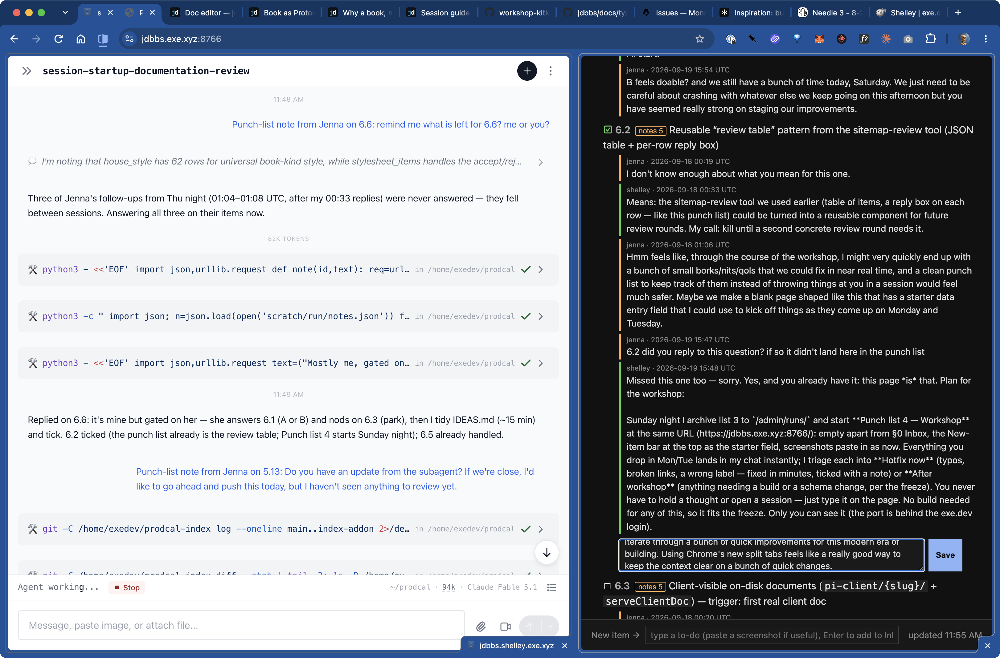

  > **shelley** · 2026-09-19 15:57 UTC  
  > Good — that split view is exactly the loop: you type on the right, the fix lands on the left, the tick comes back on the right. Worth showing. Punch list 4 (Workshop) goes up Sunday night at this URL; I’ll leave list 3 readable at /admin/runs/. One thought for the demo: the punch list is the *shape* of the pattern (items, notes both ways, ticks), not a product — the same shape works with any agent that can read a file and POST a note.

- [x] 6.3 Client-visible on-disk documents (`pi-client/{slug}/` + `serveClientDoc`) — trigger: first real client doc

  > **jenna** · 2026-09-18 00:20 UTC  
  > I don't know enough about what you mean for this one.

  > **shelley** · 2026-09-18 00:33 UTC  
  > Means: like /exedeck or /workshop, but per client — drop an HTML file in pi-client/{slug}/ and it shows only to that client, behind their portal login. Nothing needs it yet; keep on the ideas list until a real client doc exists.

  > **jenna** · 2026-09-18 01:04 UTC  
  > Hmmm we'll have a bunch of clients once the workshop participants start Monday, so this is something that needs to be ready before the workshop, unless I'm still not quite understanding what you mean here.

  > **jenna** · 2026-09-19 15:47 UTC  
  > 6.3 did you reply to this question? if so it didn't land here in the punch list

  > **shelley** · 2026-09-19 15:48 UTC  
  > And this one — sorry. You’re understanding it right, but the need isn’t what it sounds like. Everything a participant needs when they become a client on Monday is **generated by the app per client already**: their portal, factory, transmittal, Word template, builds, house style. No files need dropping anywhere.
  >
  > 6.3 is narrower: it’s for the day you want to *hand-write* a one-off HTML page for one specific client — a bespoke design memo, a custom brief — and have it show only to them behind their login, the way `/exedeck` shows to everyone. That day hasn’t come; when it does it’s an hour of work (mirror `servePublicDoc` with a login check). Until then an email or the transmittal Notes covers a one-off. So: nothing needed before the workshop; keep parked.

  > **jenna** · 2026-09-19 16:05 UTC  
  > Got it, this becomes a good add to our ideas list.

  > **shelley** · 2026-09-19 16:09 UTC  
  > Parked, noted in docs/IDEAS.md with the trigger (first real client doc). Ticked as decided.

- [ ] 6.5 Print cover / spine calc — separate product question (cover is EPUB-only today)

  > **jenna** · 2026-09-18 00:22 UTC  
  > Yeah, let's not lose track of this, but the whole "how to get it printed" question is not built into the factory at all yet. I think this is a good one to keep on the idea list for now. I just did some good research, and the two print companies we could point people towards are Bookmobile and Accutrack. Add those to our research if we add this to the factory after the workshop.

  > **shelley** · 2026-09-18 00:33 UTC  
  > Added to docs/IDEAS.md with Bookmobile + Accutrack named. Stays on the ideas list.

- [x] 6.6 Strike the done rows (Admin doc editor) and move the kept ones to §5 with a date — ME, once 6.1–6.5 are decided

  > **jenna** · 2026-09-18 00:22 UTC  
  > I don't understand what this one means.

  > **shelley** · 2026-09-18 00:33 UTC  
  > Means: housekeeping of docs/IDEAS.md itself — strike rows that are done (did the Admin doc editor one tonight) and move the ones we keep into §5 with a date. It is just “tidy the list once 6.1–6.5 are decided”; I will do it when you have answered 6.1–6.4.

  > **jenna** · 2026-09-18 01:09 UTC  
  > Ah gotcha, yes let's keep Punch lists are up to date, and let's also figure out a way to keep a master list of punch lists. Maybe even add these links to our admin dashboard so that I can go back and double-check what we decided, in case I see something wrong or need to change my mind.

  > **jenna** · 2026-09-18 12:13 UTC  
  > didn't see a reply to this admin improvement tracker idea?

  > **shelley** · 2026-09-18 12:13 UTC  
  > Sorry, missed it. Yes. Plan (added as 5.10, Saturday, ~1 h): (1) the export of each punch list to docs/runs/PUNCHLIST-YYYY-MM-DD.md includes every note thread under its item, so the decisions travel with the list (today’s copies only have the ticks); (2) docs/runs/README.md is the master index; (3) a “Runs” card on the admin dashboard → /admin/runs/ that renders those files from disk, read-only, so you can re-read what we decided from any device and change your mind on the live list. Admin-only and read-only, so safe to land before the freeze.

  > **shelley** · 2026-09-18 14:03 UTC  
  > Done row struck (Admin doc editor → a Done section at the foot of docs/IDEAS.md). Already-decided ideas moved to §5 with dates: 5.7 magic-link (was there), 5.12 Jev pilot (new). 6.1–6.5 are still yours to keep or kill — tick or note each and I’ll move the keepers to §5 and drop the rest from IDEAS.

  > **jenna** · 2026-09-19 15:48 UTC  
  > remind me what is left for 6.6? me or you?

  > **shelley** · 2026-09-19 15:49 UTC  
  > Mostly me, gated on you. 6.6 is just “tidy docs/IDEAS.md once 6.1–6.5 are decided”: strike the done rows, move the keepers into §5 with a date, drop the killed ones. The tracker part (per-note export, master index, /admin/runs/) is done (5.10).
  >
  > State of the five:
  > - **6.1** stylesheet — decided *keep*; needs your **A or B** on my note above, then it moves to §5.
  > - **6.2** review table — resolved: the punch list already is it; Punch list 4 (Workshop) starts Sunday night. I’ll tick it.
  > - **6.3** client docs — *park* (my recommendation on the note); a tick or “agree” from you and it stays in IDEAS as parked.
  > - **6.4** — already gone from the list (decided Thursday).
  > - **6.5** cover/spine — you said keep on ideas with Bookmobile + Accutrack; already in IDEAS. Done unless you want it queued.
  >
  > So: **you** — answer 6.1 (A/B) and nod on 6.3. **Me** — then 15 minutes to tidy IDEAS.md and tick 6.6.

  > **jenna** · 2026-09-19 16:05 UTC  
  > ok I think I've responded to your 6.1 and 6.3. Let me know if I've missed something for knocking this one off

  > **shelley** · 2026-09-19 16:09 UTC  
  > Nothing missed — 6.1 (B, building), 6.3 (park), 6.5 (park) were all I needed. IDEAS.md tidied: 6.1 moved to Done dated today, 6.3/6.5 rows annotated as re-parked. Ticked.

