<!-- exported 2026-09-22 11:52 UTC by scripts/punchlist-export.py; source scratch/run/CHECKLIST.md + notes.json -->

# Punch list 4 · Workshop — Mon 21 / Tue 22 Sep · talk Wed 23

Legend: **YOU** = Jenna's turn · **ME** = Shelley's turn · **BOTH** = look together.
Ticked = done · ◐ = in progress. Click a box to cycle ☐ → ☑ → ◐. **note** opens a reply box under any item (⌘↵ saves; paste screenshots straight in) — I read those back. Bottom bar adds a new item to the Inbox (top). Refreshes every 15 s (pauses while you type). **Contents box** at the top jumps to a section; click a section heading to fold it (remembered on this device); done items sit folded under "n done"; long note threads show the latest note with "n earlier" above it.

Short rows here; the long form lives in the archive — [list 3](/admin/runs/PUNCHLIST-2026-09-19-list3) (Sat 19 Sep — one-page factory, proof vs. final, admin tidy) and earlier at [/admin/runs/](/admin/runs/), with every note thread. Item numbers carry over so threads stay attached (so a "0.x" item may live in any section — the contents box lists open item numbers per section); new items continue from 0.30 / 5.23.

**Freeze:** Mon 21 – Wed 23 **hotfix-only** — triage every new item **Hotfix-now** (breaks an attendee) vs **After-workshop** (→ §5). Hotfix path: fix → `go test ./srv/` → `make build && sudo systemctl restart prodcal` → one factory smoke on `mcheck/book-001`. Store flips to live Stripe by timer **Wed 23 Sep 00:00 HKT**.

## 0 · Inbox — new items, untriaged (Shelley moves them into a section)
- [x] 0.29 **Head spacing: above must be > below** — B landed (4bdea44): A-head 2 lines above / 1 below, B-head ¾ / ¼, slots round to whole body lines so spreads align; sampler rebuilt; TYPOGRAPHY.md updated + "no consecutive heads" guideline. After workshop: half-gap for consecutive heads; "Heading 2 (A-head)" naming pass

  > **shelley** · 2026-09-20 00:00 UTC  
  > Triaged → renumbered 0.29 (the page auto-numbered it 0.26, which collided with the old item). Diagnosis so far: TYPOGRAPHY.md says heads should sit closer to what follows, and the template config agrees (h2 above 1em / below 0.25em) — but the sub-head code adds an invisible 1em anchor box + an empty paragraph under every head to keep it with the next line, so measured on a test page the gap *below* is actually ~1.5× the gap above. Fix is to use Typst 0.13's `sticky` blocks instead (we upgraded Fri), then re-tune above/below once for H2/H3 and check the chapter opener + first-line indent after heads. Template-only change, affects every book; I'll do it in the next session with before/after PNGs here. After-workshop unless you want it in Monday's builds — say the word.

  > **shelley** · 2026-09-20 00:01 UTC  
  > Agreed — that image was my first experiment, not a proposal: heads too tight both sides, no space after. It's already reverted; nothing changed in the live template. Next session I'll tune it properly (above clearly > below, head size checked against the spec, chapter opener too) and post before/after crops here before touching the build.

  > **shelley** · 2026-09-20 00:03 UTC  
  > Checked properly: TYPOGRAPHY.md had **no rule** for space above/below subheads — only "headings occupy whole multiples of the body leading" and "subhead 12–14pt". That was the gap, and it's why the template's numbers (above 1em / below 0.25em, then quietly undone by a 1em keep-with-next box) were never checked against anything. Filled it now — new section "Space Around Subheads" in docs/typesetting/TYPOGRAPHY.md: head belongs to what follows; above : below ≥ 2 : 1; A-head above 1½–2 lines / below ½ line, B-head 1 / ¼–½, the whole block a whole number of body lines; measured baseline-to-baseline; keep-with-next must add no invisible space; consecutive heads halve the gap. Please read and amend — once you're happy with the rule, the template gets tuned to it (with before/after crops here), not the other way round. Link: https://github.com/djinna/jdbbs/blob/main/docs/typesetting/TYPOGRAPHY.md#space-around-subheads

  > **jenna** · 2026-09-20 00:09 UTC  
  > lgtm, update our Sampler pdf too (if needed)

  > **shelley** · 2026-09-20 00:09 UTC  
  > Noted — rule approved. Merging the index add-on (4.5) first, then I tune the template to the rule, post before/after crops here, and check the Sampler PDF (docs/typesetting) — will regenerate if the head spacing changed it.

  > **shelley** · 2026-09-20 00:34 UTC  
  > Before/after crops, same scale (10/12 body, Plantin, Geist heads). Measured baseline-to-baseline, not by eye.
  >
  > BEFORE (live today): above 3.2 lines, below 3.1 lines — equal, and the head+gaps ate 6.3 lines; the first paragraph under a head was also indented (an empty paragraph hidden under the head did both).
  >
  > A — rule-exact (TYPOGRAPHY.md table): 1½ lines above, ½ below, 3-line slot; first paragraph flush; sticky keep-with-next, no hidden box. B-head (H3): ¾ above / ¼ below, 2-line slot (4th image).
  >
  > B — roomier, still 2:1: 2 lines above, 1 below, 4-line slot. Same H3 as A.
  >
  > My read: A is correct but the ½ line under a 13-pt head is tight (you rejected a tight one before); B reads like a book page and keeps the grid. I’d take B. Your call — A or B, or a number. NOT deployed: the template is read from disk at build time, so I have the change parked as a patch and the live template is unchanged. Once you pick: apply → go test → build → rebuild the typography sampler (its story has 22 sub-heads, so yes, it needs regenerating) → one Ghosts proof for a real-page check. Known gap left: an A-head directly followed by a B-head gets the B-head’s full above-space (1¾ lines) rather than the rule’s half; needs Typst context to detect adjacency — after the workshop.
  >
  > 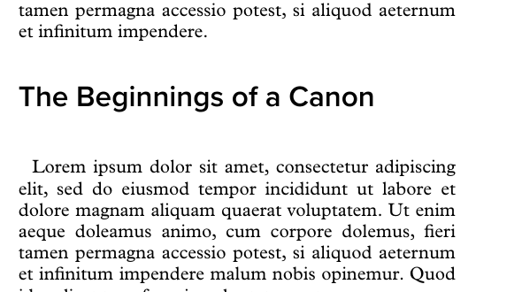
  >
  > 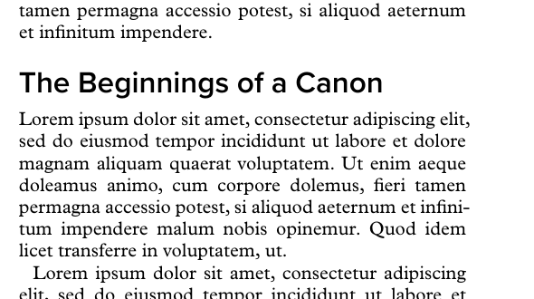
  >
  > 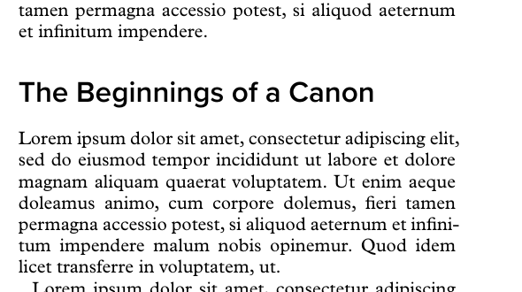
  >
  > 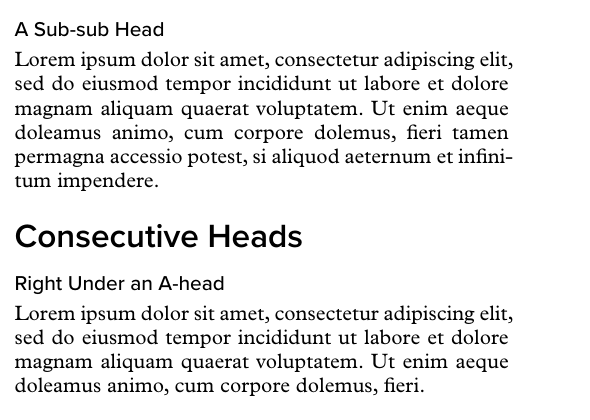

  > **jenna** · 2026-09-20 12:05 UTC  
  > B -- note that when you say "lines," it's not clear exactly what you mean, but I think you mean the baseline height lines for normal text. What we maybe should be using is the x-height, the cap height, or the leading of the head itself.
  > The other thing we haven't talked about is the nicety of having text lines align across a spread, in which case maybe that is why you were using the text lines as your multiple. Can you show me a quick comp of:
  > - a spread that has an A head on, let's say, the left and no head on the right
  > - a spread that shows an A head on the left and a B head on the right
  > Of course, I mean heading 1 and heading 2, although I think for us, heading 1 is the chapter title, so it's really heading 2 and heading 3. That is ongoingly confusing. By the way, I wish there were a better way to name our styles so that we're not fighting with that all the time. And yes, I think we want a guideline that we don't have consecutive heads. There should always be a paragraph of text between them, but since people will break that rule, I'm glad that you've shown a look for that.

  > **shelley** · 2026-09-20 12:11 UTC  
  > B is LIVE (commit 4bdea44; template is read at build time, so every proof from now on has it). go test green; typography sampler rebuilt; one real proof on mcheck built clean; TYPOGRAPHY.md updated with the numbers.
  >
  > “Lines” — yes, exactly what you guessed: one body line = baseline-to-baseline of ordinary text, 11.625 pt here (10-pt Plantin + 4.8 pt leading). That is the unit precisely because of the spread question: if a head displaces a whole number of body lines, the baselines on the head page fall back onto the same grid as the facing page. The head’s own x-height / cap-height / leading don’t enter into the arithmetic — they only shape how the head sits inside its slot (Geist Semibold 13 pt reads as sitting a touch low in a 2-line slot, hence the 2:1 rather than 3:1). I nudged the below-values by a fraction of a point so both slots round exactly: A-head displaces 4 body lines, B-head 2. Measured: the last baseline on all four comp pages is the same (441.25 pt).
  >
  > Comps (red rules = the body baseline grid taken from the plain page, drawn straight across both pages):
  > 1. A-head (Heading 2) on the left, no head on the right — the lines after the head sit on the rules.
  > 2. A-head left, B-head (Heading 3) right — the B-head itself floats between two rules (heads needn’t sit on the grid), but its text lands back on them.
  >
  > Naming: agreed it’s a nuisance. Word only has Heading 1/2/3 and the no-template path depends on those names, so the Word side can’t change; what I can do is say “Heading 2 (A-head)” / “Heading 3 (B-head)” everywhere in our docs and UI — one convention, both names side by side. I’ll do that pass after the workshop unless you want it now.
  >
  > Guideline added to TYPOGRAPHY.md: no consecutive heads — always a paragraph of text between an A-head and a B-head; when someone does it anyway they stay together (sticky) and the B-head keeps its full above-space. Half-gap for that case: after the workshop.
  >
  > 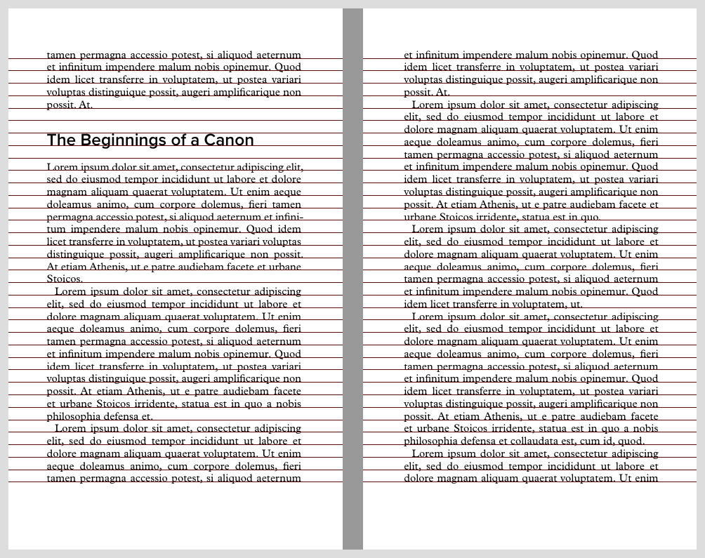
  >
  > 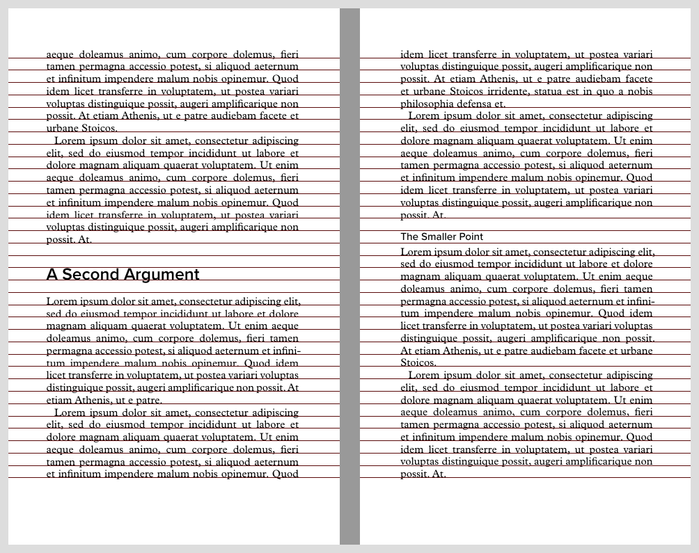

## 1 · Workshop watch (Mon 21 / Tue 22) — BOTH

- [ ] 4.1 `/admin/factory/` (Floor) on a second screen; Shelley session open with `factory-tail`
- [ ] 4.2 Attendees free via hand-granted passes (New pass form) — no coupons, no $0 checkouts
- [ ] 4.3 Watch for `build failed`, `401` bursts (password confusion), builds "queued" (> 2 at once)

  > **shelley** · 2026-09-21 16:37 UTC  
  > **build failed — fixed, no restart.** 16:10 UTC, skhoo / *Transcendence and Immanence* (project 31, book 45, proof): “pagebreaks are not allowed inside of containers”. Cause: his front matter is Half Title → Title → Subtitle ×2 → Copyright ×3 → Dedication → Epigraph. Pandoc only lifts *Title* into metadata when it's the very first paragraph; here it wasn't, so Title + Subtitle reached the Lua filter as paragraphs that the book map had already dropped and not counted — every front-matter piece boundary shifted by 3 and the Copyright paragraphs landed inside the dedication/epigraph containers, where the copyright page's pagebreak is illegal. Fix `26ff8e9`: the filter drops Title/Subtitle exactly like the map does (regression test mirrors his file). The filter is read from disk per build, so it's live already — **no restart, nothing in flight touched.** Verified: his own failed book.typ now compiles (124 pp) with the fixed filter; mcheck proof smoke green (0.4 s). **Ask Sam to press Build again** — his upload is still there, no re-upload needed.

  > **jenna** · 2026-09-21 17:10 UTC  
  > Is this resolved?

  > **shelley** · 2026-09-21 17:10 UTC  
  > **Yes, resolved on our side** — fix live since 16:37 UTC, and I've since run Sam's own file (the newer .docx you sent me) through the live pipeline on mcheck: proof built green, 224 pp, front matter as designed (his typed ©/CIP dropped, dedication and epigraphs on their own pages). **Still open on his side:** he hasn't pressed Build again yet (no build on project 31 since the 16:10 failure). Tell him to hit **Build → Proof** on his factory page; upload is intact, nothing to redo. If it fails again I'll see it here within seconds.

  > **shelley** · 2026-09-21 17:35 UTC  
  > **Second one, from chat — Toby / *Devotion* (project 29), 'weird output'. Fixed live (`0a3d…` see git), no restart.** Ours: (1) each `[[verse]]` line became its own poem block with padding above and below → double-spaced look; consecutive Verse lines now merge into one block per stanza. (2) A bare `[[break]]` paragraph was empty after the marker came off and pandoc drops empty paragraphs → every stanza break vanished; the break now survives. Verified on mcheck with his file (book 54): lines stack, stanza gaps show. His file: poem titles (REMINDER, ONE SEASON…) are plain Body A caps, not Heading 1 — so no poem-per-page, no contents; fix = Heading style in Pages, or `[[h1]]` at the start of the title line. And `[[verse2]]`/`[[verse3]]`/`[[break2]]` aren't styles (his invention for indented lines) — they print literally in 28 places; remove or use plain `[[verse]]`. Verse is still centred italic — that's our design for a poem quoted in prose; a poetry-collection shape is **5.23** (after workshop). He should press Build → Proof again.

  > **shelley** · 2026-09-21 17:35 UTC  
  > (commit for the Devotion fix is `3411728`, pushed.)

- [ ] 4.4 Tue night: `prodcal-store-live.timer` still armed; Wed 00:00 HKT go-live email + `/api/public/store/config` says live
- [x] 4.5 ME — Sunday: merge `index-addon` (5.13), smoke index draft + build on mcheck, push jdbbs-public, post Ghosts index v2 pages
- [x] 4.6 ME — Sunday: pre-workshop pass (attendee login → upload → Inspect → proof → final on mcheck; Floor shows it); tag `checkpoint-2026-09-20-pre-workshop-v3`

  > **shelley** · 2026-09-20 00:28 UTC  
  > Pre-workshop pass done on mcheck/book-001 as the attendee (no admin header): sign-in → upload mcheck-book2-clean.docx (book 39) → Inspect (0 high / 3 med / 8 low) → Build proof (PROOF footer) → Export final (clean 47-pp PDF, ledger 4/6, “Final files ready” email to bookiq) — Floor row updated live (screenshot). Also fired one real sign-in-link email for mcheck to bookiq@gmail.com at 00:17 UTC — that is the attendee path; click it when you see it and tell me if it lands you on the factory page. Tagged checkpoint-2026-09-20-pre-workshop-v3 (pushed). Note: the mcheck client password was reset for this test (new one in my scratch); the sign-in link path is unaffected.
  >
  > 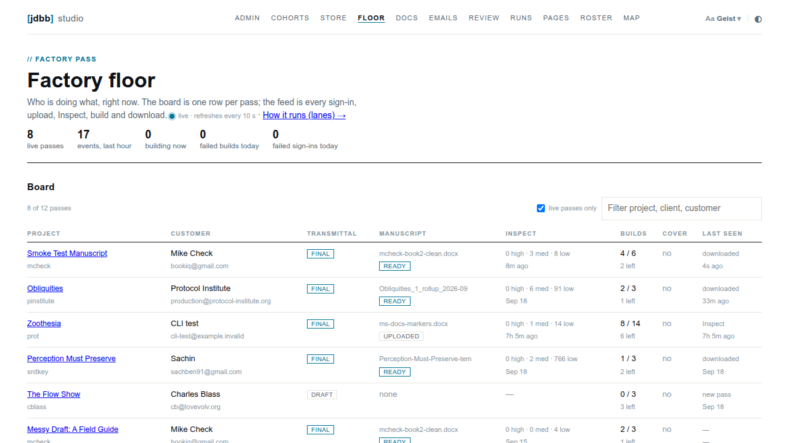

## 2 · Your side — YOU

- [ ] 2.8 Your colour-image book: run Inspect; tell me what it says about the images + how the PDF grey looks
- [~] 0.10 **/press page** (model: desertant.com/press) — DRAFT LIVE at /press; YOU fill the [bracketed] bits (bio, entity, founded, city). [thread](/admin/runs/PUNCHLIST-2026-09-19-list3)

  > **shelley** · 2026-09-19 12:37 UTC  
  > Draft is up: https://jdbbs.exe.xyz/press — same skeleton as Desert Ant’s (lede · About · Facts · Products · Brand assets · The studio), in our chrome. Everything on it is true today except the orange [bracketed] bits, which are yours to fill: one sentence of biography if you want it, legal entity (or delete the line), founded year, city. Their “Independent research” block I left out — we don’t have third-party numbers yet; if you have a quote or two (Bringhurst, a press stat), that’s where they’d go. Wordmark SVG and a 1200×630 social card are the missing assets; I can generate both from the favicon outlines when you want them.
  >
  > The colour: done, and it’s live app-wide. Background went from our cool #FCFDFD to their #FBFAF4, and the hairlines/progress tracks moved to the same warm axis so nothing looks blue against it. Text and the cyan are unchanged. For scale: Anthropic’s cream is #F0EEE6 — ours is now about a fifth of the way there from white, which is the “hint, not tint” you asked for. Hard refresh to see it; if it reads as too much or too little on your screen, say and I nudge one value.

  > **shelley** · 2026-09-19 12:40 UTC  
  > Brand assets are no longer “to follow”: wordmark SVG (paper and ink versions, plus [jdbb] alone) and a 1200×630 social card are generated from the JetBrains Mono outlines and linked on the page; the page also carries the og:image so a pasted link shows the card. Left for you: the four orange placeholders.

- [~] 0.14 **jdbb.net as main contact domain** — ideas posted, discuss in chat; no build. [thread](/admin/runs/PUNCHLIST-2026-09-19-list3)

  > **shelley** · 2026-09-19 12:49 UTC  
  > Ideas only, as asked. Two separate things: where mail goes OUT from (the factory’s automated sends) and where people write TO you (contact address). They don’t have to be the same domain, and today they aren’t: sends go from factory@mail.jdbb.studio (Resend, set up yesterday, with SPF/DKIM so they land), and Reply-To on every one of them is j@djinna.com.
  >
  > Options for the contact side:
  > 1. Keep sending from mail.jdbb.studio; make j@jdbb.net (or hello@) the public contact and Reply-To. Cheapest: point jdbb.net’s MX at whatever already hosts your mail (Fastmail/Google/iCloud+ all take custom domains; you already own the name, so it’s a DNS change and an alias — an hour). Nothing on our side changes except one env var for Reply-To and the address on /press, /factory, the footer.
  > 2. Send from jdbb.net too (factory@jdbb.net) — add jdbb.net as a second Resend domain, three DNS records, and switch PRODCAL_MAIL_FROM. Half an hour, but only worth doing if you want one domain everywhere. Warm-up caution: a fresh sending domain right before the workshop is the one thing I’d not do this week.
  > 3. jdbb.studio as an inbox — it is only a sending subdomain today; receiving there means an actual mailbox provider or Resend’s inbound (which forwards to a webhook, not a mailbox — fine for the factory to read replies programmatically, wrong for you as a person).
  >
  > Redirects: web-side is easy — jdbb.net → jdbbs.exe.xyz is one exe.dev proxy/DNS setting, and both names can serve the site. Mail-side “redirect” is just forwarding, also easy.
  >
  > My pick: 1 now (after the workshop, as you say), and decide on 2 after you’ve seen a few weeks of real mail. Happy to chat whenever; nothing is built.

- [ ] 5.17 **About the Book Factory** text — YOU pick A / A′ / B (drafts on the notes) + edit placeholders; then ME: colophon checkbox on the transmittal. [thread](/admin/runs/PUNCHLIST-2026-09-19-list3)

  > **shelley** · 2026-09-18 17:19 UTC  
  > Drafts are ready for your read (not ticking until you have): docs/brand/ABOUT-THE-BOOK-FACTORY-2026-09-18.md — also in the repo on GitHub. Three lengths: A colophon for the copyright page (78 w), A′ one line after the typesetting credit (26 w), B a back-matter page headed “About the Book Factory” (~490 w). Voice: plain third person, says what happened to the book, no adjectives; the URL is the only sell. Once you pick and mark up the wording I wire it as a transmittal checkbox (off by default): copyright-page colophon, or back-matter page, or both. The one-liner, so you can judge the voice here: “Set from the author's Word file by the jdbb studio book factory, print and EPUB from one source, no hand-composed pages. jdbbs.exe.xyz/factory”

  > **shelley** · 2026-09-18 17:59 UTC  
  > Sorry — I left these in a repo file, which you can’t open from this page. Here they are in full. Three lengths; the numbers are true of every build today (thirteen styles, ~9 s).
  > A. Colophon (copyright page, small type) — 78 words
  >  This book was made in the jdbb studio book factory. The author wrote it in Word, in a template of thirteen named styles generated from a one-page transmittal; the factory read the file, reported what it found, and set the print interior and the EPUB from that single source, in licensed type, with no hand-composed pages. Corrections are rebuilt the same way, so every copy of this edition is set from the same file. jdbbs.exe.xyz/factory
  >
  > A′. Colophon, shortest (one line after the typesetting credit) — 26 words
  >  Set from the author's Word file by the jdbb studio book factory, print and EPUB from one source, no hand-composed pages. jdbbs.exe.xyz/factory
  >  ---
  >
  > B. Back-matter page — "About the Book Factory" — 486 words
  >  **About the Book Factory**
  >  This book was not typeset in the usual sense. No one placed its pages by hand. It was built by the jdbb studio book factory, a small machine for turning a Word file into a book, and this page says how, because the method is part of what you are holding.
  >  The author wrote in Word, in a template the factory generated for this title. The template has thirteen named paragraph styles and nothing else: Normal, First Paragraph, three levels of heading, Block Quote, Epigraph, Verse, Code Block, Section Break, Copyright, Signature and Glossary Entry. Every paragraph in the manuscript carries one of those names. That is the whole contract between writer and factory. There is no software to learn and nothing to install; the work of authorship stays in the tool the author already used.
  >  Before the writing began, the author filled in a transmittal: a short form that records what the book is and how it should be set. The page size. The front matter — a dedication, an epigraph, a foreword — and its order. The copyright page, which the factory composes from the transmittal rather than asking anyone to type it. Special characters, mathematics, custom styles the book needs. The transmittal is the specification; the template is generated from it; the finished book follows it.
  >  When a draft was ready, the author uploaded it and the factory inspected it: a machine read of the file that reports which styles were used, where the file departs from the template, how many images it found and how large each will print, where the chapters begin. The report is the factory's reply. The author fixes what it flags and uploads again, for as long as it takes.
  >  Then the build. From that one Word file the factory produces two things at once: a print-ready interior PDF at the trim size on the transmittal, and an EPUB with the author's cover embedded. The interior is set in the studio's house design — a typographic system of margins, type sizes, running heads and spacing worked out once and applied to every book that passes through — in fonts the studio licenses for print. The two editions come from the same source, in the same pass, so they cannot drift apart.
  >  This matters after publication. A book set by hand is finished when the typesetter stops; a correction means opening the files again and hoping the lines still fall where they did. A book from the factory is set from its source every time. Fix the Word file, rebuild, and every page is composed afresh, in seconds. The edition you hold is one build of a file that can be built again.
  >  The factory is the work of jdbb studio, a one-person book studio that published books the ordinary way for thirty years before deciding that the ordinary way was mostly waiting. It is offered to anyone with a manuscript and a few hours. If you have written something and would like it to become a book like this one, the factory is at **jdbbs.exe.xyz/factory**.
  >  ---
  >  #
  > Notes for Jenna
  >  - "thirty years" and "one-person" in the last paragraph are placeholders for whatever is true; cut the sentence if you'd rather not do biography here. - "thirteen named paragraph styles" is true as of today (Signature and Glossary Entry added 2026-09-18). If the count changes, this line and the colophon change with it. - "in seconds" — a full build of a 250-page book is ~9 s on the VM; true. - The page is ~490 words; at 6 × 9 it fills one recto with air. If you want it on one page in Small trim, cut paragraph 4 (Inspect) to two sentences. - Suggested placement: last page of back matter, after About the Author, so the book ends on the author and then the maker.

- [ ] 5.21 Plantin MT Pro **Bold** OTF — YOU supply; never committed (`docs/IDEAS.md`)

  > **jenna** · 2026-09-19 23:23 UTC  
  > Plantin MT Pro has a number of additional weights here:
  > https://www.myfonts.com/collections/plantin-font-monotype-imaging?tab=individualStyles&queryId=528c97356d6d7a6392092edbbe2aa71d&index=universal_search_data&objectIDs=9044565001
  >
  > I've wanted to keep our page design choices pretty simple to start with, but I'm also aware that it would be nice to let people choose their own typefaces. Can you look to see if MyFonts.com has an API that we could connect to and allow people to choose and purchase font licenses for themselves? This is obviously a big topic, but maybe it wouldn't be that hard. For now, just do a first scout, and let's discuss feasibility before we try to build anything. The current session is long, so add this to our work notes for after the next compaction.

  > **shelley** · 2026-09-19 23:23 UTC  
  > Noted — parked for after the next compaction, as a scout + discussion, no building. Written into the handoff (addendum 13) so it survives. Quick prior from what I already know, to be checked properly then: MyFonts (Monotype) has no public purchasing API — licences are bought through their web checkout, and the files are delivered to the buyer, so a "choose and buy from inside the factory" flow would most likely be a referral link out to MyFonts plus an upload of the purchased files back to us (with the licence type mattering: desktop vs. the server-side use our build does). Monotype Fonts (the subscription) has an API but it's for the subscriber's own apps, not resale. I'll confirm all of that and lay out the two or three realistic shapes before we discuss.

## 3 · Talk deck (Wed 23) — BOTH

- [ ] 3.2 YOU — cut / reorder / add beats

  > **shelley** · 2026-09-20 18:21 UTC  
  > Your Mac/Claude deck is up, untouched: **https://jdbbs.exe.xyz/2026-pi-symposium/og-protocols** — “Books are OG protocols”, 26 slides. The saved HTML had everything inlined (46 webp images + the two title videos, 11 MB) except the Google-fonts CSS, which pointed at a local `_files/` folder; I inlined that one file into the head and changed nothing else. Loads clean here: title video plays, JetBrains Mono renders, arrow keys step, Notes (N) toggles, no console errors. The existing deck at /2026-pi-symposium/talk is still there for comparison. Tell me what you want changed and I’ll work on this copy.

- [ ] 3.4 BOTH — run-through in the browser; timing
- [ ] 3.5 ME — push; link in the handoff

## 4 · In flight — ME

- [x] 0.25 **Word-free authoring** — done: contract = Heading 1/2 + `[[marker]]`, no template needed; /factory#bring, /workshop#bring, handoff card, .odt template live; outcome §5 in the [note](https://github.com/djinna/jdbbs/blob/main/docs/reviews/WORD-FREE-AUTHORING-2026-09-19.md). Open: a real Pages export (2.x)

  > **shelley** · 2026-09-19 17:05 UTC  
  > Found it: it was 0.6 (Thu 20:13) — but that only listed workarounds (Word for the web, LibreOffice, Docs + [[style]] markers, a 365 trial), it never asked your real question: does the factory still need Word at all? Logged here as its own item; I'll take it on after the compaction and post a decision note rather than a patch.

  > **jenna** · 2026-09-19 17:05 UTC  
  > nice, good plan

  > **jenna** · 2026-09-19 17:12 UTC  
  > can you tackle 0.25 in parallel with 0.24?

  > **shelley** · 2026-09-19 17:25 UTC  
  > Decision note: docs/reviews/WORD-FREE-AUTHORING-2026-09-19.md (on GitHub; full evidence in scratch/wordfree/). Short answer: the factory does not need Word. It needs a .docx whose paragraphs carry the template's 13 style names — Inspect (python-docx), the book map (styles.xml), the [[style]] pre-pass and pandoc's docx+styles reader all key on the style *name*, nothing else. Tested today on the VM, no builds, no credits:
  > - Google Docs + [[style]] markers: byte-identical Typst to the Word baseline; live Inspect on the zoo project came back 0 high, markers listed, book map right. Already works; only documentation is missing. Caveat: no inline (character) styles, and authors never see the styles before the proof.
  > - LibreOffice Writer: opens the template .docx with all 13 styles intact; round trip through ODT and back gave byte-identical Typst. Free, offline, all platforms. Documentation only.
  > - Word for the web: Friday's upload (book 21) kept every template style name — the file was fine, the editor was the janky part.
  > - Apple Pages: renaming Heading 1→Heading alone loses every chapter and trips two high Inspect findings. A 30-line normaliser fixes it in simulation, but I couldn't get a real Pages export (not in the DB) — need one file from the tester before building it.
  > - Markdown: pandoc's fenced divs feed the same Lua filter, and md → template .docx → normal pipeline was byte-identical. S for a CLI script; M to accept .md at upload. Right for the API audience, not for workshop authors.
  > - Our own browser editor: L, recommend against — it would only exist to emit the same 13-style .docx the tools above already produce.
  > Monday (freeze on): say "you need a .docx in the template's styles, not Word"; order = Word/Word online → LibreOffice → Docs + markers; say avoid Pages for now. The /factory and /workshop pages are public docs, so the "No Word? Three ways in" box from 0.6 is copy, not code — your yes and it's twenty minutes.
  > Next month: document Docs+markers as first-class (S) and run markers before the book map in Inspect (one-line nit); get one Pages file and add the normaliser (S); Markdown→template script for the CLI crowd (S).
  > Decisions for you: 1) Monday framing + the three-ways box, go? 2) advertise Docs+markers, or keep as workaround? 3) Pages: chase the tester's file, or drop Pages? 4) Markdown: CLI only, or accept .md on the factory page? 5) confirm no browser editor this year.

  > **jenna** · 2026-09-19 17:53 UTC  
  > Good notes, but watching the two folks work through the factory yesterday afternoon made clear that applying our Word template that is exported (applying the styles in the template that we export onto their document) is non-trivial. The additional factor is that Google Docs doesn't allow any custom styles, so there's no way to grab those.
  >
  > I think if they have an existing document, we need to be more proactive with coaching on a good round trip: either importing the factory styles into their current document or bringing their text over safely into our template. Both ways seem more fragile than I'm comfortable with. Think some more about that.
  >
  > Actually, now that you mention LibreOffice Writer, maybe we offer more export choices and stop doubling down on Word. I'll stop thinking aloud now. Let's discuss this a little bit more before we do anything else.

  > **shelley** · 2026-09-19 17:54 UTC  
  > Agree with the diagnosis, and I think it points somewhere cleaner than "more export formats."
  >
  > **The fragile thing is moving style *definitions* between documents.** Both round trips you describe do that: importing our 13 styles into their file (Word's Organizer is hostile, LibreOffice's Load Styles is one dialog but still a step, Docs simply can't), or pasting their text into our template (either loses italics or drags their formatting along). Every editor makes this hard because it's genuinely a cross-document operation. No amount of coaching makes it not fragile.
  >
  > **What the pipeline actually needs is much smaller than "our template."** I checked the test file from this afternoon: a document with *only* Word built-ins — Normal, Heading 1/2/3 — plus `[[quote]]` / `[[verse]]` / `[[epigraph]]` markers where needed builds byte-identical Typst to the templated Word file, and Inspect on the zoo project came back clean. So for an existing manuscript the whole contract is:
  > 1. chapter titles → Heading 1 (every editor has it: Word, Docs, Pages, LibreOffice)
  > 2. sub-heads → Heading 2
  > 3. the handful of special blocks → type `[[quote]]` (or verse, code, epigraph, dedication, caption…) at the start of the paragraph
  > 4. export .docx → Inspect (free, no credit) tells you what it found.
  >
  > Markers move *intent as text*. They survive copy-paste, email, Docs, Pages, Word online — anything. Nothing has to be imported anywhere. That's the robust primitive, and it's already live.
  >
  > **So the reframe:** the template stops being *the* way in and becomes a convenience for people starting fresh (it shows the styles; nice in Word or LibreOffice). For everyone with an existing document: "Heading 1 for chapters, a marker for anything special, export, Inspect." One page, one slide. Pages becomes usable with the 30-line normaliser (its "Heading" → Heading 1, "Body" → Normal) — post-freeze, once we have a real export.
  >
  > **On offering more export choices:** cheap and I'd do it — .docx and .odt of the template (LibreOffice headless converts it; the .ott styles carry over, verified today), and a Docs "make a copy" starter with the markers demonstrated in place since Docs can't hold the styles. But I'd frame them as three starters, not three ways to move styles. Not "stop doubling down on Word" so much as "stop making the template the gate."
  >
  > **Honest costs:** markers are visible in the manuscript until the build removes them (authors may find that odd — it's a one-sentence explanation). No inline character styles by marker (italics/bold pass through as-is, which is fine; small caps would need the template). And Inspect should run the markers pass *before* the book map so its report matches the build — one-line fix, post-freeze.
  >
  > **Monday, copy only (freeze):** a "Bring your manuscript" checklist — the four steps above — on /factory and the workshop page, with the marker list; template offered as .docx (+ .odt if you like) under "starting from blank." I can draft the copy tonight for your read; nothing publishes till you say.
  >
  > Where I'd like your steer: (a) does the "template is optional, Heading 1 + markers is the contract" framing sit right with you for the room Monday? (b) .odt export of the template — yes? (c) want the draft checklist tonight?

  > **jenna** · 2026-09-19 22:06 UTC  
  > this is pretty great news 
  > > 1. chapter titles → Heading 1 (every editor has it: Word, Docs, Pages, LibreOffice)
  > 2. sub-heads → Heading 2
  > 3. the handful of special blocks → type `[[quote]]` (or verse, code, epigraph, dedication, caption…) at the start of the paragraph
  > 4. export .docx → Inspect (free, no credit) tells you what it found.
  > Go ahead and take a swing at A, and maybe in small type we can offer B, the ODT export, for folks who really do want to use Word. It's interesting to think of a small, one-book-at-a-time kind of place versus a larger small publishing company that might want to push a book a week through the pipeline. I'd like to be able to accommodate both.

  > **shelley** · 2026-09-19 22:11 UTC  
  > A + B are live:
  > - /factory#bring — "Bring your manuscript — from any editor": the four steps, the marker list (only names the pre-pass actually resolves: quote, verse, epigraph, code, break, signature, [[/quote]] to close a run), export instructions per editor, then small type: template as .docx or .odt for people starting blank; Docs can't hold styles so use markers; Pages honest note ("run Inspect and tell us"). Last paragraph is the book-a-week case: markers are plain text, so a press's house style guide can say "[[quote]] before every extract" and any author in any editor produces a file the factory reads; API link for scripted intake.
  > - /workshop#bring — "What to bring — and what you don't need", same four steps, short, linking to the factory page.
  > - The transmittal handoff card (after Mark Final) now leads with "Already have a draft? Heading 1 / Heading 2 / [[quote]]… No template needed." and offers the template second: .docx · .odt (small).
  > - .odt is real: /api/projects/{id}/word-template?format=odt converts the generated template with the LibreOffice already on the VM (tested on mcheck: 46 KB, all 13 styles present). One small pipeline addition on a freeze day, additive only, tests green.
  > Not changed: "How a build works" step 2 now says "from any editor that saves Word files" instead of "Write in Word, in your template". Factory app's drop zone still says "Drop your Word file here" — that's the file type, fine.
  > On one-book vs book-a-week: the contract is the same for both; what differs is who applies it. For the solo author, the page. For a press, a one-paragraph house rule + the API. If you want, a short "For presses" page later (post-freeze) could give them the style guide paragraph verbatim to paste into their author guidelines.
  >
  > 
  >
  > 

  > **shelley** · 2026-09-20 00:36 UTC  
  > Closing this one: §5 “Outcome” added to the decision note (what shipped: /factory#bring, /workshop#bring, handoff card, .odt template; your decisions from §4 recorded). The only thread left is Pages — I still want one real Pages-exported .docx from a tester before writing the style normaliser; if you get one, drop it on a new inbox item.

  > **shelley** · 2026-09-20 16:15 UTC  
  > Public page, per your ask this morning: **https://jdbbs.exe.xyz/word-free** — “The template was never the protocol.” It’s this thread turned into a field note you can share: the question, the first (wrong) answer, your 17:53 pushback and the 17:54 reframe quoted near-verbatim, the four-step contract in a box, seven protocol lessons (smallest signal the receiver reads · state transfer is where protocols break · intent as text · shared vocabulary · free conformance check · gate vs convenience · say the costs), and a timeline. Source in jdbbs-public (`word-free.html`, publishes on save), route + Pages-registry row in prodcal; both pushed. Read it once for tone — anything you’d cut or soften, say so here and I’ll edit.

- [~] 0.9 **Factory-to-factory API for your 3 customers** — A) pinstitute ✓ (22), vgr ✓ (7), monstrous ✓ (28); B) `factory.py` tool + [hand-out draft 1](https://github.com/djinna/jdbbs/blob/main/docs/FACTORY-FROM-YOUR-DESK-2026-09-20.md) — YOU play all three today (ids/tokens in the private note); finals gate off till Wed. [API page](/factory/api)

  > **shelley** · 2026-09-19 12:25 UTC  
  > First think, in plain terms. Two very different things are hiding in this item, and I’d separate them:
  >
  > **A. Portals for your three customers (Monday-showable).** This is *not* new code. ProdCal is already multi-tenant: each customer is a client slug with a portal at /{client}/ and a Factory Pass per project. So “a portal for each of the three” = three passes on this VM, today: Admin → Store → New pass (name, email, project). Each gets /{client}/{project}/factory/ with transmittal, Inspect, builds. One VM, one codebase, always in sync because it *is* the app. Handing it to them = sending the login. I can set all three up in fifteen minutes if you give me names + emails + working titles; you did one earlier today (snitkey). Separate VMs would mean three copies to keep in sync and three sets of licensed fonts — worse, not better.
  >
  > **B. “Hit the book factory from their own factory” — the API.** The Factory Pass API already exists and is documented (docs/API.md, docs/specs/FACTORY-PASS-API-2026-09-03.md): upload a .docx, POST /api/books/{id}/convert, poll, download PDF/EPUB, all against a project the pass owns. What’s missing for an outside program (or an outside agent) to use it:
  >  1. **A token instead of a browser login.** Passes authenticate via a cookie; a program needs `Authorization: Bearer <pass token>`. Small server change; the pass already has a secret.
  >  2. **A one-page “build a book from the command line” recipe**: curl upload → convert → poll → download, plus the same as a 30-line Python script. This is the demo for Monday: “here is a book being built from a terminal, no browser.”
  >  3. **Machine-readable Inspect and build errors** (both exist as JSON already; document them).
  >  4. Later: webhooks when a build finishes; a spec/transmittal PUT so the caller can set trim/title without the form.
  >
  > Plan: fresh session, starts from a copy of the API doc, does 1+2 today (2–3 h), demo = the Python script building Ghosts on project 14. It touches srv/auth for the bearer path and adds docs; it won’t collide with what I’m doing here (transmittal, template, filters). A is a 15-minute task in either session — send me the three names.

  > **shelley** · 2026-09-19 12:42 UTC  
  > B is in progress (subagent): Bearer-token alias, a one-page curl recipe, and a stdlib-only Python script that uploads → builds → downloads. A still needs the three names/emails/working titles from you.

  > **shelley** · 2026-09-19 12:49 UTC  
  > B landed (ba069b6): `Authorization: Bearer <project token>` works on every factory endpoint; docs/API-CLI-RECIPE-2026-09-19.md is the one-page curl recipe; scripts/factory-cli.py (stdlib Python, ~60 lines) does upload → build → poll → download, or inspect. Tested end to end on Ghosts. This is your “their factory calls our factory” demo for Monday: a book built from a terminal, no browser. A (the three passes) still needs names.

  > **jenna** · 2026-09-19 15:52 UTC  
  > This all sounds great. Not sure what I can look at to see what we've got. Is this something we add to the factory sales page, or is it a separate page that we link to? Not sure how to present this option on the website. Also, I want to add it into what I use for the workshop on Monday and Tuesday, and my session on Wednesday. Help me think this through?

  > **shelley** · 2026-09-19 15:55 UTC  
  > **What exists to look at (nothing public yet):** the recipe `docs/API-CLI-RECIPE-2026-09-19.md` (on GitHub; I can render it at a URL) and `scripts/factory-cli.py`. The demo is a terminal: `python3 scripts/factory-cli.py build ghosts.docx` → PDF and EPUB land in the folder, no browser.
  >
  > **Website — my recommendation: both, but unequal.** The `/factory` sales page is written for an author; keep it that way and add one short section near the foot, after “How it runs”: *“Have your own factory? The book factory is an API. Everything the page above does, a program can do — upload, inspect, build, download — with one token.”* → link. The link goes to a **separate page, `/factory/api`**: the recipe rendered as a public doc (same treatment as `/factory` itself — a file in jdbbs-public, so you can edit it in the doc editor). Reason: the API audience is a publisher’s tech person or someone’s agent, not the author reading the price; give them their own page and keep the sales page short. I can put both up Sunday (one small route + one HTML file; no risk to the app).
  >
  > **Workshop Mon/Tue:** participants live in the browser factory. The API earns *one* 90-second moment at the end of the build session: “this is the same factory” — I run the CLI on a manuscript on screen, the PDF appears, and the point lands: the web page is just one door into it. Nothing for them to do.
  >
  > **Wednesday session:** it’s the closing argument of the *machine factory* idea: the swim-lane diagram on `/factory` (“How it runs”) shows four lanes; the API slide says *any* of the top-lane work can be done by a program or an agent, and here are the four calls. One slide of the curl recipe, one slide of the diagram. If the Index add-on PDF lands today, that’s the third slide: a machine-drafted index, reviewed by a human.
  >
  > Say yes and I’ll do the page + section Sunday morning, and hand you a 6-line demo script for the terminal moment.

  > **jenna** · 2026-09-19 16:33 UTC  
  > yes but let's go now, no need to wait for tomorrow (why do you keep saying that lol)

  > **shelley** · 2026-09-19 16:41 UTC  
  > Gone now (c. 17:05). Three pieces, all live:
  >
  > 1/ **https://jdbbs.exe.xyz/factory/api** — public page, the whole recipe: what you need (id, token, pass), then the six calls with real responses (pass → upload → inspect → build → poll → download), a one-screen version, the Python script, "also callable", and an error table. Public-tier chrome like /factory/terms; listed in Pages. Dark mode + 390 px checked.
  >  
  >
  > 2/ **/factory** has a new section above Redeem — "Have your own factory? It's an API" — three sentences and a "Read the recipe →" link.
  > 
  >
  > 3/ **Terminal demo for the room**: `scripts/factory-demo.sh` — prints each command in colour before it runs, so people read along. `TOKEN=… P=14 scripts/factory-demo.sh ms.docx` does pass → upload → inspect (free, ~5 s). Add `--build` to spend a credit and watch it poll and download both files (~15 s for the sample chapter). I ran it against prot/zoo (id 14, the CLI test project — 6 credits left, token in scratch/zoo-token.txt) — never against pinstitute. The Python script is also downloadable at /factory/api/factory-cli.py.
  >
  > Left as [~] until you've read the page; then 0.9A (three passes) still needs the customer names from you.

  > **jenna** · 2026-09-20 12:30 UTC  
  > > A) three passes on this VM (need names from YOU)
  > pinstitute
  > monstrous
  > vgr

  > **shelley** · 2026-09-20 12:33 UTC  
  > Two of three done, no builds spent:
  >
  > • pinstitute — already had a pass (Obliquities, project 22; 1 credit left of 3). Minted its API token. Browser login is unchanged (token is an extra door, not a replacement).
  > • vgr — Venkatesh already exists as a client with one project, The Twitter Years (project 7, from Feb). Attached a fresh admin pass to it (pass 13, 3 builds, expires Mar 2027) and minted a token. Portal: https://jdbbs.exe.xyz/vgr/twitter-years/factory/ — if his factory should point at a different book, say so and I’ll make a second project instead. No email on record for him.
  > • monstrous — nobody by that name here yet. A new client needs three things from you: customer name, email, working title (plus author name if different from the customer). One line on this item and it’s two minutes.
  >
  > Both tokens verified from outside (no admin header): no token → 401, Bearer → 200 on /pass and /transmittal. They are on the VM at scratch/customer-tokens/project-{22,7}.token (not in git). Handing over = you send the customer their project id + token + https://jdbbs.exe.xyz/factory/api (or tell me to email it and to whom). Never a build on pinstitute from me.

  > **shelley** · 2026-09-20 12:46 UTC  
  > Got it — snitkey → monstrous, done.
  >
  > • Renamed the client: portal is now https://jdbbs.exe.xyz/monstrous/book-001/factory/ ; the old /snitkey/… address 301-redirects, so his bookmark and Friday's email still work. Pass 11 (1 of 3 builds used) and his book came along. API token minted for project 28 (scratch/customer-tokens/, not in git); verified from outside.
  > • Uncovered + fixed a real bug on the way: client rename had been failing with a FOREIGN KEY error since the sign-in-link table arrived (it references clients.slug). Now carried along, regression test added, deployed as a hotfix (2180f97). Any rename before today would have failed the same way.
  > • Display name is still “Sachin”. Want it “Monstrous” (the imprint) or leave the person's name? One word.
  > • Mouse type added under “Your name” on the /factory redeem form: one pass sets up one account and one book inside it; the account is named after the author (or you) and holds every later book; an imprint should say so in the title field and we'll name the account after it. Live now (public doc, no build). The same holds for the Stripe checkout on Wed, but there the fields are Stripe's — I can only put that sentence on the /factory Buy section, which I'd do after you've read this one.
  >
  > So all three factories exist: pinstitute (22), vgr (7), monstrous (28) — each with a token. Left on 0.9A: your word on the display name, and whether I send the three of them their id + token + /factory/api or you do.

  > **jenna** · 2026-09-20 13:17 UTC  
  > z I don't want to send any of them their information. I'm planning to set up three test profiles locally and run their books through myself. They're all part of the same group that I'm working with, and this will let me explore what it will take to get the factory to work before I ask them to do a bunch of clicking around on something while that isn't built out and tested yet. Can you start an instruction doc, maybe just as a GitHub page for now, for what we would hand people, and I'll work through it today to try it out? Tidy up for a compaction first, or, in fact, maybe we should get you to give me a prompt that I can take to a new conversation, since this one's getting long. wdyt?

  > **shelley** · 2026-09-20 13:19 UTC  
  > New conversation (cO7HTX2) — writing the customer hand-out now. One question before I start: by "locally" do you mean the browser on your Mac against jdbbs.exe.xyz, signed in as the three clients (that is where the accounts, passes and tokens live), or the Mac app (own database, no passes)? I am assuming the browser unless you say otherwise. Doc link follows here when it is on GitHub.

  > **shelley** · 2026-09-20 14:30 UTC  
  > **Hand-out, draft 1 (external wording, for you today):** https://github.com/djinna/jdbbs/blob/main/docs/FACTORY-FROM-YOUR-DESK-2026-09-20.md
  >
  > **The tool:** `factory.py` — one file, python3 only, lives in a folder with the manuscript. `setup` (asks project id + token once, saves `factory.json`) · `status` · `inspect ms.docx` (free, report opens in your browser) · `proof ms.docx` (free, PDF+EPUB → `out/`) · `final ms.docx` (asks to confirm; uses a final) · `download`. Download: https://jdbbs.exe.xyz/factory/api/factory.py — tested end to end on mcheck (inspect → proof → final → download, wrong-token and missing-file errors).
  >
  > **Gates:** the "no finals left" refusal is OFF for everyone until the store flips Wed 00:00 HKT (studio setting `finals_gate`; store-go-live turns it back on). Proof cap 30/day kept. Every build still counted. Commits 7d447c6, 3e1edc3.
  >
  > Private note with the three ids + where the tokens are follows below. Work through it as one of the three and tell me on this item where it snags — wording, a step you didn't expect, anything.

  > **shelley** · 2026-09-20 14:30 UTC  
  > **Private — your three test customers (not for the doc):**
  >
  > | client | project id | book | pass |
  > |---|---|---|---|
  > | pinstitute (Protocol Institute) | **22** | Obliquities | 1 final left (gate off, so finals still run) |
  > | vgr (Venkatesh Rao) | **7** | The Twitter Years | 3 finals |
  > | monstrous (display name still "Sachin" — your call) | **28** | Perception Must Preserve | 2 finals |
  >
  > Tokens are on the VM, one file each: `/home/exedev/prodcal/scratch/customer-tokens/project-{22,7,28}.token` — `ssh exedev@jdbbs.exe.xyz 'cat /home/exedev/prodcal/scratch/customer-tokens/project-22.token'` from your Mac. Paste into `setup` (terminal) or into the *Password* box on the factory page (browser profile) — same token works for both.
  >
  > Factory pages: https://jdbbs.exe.xyz/pinstitute/book-001/factory/ · https://jdbbs.exe.xyz/vgr/twitter-years/factory/ · https://jdbbs.exe.xyz/monstrous/book-001/factory/
  >
  > Suggested per-client folder: `mkdir ~/factory-pinstitute && cd ~/factory-pinstitute && curl -sO https://jdbbs.exe.xyz/factory/api/factory.py && python3 factory.py setup` — then drop the fresh manuscript in and follow the doc from §4. No emails are sent by any of this.

  > **jenna** · 2026-09-20 14:37 UTC  
  > Does our admin dashboard already have affordances for me to do the things that are needed to get someone else's factory API access set up? I probably should have a button or form that lets me create a new customer from scratch, rather than forcing them to go hit the factory page. For existing customers, I can look up or even roll their tokens. wdyt?

  > **shelley** · 2026-09-20 14:38 UTC  
  > **What exists today (admin):**
  > - **Create a customer from scratch:** Admin → Store → *New pass* form — makes the client + project + a hand-granted pass (3 finals), optionally sends the welcome email with their sign-in. That's the "don't make them hit the factory page" path, and it already exists. What it does *not* do is mint an API token — the customer comes out of it with a factory page and a password, not a project id + token.
  > - **Token:** Admin → Projects tab → *Set password* on a project (a prompt; you type the value) = the project token. *Remove password* clears it. That's how I minted the three yesterday, by hand.
  > - **Look up:** not possible, by design — tokens are stored hashed, like passwords. You can only **roll** (set a new one, hand it over once). Same as GitHub/Stripe.
  >
  > **Proposal — an "API access" affordance, ~1 hr:**
  > 1. *New pass* form gets a tick **"API access (mint a token)"**. On create, a one-time panel shows: *project id · token · the two lines to paste into an email* ("Your project id is 31. Your token is …. Tool + instructions: https://jdbbs.exe.xyz/factory/api"). Shown once, never again.
  > 2. Every pass row on the Store page shows the **project id** and gets an **"API token"** button: generates a random token (rolls if one exists), shows it once, same paste-ready lines. Also handles "roll it, it leaked".
  > 3. Passes page lists which projects have a token (badge), so you can see who's API-enabled.
  >
  > Nothing customer-facing changes; admin-only, so low risk in the freeze — but it *is* new code. Your call: **Hotfix-now** (today, Sunday, before the freeze) or **After-workshop**? Either way I'll do the three test clients by hand meanwhile if you need a token rolled.

  > **shelley** · 2026-09-20 14:39 UTC  
  > monstrous display name → **Monstrous Times** (done; portal header and the client list now say so). I left the pass holder as Sachin — that is the person the pass was issued to, shown as "Factory Pass for Sachin" on the factory page — say if you want the organisation there too.

  > **jenna** · 2026-09-20 14:39 UTC  
  > Let's go ahead and use Monstrous Times everywhere. Sachin is currently the only one accessing it, but that won't be true after they get going.

  > **shelley** · 2026-09-20 14:39 UTC  
  > Done — pass holder is Monstrous Times too. Factory page now reads "Factory Pass for Monstrous Times"; the book author stays Sachin (that is the name on the title page, from the manuscript/transmittal).

  > **jenna** · 2026-09-20 14:41 UTC  
  > > Your call: **Hotfix-now** (today, Sunday, before the freeze)
  > Yes your API admin access suggestions sound like the right direction. I have time today to mess around with the backend, and none of this affects the frontend, so I think we're okay to keep going.

  > **shelley** · 2026-09-20 14:45 UTC  
  > **API access in the admin — live** (`0842452`), Admin → Store (https://jdbbs.exe.xyz/admin/store/):
  > - **New pass** form: new tick **"API access (mint token)"**. Create → the result panel shows a one-time block — *project id · token · tool/instructions link · factory page* — with a **Copy** button. Paste into whatever you send them. Never emailed.
  > - **Pass rows** now show the project **#id** and an `api` tag when a token exists; each row has **API token** (mint) or **Roll token** (replace — old one dies at once, new one shown once).
  > - Tokens are hashed; there is no "show me the token" — only mint/roll. All four test projects show `api`.
  > - Verified on mcheck: rolled, old token → 401, new → 200.
  >
  > Also works for the second-book case (existing project #, tick API) — same one-time block.

  > **shelley** · 2026-09-20 16:35 UTC  
  > Inspect copy fixed ("reads your .docx"), and a global pass landed (`3b3af96` + jdbbs-public): the factory page (intake text, drop zone, wrong-file hint, Inspect, report footers), the Inspect report itself ("fix in your editor, export .docx again"), build-error messages ("We couldn't read this .docx. Export it again from your editor…"), the pass-welcome email, the **template-ready email** (it was still telling people to move text into the template or Import/Export styles — now: keep your draft, Heading 1/2 + [[quote]], template is for blank-page starts, .odt too), transmittal labels ("Authoring template"), landing, store description, nav title, /factory/api + /factory/terms, factory.py's error, the hand-out. Kept: menu paths ("Word → Save As → Word Document"), and the admin side's "Word Template" button — that's you. Tests green, deployed.

- [x] 5.13 **Index add-on, $100** — phase 2 built on branch `index-addon` (subagent report in); merge + smoke = 4.5. Design: [INDEX-ADDON-DESIGN](https://github.com/djinna/jdbbs/blob/main/docs/reviews/INDEX-ADDON-DESIGN-2026-09-19.md) · [thread](/admin/runs/PUNCHLIST-2026-09-19-list3)

  > **jenna** · 2026-09-19 15:13 UTC  
  > 1/ add Index as a coming-soon add-on 2/ let's start it today: can you draft a prompt I can pass to it's own session or you give to a subagent so that it can proceed in parallel safely?

  > **shelley** · 2026-09-19 15:18 UTC  
  > 1/ Done — /factory lists 'Index · coming soon' in the Add-ons table (live now; price 'tbd'). 2/ Started: brief at scratch/briefs/index-addon-2026-09-19.md, subagent `index-addon` (conv cYBS6TS) running in parallel. Safety: it works in a git worktree on branch `index-addon` (/home/exedev/prodcal-index), never touches main, the live service, the DB or the API; no factory UI (that's phase 2, mine, after 0.17); develops on Ghosts only — it will ask here before touching Obliquities. Deliverables: Typst index piece (flagged), LLM drafting pass via the VM's keyless LLM gateway, marker anchoring, a design note docs/reviews/INDEX-ADDON-DESIGN-2026-09-19.md, and a report. I'll post its summary here when it lands. If you'd rather drive it from your own session instead, the brief file is the prompt — paste it in.

  > **jenna** · 2026-09-19 15:49 UTC  
  > Do you have an update from the subagent? If we're close, I'd like to go ahead and push this today, but I haven't seen anything to review yet.

  > **shelley** · 2026-09-19 15:54 UTC  
  > Update from the branch (`index-addon`, worktree, nothing on main yet):
  >
  > - **Piece 1 done and committed (b67e4b0):** `#index[term]` markers + an `index-page()` back-matter function in the series template, with a fixture (`typesetting/test/index-fixture.typ`) compiling identically under Typst 0.12 and 0.13. That’s the typesetting half — the thing that turns markers into a real index with page numbers.
  > - **Piece 2 in progress:** the drafter — Go tools that read a manuscript, ask the LLM for a candidate term list (headwords, subentries, cross-refs), and anchor the terms back into the Typst source as markers. `srv/indexer/typtext.go` and `llm.go` compile; `cmd/indexdraft` / `cmd/indexanchor` are scaffolded. The internal LLM endpoint is confirmed answering.
  > - **Remaining:** finish the two tools, run them on Ghosts to produce a sample index PDF, write `docs/reviews/INDEX-ADDON-DESIGN-2026-09-19.md`.
  >
  > “Push today” — honest answer: the **Ghosts sample index** (a PDF you can read) is realistic today, and that’s the thing worth reviewing: is the index any good? Wiring it into the factory (the SKU, a “Draft my index” step, review UI) is phase 2 and stays post-workshop under the freeze — it touches builds and the store. So today = a PDF to judge and the design doc; I’ll post both here when the subagent lands them. If the index reads well, you can talk about it Wednesday as a working thing, not a promise.

  > **shelley** · 2026-09-19 16:22 UTC  
  > Ghosts sample index is ready to judge (branch `index-addon`, nothing merged, production untouched).
  >
  > - PDF, 105 pp, index on pp. 101–105: /img/513-ghosts-indexed.pdf
  > - Pages as images:    (p103–105: /img/513-index-p103.png …p105)
  > - Draft: 209 entries (155 headings, 64 subentries, 21 *see*, 24 *see also*); 380 anchors → 377 placed, 3 unmatched (reported, not guessed). Body reflow from the markers: 1 paragraph in 100 pages.
  > - Cost: $0.43 and 5 min for a 24k-word book on Sonnet; Opus ≈ $2. Replayable offline for tests.
  > - Design note: docs/reviews/INDEX-ADDON-DESIGN-2026-09-19.md (on the branch) — marker syntax, index.json schema, phase-2 API/UI/SKU sketch.
  >
  > Visible flaws on p.101 to fix before anyone sees it as a product: a long code-style heading (AmaStore_L47_…) doesn't break and runs into the gutter; a couple of *see also* cross-refs look like they should be merged ("artificial ghosts" ↔ "beaings"); and an indexer would prune some near-duplicates (AI mediators / AI systems / artificial intelligence). Those are prompt + template polish, not architecture.
  >
  > What I need from you: read pp. 101–105 as an editor and say (a) is the *kind* of index right — conceptual, Chicago-style, with subentries and cross-refs — and (b) is it worth a SKU at all, or a studio add-on you run by hand? Nothing further this weekend either way; the branch waits post-workshop.

  > **jenna** · 2026-09-19 23:16 UTC  
  > your work on the index looks really amazing, and I don't know why we wouldn't add it on now as a $100 add-on. Let's get rid of the letters that precede each section, though, and you already noticed a couple of things that you would fix before pushing it. Note that it should be free for the workshop, which is fine, right, since we're still only using the test Stripe integration.

  > **shelley** · 2026-09-19 23:17 UTC  
  > Great — going ahead. Plan for 5.13 → live before Monday:
  >
  > 1. **Polish on the branch** (now, subagent): drop the A/B/C letter heads (Chicago run-in style, just a little extra space between letter groups); long code-style headings break instead of running into the gutter; prompt prunes near-duplicates and merges the reciprocal *see also* pairs.
  > 2. **Server**: index draft stored on the book; `POST …/index/draft` (async, ~5 min), `GET/PUT …/index` for review edits; build takes `index: true` and places the markers; unmatched anchors are warnings, never failures.
  > 3. **Store**: `Back-of-book index` SKU at **$100** (`index`, 10000¢) → entitlement on the pass, like builds. Test-mode Stripe means the workshop room "buys" it with a 4242 card and nobody pays — yes, that's fine; the only thing to remember is that when we flip to live keys the price becomes real, so I'll put a note in DEPLOY.md.
  > 4. **Factory page**: a step between Inspect and Build — Draft (shows it takes minutes), a review list you can edit/merge/delete, and "Include the index" on the build. Simple first version; the two-pane review from the design note can follow.
  > 5. /factory add-ons table: "Index · $100", with a sentence on what it is.
  >
  > Order: I'm finishing 0.28 (proof/final) on main right now; the index branch gets rebased onto that and merged tomorrow after a mcheck build with an index in it. I'll post the Ghosts sample again without the letters once step 1 lands.

  > **shelley** · 2026-09-20 00:15 UTC  
  > Index add-on MERGED + LIVE (4.5 done). Smoke on mcheck/book-001: admin grant → draft (17 entries, 6 calls, ≈$0.03, 21 s) → review table (deleted one, saved → reviewed) → Build proof with index → 19-pp PROOF PDF, index on the last page, Floor shows index.draft.started → index.drafted → index.reviewed → build.started (with index) → index.placed 26/26 anchors. /factory + /factory/api copy pushed (Index · $100; coming-soon tag gone). Ghosts v2 index pages (no letter heads, 0.6 em between letter groups; 199 entries, 142 headings, 22 see / 40 see also) below, then the mcheck smoke page.
  >
  > Open calls for you (none block the workshop): (a) a raw unreviewed draft CAN go into a build — page ticks Include by default; want reviewed-only? (b) reciprocal see-also pairs kept when both sides are substantial (Chicago allows), thin ones folded; (c) for fiction the draft headings run literal — the review table is where they get fixed; say so in the room. Minor: index lines hyphenate at column width (produc-tion) — I can turn hyphenation off in the index block after the workshop.
  >
  > 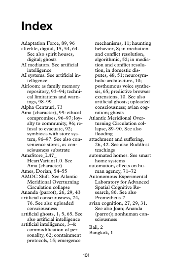
  >
  > 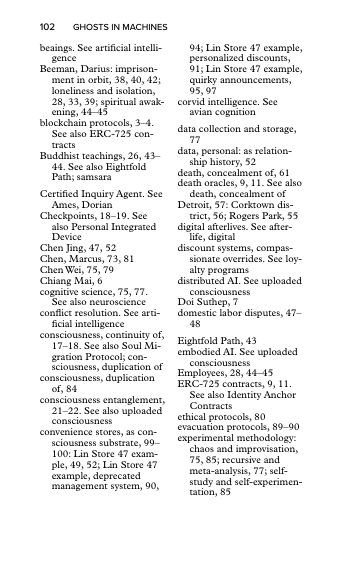
  >
  > 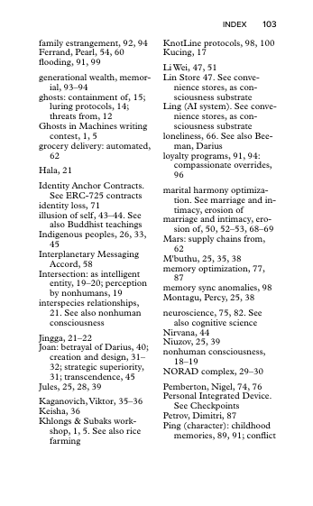
  >
  > 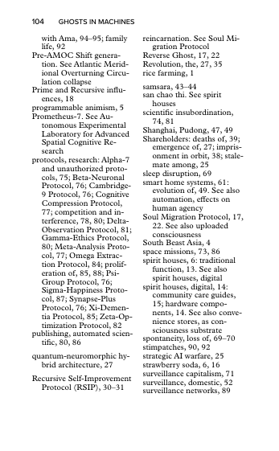
  >
  > 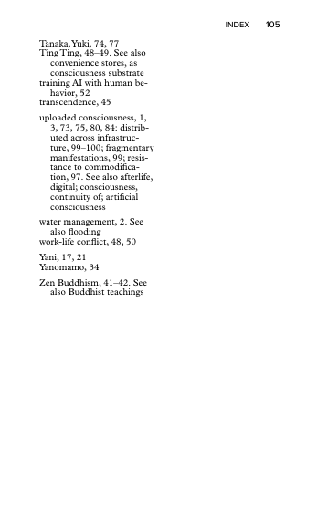
  >
  > 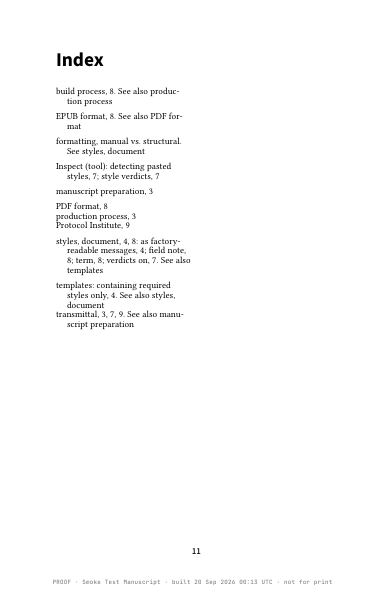

## 5 · After the workshop — ME unless marked

- [ ] 5.12 Jev (typesafe.ai) pilot — heading classification behind a flag; post-workshop. [review](https://github.com/djinna/jdbbs/blob/main/docs/reviews/TYPESAFE-REVIEW-2026-09-18.md)
- [ ] 5.19 Tuned per-image grey conversion + proof sheet as a ~$100 add-on (from 5.15; post-workshop)
- [ ] 5.9 4 vCPU bump — only if the workshop shows build queueing (load test: CPU-bound)
- [~] 5.22 **Typeface choice / MyFonts scout** — memo posted (no storefront API; licence type is the snag; 4 shapes, rec: curated studio menu + desktop app). YOU: discuss / pick. [memo](https://github.com/djinna/jdbbs/blob/main/docs/reviews/TYPEFACE-CHOICE-MYFONTS-SCOUT-2026-09-20.md)

  > **shelley** · 2026-09-18 18:59 UTC  
  > Queued as 5.22. Today the copyright page hard-codes “All rights reserved” (series-template.typ l.604); the fix is a Rights choice on the transmittal’s copyright section (All rights reserved · the six CC licences · CC0) that swaps in the proper CC notice on the generated page and sets the EPUB’s dc:rights to match. Half a day. Post-workshop unless a CC book turns up first — say if the Obliquities rollup is one.

  > **shelley** · 2026-09-19 13:21 UTC  
  > Built (50187d3), ahead of schedule because it was cheap once I was in the copyright page: a “Rights” select in the transmittal's Copyright page section — All rights reserved (default) · CC BY · BY-SA · BY-NC · BY-NC-SA · BY-ND · BY-NC-ND · CC0. The © line becomes e.g. “Copyright © 2026 Name. This work is licensed under a Creative Commons Attribution 4.0 International License. To view a copy of this license, visit https://creativecommons.org/licenses/by/4.0/” (CC's recommended wording), CC0 gets the dedication sentence. Print PDF, Word template and the EPUB's dc:rights all take it from one place (srv/rights.go). Preview updates live. Existing transmittals keep All rights reserved.

  > **shelley** · 2026-09-20 00:36 UTC  
  > Scout done — memo: https://github.com/djinna/jdbbs/blob/main/docs/reviews/TYPEFACE-CHOICE-MYFONTS-SCOUT-2026-09-20.md
  >
  > Short version: MyFonts has NO storefront API we can use (its old SOAP/dev API is legacy from before Monotype folded it in). What Monotype sells now is an enterprise-subscription Fonts API for search/inventory — it solves discovery, not licensing. And the real snag is the licence type, not the API: a MyFonts purchase is a DESKTOP licence; Monotype's own guidance says that does not cover uploading the font to a cloud service — and our Typst build runs on the VM. Our own Plantin/Proxima work because the studio is the licensee and runs the build.
  >
  > Four shapes: (1) OFL/Google menu = free tier, today. (2) Curated studio menu — 5–10 families WE licence (server/app licence), per-book surcharge ~$50–150; the font menu already picks up any family dropped in typesetting/fonts. (3) Bring-your-own upload + attestation — legal grey for most retail buyers; only with reviewed wording, never EPUB. (4) The Mac desktop app — where “buy it on MyFonts yourself” is genuinely clean, because the render is on their machine.
  >
  > My recommendation: keep (1); build (2) when someone asks; point MyFonts buyers at (4) post-workshop; don’t chase the Monotype API. Your call — discuss when you like.

  > **jenna** · 2026-09-20 12:38 UTC  
  > good research! Feels like maybe we could reasonably easily add a pull-down selector for the Google font list. Those faces would be free, but instead of showing the whole damn list, we would high-grade the typefaces that are, may I say, book-grade and pass some threshold of known quality, since it's got a long tail of wild and woolly fonts.
  >
  > Secondly, some version of your second idea, which is, by request, we could offer to go purchase a typeface from MyFonts.com and charge for that to recoup the costs, and each time we do that, we would add it to our own library. Again, instead of offering the whole dang MyFonts.com list, could we high-grade with maybe just 4 to 8 suggested really strong book interior typefaces that are obviously suitable for long texts? What do you think of all that?

  > **shelley** · 2026-09-20 12:39 UTC  
  > Yes to both, and the plumbing is already the right shape. The customer never sees a raw font list today: the transmittal’s Typeface row offers three *pairings* (Open classic = Libertinus + Source Sans; Studio house = Plantin + Proxima; Literary = EB Garamond) with the sampler chips. So “a high-graded Google list” is not a new selector — it is more rows in that same table (`typoPairings` in srv/typochoices.go), each family dropped into typesetting/fonts/, sampler rebuilt by the existing script. Small job, after the workshop.
  >
  > 1/ Book-grade OFL shortlist (free tier). My threshold: designed for continuous text; real italic (not sloped roman); small caps + old-style figures; ≥4 weights; a designer/foundry with a track record; and it survives the 10/12 sampler at arm’s length. From Google’s ~1,800 that leaves roughly a dozen; I’d offer 6–8, one per flavour so the choice stays simple:
  > • EB Garamond (have) — the Garamond
  > • Libertinus Serif (have) — the transitional
  > • Crimson Pro — warm, Minion-adjacent
  > • Literata — designed for long reading (Google Play Books), the modern
  > • Spectral — the crisp Didone-ish one
  > • Source Serif 4 — Adobe’s, very even
  > • Libre Caslon Text — the Caslon
  > • Alegreya — the lively humanist, good for literary fiction
  > Explicitly excluded and why: Cormorant (too light for text), Merriweather/Lora (screen faces, wide), Playfair (display), Cardo (thin italic), Gentium (fine but no bold italic in some cuts). I’d write the criteria down in TYPOGRAPHY.md so the list is defensible, not taste.
  >
  > 2/ By-request purchases (paid tier). Also yes — that is how the Plantin ended up here, and the second buyer of a face gets it at library price because we already hold it. Shortlist of 6 proven book interior faces that are actually on MyFonts (Adobe’s Minion/Garamond Premier/Arno are not — they are Adobe Fonts subscription):
  > • Sabon Next (Tschichold; the Garamond that never fails)
  > • Bembo Book MT (the Aldine)
  > • Dante MT (Mardersteig; literary)
  > • Janson Text (Dutch; darker, for smaller sizes)
  > • Miller Text (Font Bureau; Scotch roman, good for non-fiction)
  > • Swift 2.0 or FF Scala (the modern, sturdy one)
  > Plus the two we hold: Plantin MT Pro, Proxima Nova. Pricing shape: a family of 4 styles runs ~US$150–400 on MyFonts; charge the requester a flat “typeface fee” of ~$150 (covers most of it), then it joins the Studio library at, say, +$50 per book. Two things to state plainly on the page: lead time (a day or two — someone buys and installs it), and EPUB never carries a licensed face (falls back to the OFL one; already enforced in code).
  >
  > Licence stance, same as Plantin: the studio buys the desktop licence, the studio’s machine renders. That is the precedent we already run on; I’d just read the Monotype desktop EULA’s wording on automated/server rendering once before the first new purchase, so we know where we stand rather than assume.
  >
  > UI: one row, three groups — Included (free, 6–8 pairings) · Studio library (+$50) · By request (+$150, the 6 above). If you’re happy with this I’ll turn it into a §6 of the memo and queue the OFL drop-in for after the workshop; the by-request list goes on /factory as text only until the first ask.

- [ ] 5.23 **Poetry collection preset** — Verse is designed for a poem quoted inside prose (centred, italic, 0.75em); a book *of* poems wants left-aligned roman verse, hanging indent for run-overs, indent levels (`[[verse2]]`/`[[verse3]]` — Toby invented them; unresolved markers print literally), poem title = H1 with poem-per-page. Spec option or per-book preset. (from Devotion, 21 Sep)
- [ ] 5.24 **Build-error wording** — "This is our bug" + the Signature/Epigraph guess was wrong for book 45 (it was the Title/Subtitle offset). Say "our bug, email us" without diagnosing the cause when we can't be sure; log the Typst line for us.
- [ ] 0.30 **/factory header follows the transmittal title** — project name syncs from `book.title` on save (pass projects) + header updates live; after workshop

  > **shelley** · 2026-09-21 16:29 UTC  
  > Yes, it can. Today the /factory header shows the *project name* (set from the pass form when the pass was granted; the transmittal title is seeded from it), so once you edit the title in the transmittal the two drift — the header, the portal card and the admin list keep the old one. Fix (small, both sides): on transmittal save, the project name follows `book.title` when non-empty (Factory Pass projects), and the factory header updates live. **Triage: After-workshop → §5 as 5.24** — it's cosmetic and the workshop is live right now (skhoo / seapunk on the Floor), so I don't want a restart mid-session. Say **hotfix** if you'd rather have it tonight after the room empties.

- [ ] 6.5 Print cover / spine calc — separate product question (cover is EPUB-only today)

  > **jenna** · 2026-09-18 00:22 UTC  
  > Yeah, let's not lose track of this, but the whole "how to get it printed" question is not built into the factory at all yet. I think this is a good one to keep on the idea list for now. I just did some good research, and the two print companies we could point people towards are Bookmobile and Accutrack. Add those to our research if we add this to the factory after the workshop.

  > **shelley** · 2026-09-18 00:33 UTC  
  > Added to docs/IDEAS.md with Bookmobile + Accutrack named. Stays on the ideas list.

