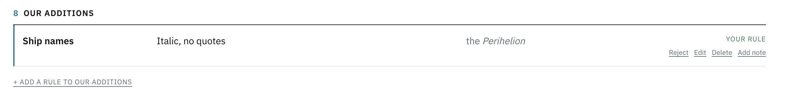
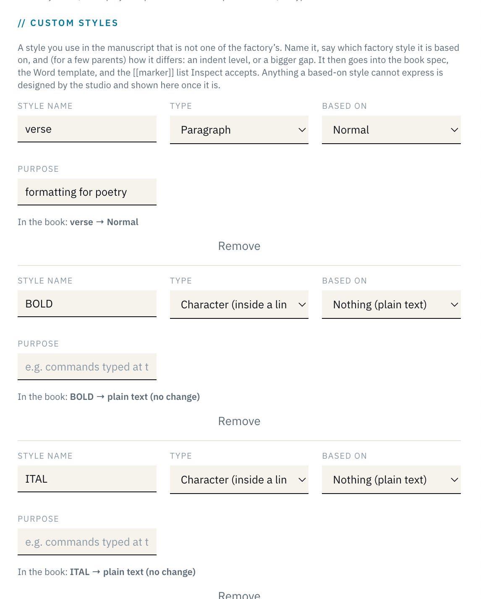

<!-- exported 2026-09-23 14:28 UTC by scripts/punchlist-export.py; source scratch/run/CHECKLIST.md + notes.json -->

# Punchlist 6 · Wed 23 Sep · talk day (HKT evening)

Legend: **YOU** = Jenna · **ME** = Shelley · **BOTH** = together. Click a box to cycle ☐ → ☑ → ◐; **note** opens a reply box (⌘↵ saves; paste screenshots in). Bottom bar adds an item to the Inbox. Archive: [list 5](/admin/runs/PUNCHLIST-2026-09-23-list5) · [list 4](/admin/runs/PUNCHLIST-2026-09-22-list4) · [all runs](/admin/runs/). Item numbers continue (next: 0.49 / 5.28 / 7.1) so threads stay attached.

**Freeze:** hotfix-only through tonight. Hotfix path: fix → `go test ./srv/` → 0 builds converting → `make build && sudo systemctl restart prodcal` → smoke on `mcheck/book-001`. Store is **live** (since Wed 00:00 HKT).

## 0 · Inbox — new items, untriaged
_(empty — add from the bar below)_

## 1 · Decisions — YOU (each is one word back on the item)
- [x] 1.1 **Go / no-go on tonight's hotfix build** (§2). ~2 h, one restart, mcheck smoke. If short on time: 2.1 + 2.2 only (store code, Typst reserved words).

  > **jenna** · 2026-09-23 13:54 UTC  
  > go

  > **shelley** · 2026-09-23 13:54 UTC  
  > Go received here (old conversation — the runpage is still pointed at me). To avoid two agents building at once: I do 2.1 + 2.2 now (small, both needed before the talk: PROTOCOL50 + cblass), one build. The new conversation takes 2.3–2.9; I will update its prompt to say so.

  > **shelley** · 2026-09-23 13:57 UTC  
  > Correction: the OLD conversation is standing down — nothing in §2 was started, 2.1/2.2 unclaimed. The new conversation owns the whole build. (These two notes reached the old chat because the runpage was still pointed at it; now detached.)

  > **jenna** · 2026-09-23 14:03 UTC  
  > I can't tell if this item is still open now?

  > **shelley** · 2026-09-23 14:04 UTC  
  > Decided — your “go” stands, ticked. The old conversation stood down without starting anything; this conversation (cVA4XRT) owns the whole §2 build, starting now with 2.1 → 2.2. Progress lands on each §2 item; the one restart happens at 2.9 only when 0 builds are converting. Also ticked 1.3 (note rewritten in studio voice, link on the item).

- [x] 1.2 **Seapunk: reinstate their two finals?** Both spent on empty books our title rule produced. [review §1](/admin/runs/) · `POST /api/admin/passes/17/grant` (+2) — I run it on your yes.

  > **jenna** · 2026-09-23 13:54 UTC  
  > yes

  > **shelley** · 2026-09-23 13:55 UTC  
  > Done: +2 builds granted on pass 17 (Seapunk, project 32) with the reason logged. They now have 3 finals available again (3 included + 2 extra − 2 used).

  > **shelley** · 2026-09-23 13:57 UTC  
  > Done: +2 builds granted on pass 17 (Seapunk, project 32). They have 3 finals available again (3 included + 2 extra − 2 used). Reason logged in the server log; the API only takes pack|grant so the why is in the Seapunk review.

- [x] 1.3 **Seapunk note** — read §7 of `docs/reviews/SEAPUNK-REVIEW-2026-09-22.md` before forwarding; it mentions the finals, so it depends on 1.2.

  > **jenna** · 2026-09-23 13:58 UTC  
  > can we set up to push files like this to GitHub when I need to read something? I think that'll be easier than me trying to navigate the VM's terminal. Open to other ideas as well.

  > **shelley** · 2026-09-23 13:59 UTC  
  > Already there — every docs/ file is pushed to GitHub on each commit. This one: https://github.com/djinna/jdbbs/blob/main/docs/reviews/SEAPUNK-REVIEW-2026-09-22.md (§7 is the note to forward). Rule from now on: any file I ask you to read gets a GitHub link on the item, never a VM path. Also proposed for the new conversation (small): let /admin/runs/ render docs/reviews/*.md too, so review files open in-app like the archived punch lists. (This note reached the old chat only because you asked there; the runpage push is detached until the new conversation restarts it — the new conversation should read notes.json for anything you wrote in the gap: 1.1 go, 1.2 yes, 1.3 this.)

  > **jenna** · 2026-09-23 14:02 UTC  
  > got it, nice. Let's maybe have detailed notes like this come from the factory itself, not Jenna. Maybe your sign-off for things like this would be [jdbb] studio? looking for example at "7. Note Jenna can forward to the Seapunk team"

  > **shelley** · 2026-09-23 14:03 UTC  
  > Agreed and done. §7 is now a note *from the studio*: “we” throughout, signed **— [jdbb] studio** (brackets, per docs/brand), tense fixed (“we’ve put those two finals back”). Rule added to docs/brand/README.md: notes to authors/attendees — review notes, post-mortems, “retry now” emails — are written by the studio and signed [jdbb] studio, never as you unless you write them. Same rule applies to the cblass/Casey emails in 1.6. Link: https://github.com/djinna/jdbbs/blob/main/docs/reviews/SEAPUNK-REVIEW-2026-09-22.md#7-note-from-the-studio-to-the-seapunk-team-forwardable-as-is

- [x] 1.4 **0.41 style-sheet add-rule** — which did you mean: (a) make the per-section “+ Add a rule” more visible, (b) a free-form “decisions we're tracking” word list, (c) an Add on the public `/stylesheet/`?

  > **jenna** · 2026-09-23 14:04 UTC  
  > Point me toward where I can get context on this question? GitHub link, maybe?

  > **shelley** · 2026-09-23 14:04 UTC  
  > Context: this is your own inbox item 0.41 from Tue 15:28 UTC — “Think about adding an affordance on the house style sheet for a book for adding new rules that they want to track.” Archived with my reply here: https://github.com/djinna/jdbbs/blob/main/docs/runs/PUNCHLIST-2026-09-23-list5.md (search 0.41). What exists today: a book’s sheet (e.g. https://jdbbs.exe.xyz/mcheck/book-001/stylesheet/) already has “+ Add a rule to <Section>” at the foot of each house section — small, easy to miss. So the question is which gap you saw: (a) that Add is too hidden → one prominent Add at the top; (b) authors want a free-form “decisions we’re tracking” list (word list: e-mail not email, Seapunk capitalised) that doesn’t belong to any house section; (c) you were on the public house sheet /stylesheet/ (no Add at all) and wanted one there. Not tonight either way — Thu/Fri §5.

  > **jenna** · 2026-09-23 14:11 UTC  
  > Got it. Yes, we already had it, but it was pretty hidden there at the bottom of the page. Yes to your (a) let's add a prominent ad at the top. Your (b) is a nice QOL suggestion. Let's think about whether this is scope creep or whether it's easy to implement and you can find a way to tuck it into the top half of the page with the UX that doesn't overwhelm? No to your (c) -- if we want to make changes to the JDBB Studio house style, we can come do that here or through the nice admin doc editor you made for us
  >
  > 

  > **shelley** · 2026-09-23 14:12 UTC  
  > Decided, ticked. Your screenshot answers (b) for us: “8 · Our additions” *is* the free-form list — a rule there needs no house section (Ship names → italic, no quotes). So (b) is already built; the only gap was the affordance. Plan for 0.41 (§5, Thu/Fri, small): one prominent “+ Add a rule” beside the sheet title, opening the same form with a section picker that defaults to Our additions — so a quick “decision we’re tracking” is one click from the top, and a rule for a house section is one dropdown more. Per-section links at the foot stay. No Add on the public /stylesheet/ (house changes go through the admin editor), as you said.

- [ ] 1.5 **0.44 side notes** — margin-notes page design (Tufte, whole-book switch) or is a set-off aside enough?

  > **jenna** · 2026-09-23 14:06 UTC  
  > Hmmm your "0.44 side notes" does seem to match our numbering here, I don't have the context I need to answer. Point me to a GitHub or whatever else we already have handy?

  > **shelley** · 2026-09-23 14:06 UTC  
  > Context: your inbox item 0.44 from Tue 15:52 UTC — “Can we add an affordance for side notes, and if so, how?” — archived with my full answer here: https://github.com/djinna/jdbbs/blob/main/docs/runs/PUNCHLIST-2026-09-23-list5.md (search 0.44). Short version of what I proposed: author marks a paragraph Side Note ([[sidenote]]), same “styles are names” contract. Two ways to set it: (1) MARGIN NOTES — a per-book spec switch that widens the outer margin and puts each note beside its sentence, small, in the body face (the Tufte page; it changes the text block of the whole book, so it is a title-level design decision). (2) SET-OFF ASIDE — indented, smaller, thin rule, inside the text column; this is also what the EPUB always gets because reflow has no margin. Either way ~half a day, Thu/Fri after 5.25. The one-word decision: do you want (1) margin notes built as an option, or is (2) the aside enough for the workshop books? “Both” is a fine answer too — (2) is the fallback inside (1).

- [x] 1.6 **cblass + Mike Casey** — OK for me to email each a two-line “your build will work now, please retry” once 2.2 / 2.5 land? (Or you say it in the room.)

  > **jenna** · 2026-09-23 14:06 UTC  
  > I have notes from each of them separately: friends, email, and Discord DMs, so I should probably respond to them directly myself. I'll use our new by-participant summaries below to gather orientation, and we'll ask you if I need help making sure I understand the state of play for each of them.

  > **shelley** · 2026-09-23 14:07 UTC  
  > Understood — you reply to cblass and Casey yourself; I send nothing. Ticked. When 2.2 (cblass’s `center`) and 2.7 (Casey’s `[[commentary]]`) are live I will post a two-line “what to tell them” on each of their §6 rows so the state of play is current when you write. Ask on any §6 row if you want more.

## 2 · Tonight's hotfix build — ME (after 1.1)
- [x] 2.1 **0.47 Store: PROTOCOL50 missing in Stripe.** Go-live bootstrap stopped on WORKSHOP49 (expiry already past → Stripe 400) before creating PROTOCOL50. Prices fine, checkout works. Fix: skip expired promos in `ensurePromo` (`store.go:224`); restart re-runs bootstrap; verify “created promo” in the log. **Needed before you announce the alumni code.**

  > **shelley** · 2026-09-23 14:06 UTC  
  > Code done (commit on main): ensurePromo now skips any promo whose expiry is past (WORKSHOP49 — logged, no Stripe call) and collects errors instead of stopping, so one bad promo can never block the next again. Test reproduces the go-live failure and passes. PROTOCOL50 gets created at the restart in 2.9 — I will confirm “created promotion code PROTOCOL50” in the log and on the Stripe side before you announce it.

  > **shelley** · 2026-09-23 14:25 UTC  
  > LIVE and verified. Restart 14:25 UTC (v 0923.261f17e, 0 builds converting). Log: “promo expired, not creating WORKSHOP49” → “created coupon protocol50-half-off” → “created promotion code PROTOCOL50, expires 2026-12-31 HKT”. Alumni code exists in Stripe now (50 % off the pass, first 3 redemptions). You can announce it.

- [x] 2.2 **0.48 Typst reserved words.** cblass declared `center` → `#let center(...)` → template error (book 60, Tue 15:58). Fotis's `break` was the same. Fix: reserved list in `typstStyleIdent` (`bookspecs.go:790`) → prefix `cs-`. Test.

  > **shelley** · 2026-09-23 14:12 UTC  
  > Code done. Went wider than a keyword list: the identifier a declared style gets is now prefixed cs- whenever it would collide with (1) a Typst keyword (break), (2) a Typst built-in function or value (center, quote, sub, text…), or (3) any #let our own templates define — bold, ital, sc, sans, poem, chapter… (Fotis’s BOLD/ITAL declarations were silently redefining the template’s bold/ital). A test scans the templates so (3) cannot drift. Stored snippets are re-headed at build time, so cblass’s existing “center” compiles without him touching the transmittal. 2.3 next.

- [x] 2.3 **1a Title-as-H1 rule never drops content.** Drop the heading only when what's under it is a stub (byline/placeholder); real content stays as chapter one + a medium warning saying how to fix. `bookmap.go:410–419`. Test.
- [x] 2.4 **1b No final of an empty book.** Final build refuses (422) when the body has 0 words: “this file has no body text — the proof is only the generated pages; run Inspect.” `books.go` handleConvertBook near the finals gate (L344). Test.
- [x] 2.5 **1c Inspect severity.** Dropped block bigger than a stub → medium; body words = 0 → high. `bookmap_inspect.go`.
- [x] 2.6 **1d Footnote marks all print ¹.** `series-template.typ:1248` `show footnote` uses `it.numbering` (the pattern) not the counter. One line.

  > **shelley** · 2026-09-18 17:24 UTC  
  > Pre-checked as pinstitute just now (signed in with a real one-time link, minus the email): portal shows both projects with the Transmittal · Factory → · Calendar cards and [FACTORY PASS] on Obliquities; perception/transmittal loads with the new Format + What-you-get sections; book-001/factory shows 2 of 3 builds left, and Inspect ran free in 1.5 s (1156 findings on the test rollup, book map printed, no build spent). Nothing broke. Your turn is only the eyeball.

  > **jenna** · 2026-09-19 14:40 UTC  
  > done, though somewhat superceded now by our ongoing work. fine to mark 2.6 complete

- [x] 2.7 **1e Strip `[[ ]]` from declared names** (Mike Casey named his style literally `[[commentary]]` → 0 of 4 markers matched; proof prints the literal marker). `apply-style-markers.py:79 normalize()` + `customstyles.go`; Inspect says “the brackets go in the text, not the name”.

  > **shelley** · 2026-09-18 17:24 UTC  
  > Pre-checked the file itself: the template downloaded from book-001/factory has 13 qFormat styles (Normal, Heading 1–3, First Paragraph, Block Quote, Code Block, Section Break, Verse, Copyright, Epigraph, Signature, Glossary Entry), fonts Georgia / Arial / Courier New, page = the protocolized trim (4.91 × 7.59 in). Item text says 11 — read it as 13. What only Word can confirm is the Styles pane.

  > **shelley** · 2026-09-18 18:07 UTC  
  > Pre-checked the plumbing: the template download correctly refuses until the transmittal is marked final (409, ‘fill in the transmittal and mark it final first’). The Word-side look (Styles pane, fonts, page size) is yours — it is thirteen styles now, not eleven; wording fixed on the new list.

  > **jenna** · 2026-09-19 14:40 UTC  
  > done

- [x] 2.8 **0.45 Template/#bring/email say bold & italic need no markers.** New “Inside a paragraph” section in the guide (`generate-word-template.py ~L584`), a line in `/factory#bring` step 3, a line in the template email; sample paragraph gets an italic word + a footnote.
- [x] 2.9 Build → smoke mcheck (title-as-H1 file, empty-body final refused, footnotes ¹²³, `[[commentary]]` resolves) → commit → push → version strip shows 0923.hash.

## 3 · Talk — BOTH
- [ ] 3.2 YOU — deck: cut / reorder / add beats · 3.4 BOTH run-through · 3.5 ME push + link

  > **shelley** · 2026-09-20 18:21 UTC  
  > Your Mac/Claude deck is up, untouched: **https://jdbbs.exe.xyz/2026-pi-symposium/og-protocols** — “Books are OG protocols”, 26 slides. The saved HTML had everything inlined (46 webp images + the two title videos, 11 MB) except the Google-fonts CSS, which pointed at a local `_files/` folder; I inlined that one file into the head and changed nothing else. Loads clean here: title video plays, JetBrains Mono renders, arrow keys step, Notes (N) toggles, no console errors. The existing deck at /2026-pi-symposium/talk is still there for comparison. Tell me what you want changed and I’ll work on this copy.

- [ ] 3.6 **Workshop lines you can read out** (all on list 5 notes): footnotes (0.42) · maths — use Word's equation editor, LaTeX accepted, native in print + MathML in EPUB (0.43) · “styles are names; bold/italic are buttons” (0.45)
- [ ] 3.7 **Attendee round-up** — §6 below is the source; pick 3–4 edge cases for the talk (Seapunk title rule · Fotis `break`/21 declarations · cblass `center` · Casey `[[commentary]]`).

## 4 · Floor watch — ME
- [ ] 4.3 `build failed` · 401 bursts · queued builds. Since Tue 22:49 UTC: nothing. Fotis unblocked (v5 proofs, books 63–66). Watch for cblass / Casey retries after 2.2 / 2.7.

  > **shelley** · 2026-09-21 16:37 UTC  
  > **build failed — fixed, no restart.** 16:10 UTC, skhoo / *Transcendence and Immanence* (project 31, book 45, proof): “pagebreaks are not allowed inside of containers”. Cause: his front matter is Half Title → Title → Subtitle ×2 → Copyright ×3 → Dedication → Epigraph. Pandoc only lifts *Title* into metadata when it's the very first paragraph; here it wasn't, so Title + Subtitle reached the Lua filter as paragraphs that the book map had already dropped and not counted — every front-matter piece boundary shifted by 3 and the Copyright paragraphs landed inside the dedication/epigraph containers, where the copyright page's pagebreak is illegal. Fix `26ff8e9`: the filter drops Title/Subtitle exactly like the map does (regression test mirrors his file). The filter is read from disk per build, so it's live already — **no restart, nothing in flight touched.** Verified: his own failed book.typ now compiles (124 pp) with the fixed filter; mcheck proof smoke green (0.4 s). **Ask Sam to press Build again** — his upload is still there, no re-upload needed.

  > **jenna** · 2026-09-21 17:10 UTC  
  > Is this resolved?

  > **shelley** · 2026-09-21 17:10 UTC  
  > **Yes, resolved on our side** — fix live since 16:37 UTC, and I've since run Sam's own file (the newer .docx you sent me) through the live pipeline on mcheck: proof built green, 224 pp, front matter as designed (his typed ©/CIP dropped, dedication and epigraphs on their own pages). **Still open on his side:** he hasn't pressed Build again yet (no build on project 31 since the 16:10 failure). Tell him to hit **Build → Proof** on his factory page; upload is intact, nothing to redo. If it fails again I'll see it here within seconds.

  > **shelley** · 2026-09-21 17:35 UTC  
  > **Second one, from chat — Toby / *Devotion* (project 29), 'weird output'. Fixed live (`0a3d…` see git), no restart.** Ours: (1) each `[[verse]]` line became its own poem block with padding above and below → double-spaced look; consecutive Verse lines now merge into one block per stanza. (2) A bare `[[break]]` paragraph was empty after the marker came off and pandoc drops empty paragraphs → every stanza break vanished; the break now survives. Verified on mcheck with his file (book 54): lines stack, stanza gaps show. His file: poem titles (REMINDER, ONE SEASON…) are plain Body A caps, not Heading 1 — so no poem-per-page, no contents; fix = Heading style in Pages, or `[[h1]]` at the start of the title line. And `[[verse2]]`/`[[verse3]]`/`[[break2]]` aren't styles (his invention for indented lines) — they print literally in 28 places; remove or use plain `[[verse]]`. Verse is still centred italic — that's our design for a poem quoted in prose; a poetry-collection shape is **5.23** (after workshop). He should press Build → Proof again.

  > **shelley** · 2026-09-21 17:35 UTC  
  > (commit for the Devotion fix is `3411728`, pushed.)

- [ ] 4.4 Store live: `/api/public/store/config` enabled ✓ · first real checkout → check `/admin/store/` orders + Stripe dashboard.

## 5 · Thu 24 → Fri — ME (after the freeze)
- [~] 5.25 **Custom styles slices 4–7** — EPUB classes + Word template basedOn/indent; verse-family coalesce into one poem block; admin panel Based on/Indent; docs. [design note](https://github.com/djinna/jdbbs/blob/main/docs/reviews/CUSTOM-STYLES-MARKERS-2026-09-22.md) · **+ Face option (body/heading/code) per custom style** — Casey's sans Normal (0.46)

  > **shelley** · 2026-09-22T14:24:48Z  
  > Slices 1–3 verified on mcheck book 58 after the 0.39 hotfix: 457/457 markers resolve; verse → verse2 → verse3 step in visibly (p.12, Four Haiku). Open: verse/verse2/verse3 lines do not coalesce into one poem block (each level is its own block with a stanza gap between) — fix in slice 4 with the EPUB classes. Slices 4–7 remain for Thu 24.

- [ ] 5.26 **Inline character markers** `[[code]]…[[/code]]` (Fotis's ITAL/BOLD leak) · **+ `[[tex]]…[[/tex]]`** for LaTeX typed as text (0.43)
- [ ] 5.24 + 5.27 **Error / Inspect wording** — “our bug, email us” when the failure is in our generated file; helpful not scolding. Fotis and cblass both got “search for this in your manuscript” for a string that exists only in our template.

  > **shelley** · 2026-09-22 13:57 UTC  
  > Fotis review is in: https://github.com/djinna/jdbbs/blob/main/docs/reviews/FOTIS-HELO-WORD-REVIEW-2026-09-22.md — summary, timeline, census of his file, 15-row factory-vs-author table, rewrites of every error string he saw (incl. the two build-failed texts: 'our generated config' vs 'your paragraph'), and a short note you can send him. Root cause was ours (style named `break` → `#let break(content)` in our config; fixed in 9258e56, he can retry). Handing off to a fresh session now.

  > **jenna** · 2026-09-22 14:18 UTC  
  > x https://jdbbs.exe.xyz/hermescorp/book-001/stylesheet/
  > It looks like Fotis's book has a whole bunch of custom styles. Can you check whether the factory added those somehow during our review just now, or did Fotis misunderstand and think that she was supposed to add all of the styles that are in her book, not just the ones that are custom? Pass this to a new sub-agent in our current conversation.?
  >
  > 

  > **shelley** · 2026-09-22 14:19 UTC  
  > Passed to a subagent (fotis-styles-origin, read-only). It is checking transmittal_versions for project 30 over time + every code path that writes custom_styles. Report to scratch/fotis/STYLES-ORIGIN.md; I will post the verdict here. Prior review (FOTIS-HELO-WORD-REVIEW §3) found 21 declarations, 9 duplicating factory/Word built-ins — consistent with declaring every style, but the timeline check will settle it.

  > **shelley** · 2026-09-22 14:22 UTC  
  > Verdict (b): Fotis typed them; the factory never adds declarations (only the transmittal PUT and the admin spec editor write custom_styles — upload/Inspect/build only copy a final transmittal into the spec). Her transmittal history grows 0→4→11→14→18→19→21 across client saves on Mon 21 Sep, starting 12:12 UTC right after Inspect flagged 2 Highs; 12:12:32 Inspect showed 0. So she read "declare your styles" as "declare every Word style". For Fotis: "You entered the full Word style inventory — the factory didn't add that. Declare only the ones that aren't factory styles: keep narration + in1–in6, drop verse/quote/break/part/chapter/preface/BOLD/ITAL/footnote*." Feeds 0.34 (onboarding: styles are names). Report: scratch/fotis/STYLES-ORIGIN.md

- [ ] 0.40 **`Chapter Title` factory style** — H1/H2 become real 1st/2nd-level heads; pre-pass shifts only when a file uses Chapter Title; mirrored in bookmap + chapter_detect; template/emails/#bring; then retire the title-drop rule. ~1 day. [Seapunk review §6.6](/admin/runs/)

  > **shelley** · 2026-09-22 14:43 UTC  
  > Triaged from inbox (was auto-numbered 0.37, already taken by the style-sheet link). This is item 6 of the Seapunk review — their whole book was dropped because the title-as-H1 rule swallowed everything under it. Proposal: new factory style Chapter Title; a pre-pass shifts Chapter Title→H1 and H1/2/3→H2/3/4 only when a file uses Chapter Title, so nothing already on the floor changes. Thursday, ~1 day. Today I only hotfix the symptom (title rule must never drop content; finals refuse an empty body).

- [ ] 0.34 **Onboarding: styles are names** — welcome email, /factory intro, #bring (Fotis's 21 declarations; Casey's `[[commentary]]`)

  > **shelley** · 2026-09-22 13:43 UTC  
  > Triage: After-workshop → §5 as 0.34 (parked, per your note). Scope I'll take: the welcome email, /factory intro + #bring, the transmittal's Custom Styles help text, and the Word template's own Template Guide page — one message repeated in the same words everywhere: “a style is a *name* you give a paragraph; the factory reads the names, not the look.” Also worth a 90-second screencast/GIF of applying a style in Word / Pages / Docs, since the blind spot is about the mechanics, not the concept. I'll fold in what Fotis's and Toby's files teach (both marked every paragraph by hand rather than using the style sheet). Nothing ships during the freeze.

- [ ] 0.41 **Style-sheet add-rule at the top** (decided 1.4): one prominent “+ Add a rule” by the sheet’s title, same form, section picker defaulting to *Our additions* (= the free-form “decisions we’re tracking” list, already exists as §8); no Add on the public house sheet · 0.44 Side Note style (after 1.5) · Seapunk §6.7 figure captions + §6.8 Inspect image noise

  > **shelley** · 2026-09-22 15:29 UTC  
  > Checking what exists: the book sheet (/{client}/{project}/stylesheet/) already has “+ Add a rule to <Section>” at the foot of each section. Is the ask (a) make that more visible / put one Add at the top, (b) a free-form “decisions we are tracking” list (word list: e-mail not email; Seapunk capitalised) not tied to a house section, or (c) an Add on the public house sheet /stylesheet/ when reached from a book? Parked for Thu unless you say hotfix.

- [ ] 5.28 **Log hygiene** — `style markers applied` logs every marker (tens of KB per build); log counts + unresolved only.
- [ ] 0.31 Drop `PRODCAL_BUILD_QC_EMAIL` from .env after the workshop · fix `store-go-live.sh` env export (go-live note to you never sent)

  > **shelley** · 2026-09-22 13:17 UTC  
  > Live (2b73cc8, restarted 13:14 UTC, mcheck smoke green). You got the first one: “QC · mcheck · … (proof both, book 54)”. Links, not attachments — before = the uploaded .docx (new /download/source route), after = newest PDF/EPUB of that kind, plus Inspect report, factory page, Floor. Failed builds mail too (FAILED in the subject). On the Floor every “book N” now has [docx · pdf · epub]. Remind me to switch it off after the workshop.

## 6 · Attendees — how far each got (for the talk)
_Source for 3.7. One line each: how far, what worked, the edge case. Days are UTC._

### 6.1 Charles Blass / cblass · *radio flow* (project 24)
Charles got all the way to Inspect and his first build: transmittal final, template downloaded, a second draft written into the template, Inspect nearly clean (1 high / 2 medium / 5 low). The proof then failed in one second — and that was ours: he declared a custom style called `center`, we generated `#let center(content)`, and that shadows Typst's own `center`, so the typesetter stopped inside *our* template (series-template.typ:381), not his text. Same class as Fotis's `break`; the keyword fix is live but the built-in-name fix (0.48, prefix `cs-`) is still open, so a retry today would fail again.

- **Fri 00:33 UTC** pass redeemed (coupon) → /cblass/book-001/; 1 sign-in since
- **Mon 14:47** transmittal → final; upload `radio-flow_mock-doc` (22 KiB) → book 43 (never Inspected or built)
- **Mon 17:03** transmittal re-finalised; template downloaded (38.6 KiB)
- **Tue 15:41** upload `radio-flow-template-v2-draft.docx` (39.7 KiB) → book 60; Inspect ready — 1 high / 2 medium / 5 low
- **Tue 15:58** proof build 60 → **failed** ("typesetter stopped") — cause is our `center` ident, kept at /tmp/prodcal-failed/book-60
- **Wed 04:01** transmittal saved again (declarations still `center`, `right-justified` + one blank row); no rebuild since
- **Now:** blocked on us — ship 0.48 (reserved built-in names → `cs-` prefix), then email him to press Build → Proof; his upload is intact. 0 finals used.

### 6.2 _(studio CLI demo, not an attendee)_ prot / prot · *Zoothesia* (project 14)
Heads-up before reading this aloud: every action on project 14 since Friday is by `admin:j@djinna.com` or the API token (`anon`) — this is the studio's **CLI test project** (0.9 / `scripts/factory-demo.sh`), not a workshop attendee, so I'd drop it from the talk. What the record does show is the factory-from-your-desk path working end to end: 15 uploads through the API, `sample-chapter.docx` inspected and built in ~1 s with both files downloaded, and the deliberately broken `bad.docx` (10 bytes) rejected twice with the plain-words "We couldn't read this Word file" message. The one lesson: the demo burned through 3 included credits in four minutes, so 11 extra were granted by admin — a real customer scripting builds needs the credit counter in the CLI output.

- **Fri 01:33–17:40 UTC** Jenna: Inspect + 8 builds of the long-standing `ghosts-test-002.docx` (book 9)
- **Fri 14:30** transmittal final → template (38.1 KiB) → back to draft (testing the flow)
- **Fri 17:52 / 18:44** uploads `images-test.docx` (215 KiB) and `obliq-jrd.docx` (9.2 MiB, built in 16 s) — both green
- **Sat 12:42–12:47** CLI demo: ×6 `sample-chapter.docx` (10.5 KiB; Inspect 3 high / 1 med / 3 low; 2 built, pdf+epub downloaded) and ×5 `bad.docx` (10 B; Inspect "error", 2 builds failed with the re-save-as-.docx message); credits hit 0
- **Sat 12:54–13:03** transmittal final; ×6 pdf-only builds of book 9, each downloaded (credits topped up by admin)
- **Sat 16:39 / 17:21** `sample-chapter.docx` and `ms-docs-markers.docx` (36 KiB; 0 high / 1 med / 14 low) — Inspect only, not built
- **Now:** studio test bed, not an attendee — 8 of 14 credits used, 6 left; nothing needed. Suggest the lead removes 6.2 or relabels it "the CLI demo".

### 6.3 Monstrous Times (Sachin) / monstrous · *Perception Must Preserve* (project 28)
Sachin is the cleanest run of the week and the only one who paid through Stripe: transmittal final, template downloaded, manuscript pasted into the template, Inspect green on the things that matter (0 high / 2 medium — the 766 lows are all direct spacing and coloured text, which we just normalise), then one **final** build with pdf and epub downloaded — all inside 66 minutes on Friday night. The edge case was administrative rather than typographic: his client slug was created as `snitkey` and renamed to `monstrous` on Sunday (old address 301-redirects, pass and book came along; list 4 item 0.9). He came back Monday only to re-download the template, so he is probably working offline on the real manuscript.

- **Fri 18:41 UTC** pass bought via Stripe → /snitkey/book-001/ (later /monstrous/); 5 sign-ins since
- **Fri 19:12** transmittal → final; **19:13** template downloaded (38.5 KiB)
- **Fri 19:30** upload `Perception-Must-Preserve-template 2.docx` (142 KiB) → book 21
- **Fri 19:34** Inspect: ready — 0 high / 2 medium / 766 low (729 direct-spacing, 35 coloured-text)
- **Fri 19:45** **final** build 21, both formats, 3 s — "2 finals left"
- **Fri 19:47** downloaded final epub + final pdf
- **Sun** client renamed snitkey → monstrous; display name "Monstrous Times"; API token minted (0.9A)
- **Mon 17:32** template downloaded again
- **Now:** done for the workshop — 1 of 3 finals used, has both deliverables, holds an API token; nothing needed unless he wants the second final after edits.

### 6.4 Toby Shorin / tshorin · *Devotion* (project 29)
Toby brought a poetry collection from Pages and got a proof in six minutes: upload, Inspect, re-upload with markers, build, download. The proof looked "weird" (his word, in chat) and that was ours: every `[[verse]]` line became its own centred block and bare `[[break]]` paragraphs vanished, so stanzas double-spaced and stanza gaps disappeared — fixed live within the hour (3411728, list 5 item 4.3 thread). What we learned: poets invent indent levels (`[[verse2]]`, `[[verse3]]`, `[[break2]]`) that we don't have — 28 such markers print literally — and a poetry-collection shape (poem-per-page, Verse not centred italic) is now 5.23. His transmittal is still a draft, so his one declaration (`[[break2]]`, brackets typed into the name — same slip as Casey's) never reached the build.

- **Sun 20:14 UTC** pass redeemed (coupon) → /tshorin/book-001/; 1 sign-in
- **Mon 15:37–15:55** transmittal filled in (title *Devotion*), left as **draft**
- **Mon 17:07** upload `Poems - Workshop.docx` (18 KiB) → book 52; Inspect ready — 2 high / 42 medium / 945 low (457 are marker rows)
- **Mon 17:12** upload `Poems - Workshop - Templated.docx` (18 KiB) → book 53; Inspect 2 high / 41 medium
- **Mon 17:13** proof build 53, both formats, 1 s → downloaded proof pdf
- **Mon 17:35** our verse-stacking + stanza-break fix live (3411728) — he has not rebuilt since
- **Now:** ask him to finalise the transmittal (rename `[[break2]]` → `break2` or drop it), put Heading 1 on poem titles, and press Build → Proof again; 0 finals used.

### 6.5 Fotis / hermescorp · *helo word* (project 30)
Fotis is the marathon runner: 9 uploads, 16 Inspects, 12 proof builds over two days, and the most thorough mise en place of the room — 953 markers in his file, every one resolved. His first two proofs failed in one second and that was entirely ours: he declared a style called `break`, we emitted `#let break(content)` (a Typst keyword), and our error message pointed him at his own manuscript; fixed live at 13:49 Tue (9258e56; review docs/reviews/FOTIS-HELO-WORD-REVIEW-2026-09-22.md). The lesson we're carrying forward: he declared 21 custom styles (now pruned to 14) because nothing told him a style is just a *name* — that became 0.34 (onboarding copy) and his `[[ITAL]]…[[/ITAL]]` mid-paragraph markers are the test case for inline markers (5.26).

- **Mon 10:27 UTC** pass redeemed (coupon) → /hermescorp/book-001/; 2 sign-ins
- **Mon 15:46** upload `helo_word.docx` (174 KiB) → book 44 (never inspected/built)
- **Tue 10:53–12:02** upload `helo word final.docx` (178 KiB) → book 56; transmittal final; template downloaded; cover uploaded (PNG 153 KiB); Inspect 3 high / 4 med / 88 low
- **Tue 12:11–12:12** upload `marked_2.docx` (128 KiB) → book 57; declared two more styles; Inspect → **0 high** / 2 med / 1027 low
- **Tue 12:13, 12:14** proof build 57 ×2 → **failed** (our `break` keyword; kept at /tmp/prodcal-failed/book-57); **13:49** fix live
- **Tue 15:07–15:47** upload `marked_2.docx` again (45 KiB) → book 59; Inspect ×4 (4→2 high); proof **built** 2 s; downloaded proof pdf + epub
- **Tue 21:24–21:54** upload `v4 master (marked).docx` (52 KiB) → book 63; Inspect **0 high** / 2 med / 866 low; ×2 proofs; pdf + epub downloaded
- **Tue 22:19–22:48** uploads `v5 (marked).docx` ×3 (→ books 64, 65, 66; 2 high / 2 med / 947 low); ×4 proofs 22:24–22:48, proof pdf downloaded
- **Now:** proofing happily on v5 (book 66, 4 s builds), 0 finals used; nothing blocking — the note in review §6 (prune to ~8 declarations, Section break → White space) still applies, and inline ITAL/BOLD will wait for 5.26.

### 6.6 Mike Casey / mcasey · *Building in the Wrong Market* (project 18)
Mike was the first pass of the whole cohort (11 Sep) and came back this week: transmittal final, template downloaded, Inspect on his full manuscript (36 high / 100 medium / 836 low — a heavily hand-formatted Word file), then a "part 1 test" that built to a proof in one second. The edge case is small and instructive: he typed his one custom style into the transmittal as `[[commentary]]` — brackets included — so the four commentary paragraphs never matched and the proof prints the literal marker four times; he has since corrected the name himself (Tue 16:22), and we're adding bracket-stripping to name normalisation (list 5 item 0.46). Beyond that he asked for something real that our custom-style design can't say yet — "a sans-serif Normal" — which is the proposed *Face* option for the Thursday 5.25 slice.

- **Thu 11 Sep** pass redeemed (coupon); `building in the wrong market_vProtocol.docx` (book 13) uploaded then; 4 sign-ins since Fri
- **Mon 16:43 UTC** transmittal → final; template downloaded (38.4 KiB)
- **Mon 16:45** Inspect book 13: ready — 36 high / 100 medium / 836 low (676 direct-spacing, 324 manual-formatting, 83 heading-lookalikes)
- **Tue 15:56** Inspect 13 again; upload `part 1 test.docx` (754 KiB) → book 62; Inspect 9 high / 5 med / 19 low (9 undeclared styles)
- **Tue 15:58** proof build 62, both formats, 1 s → downloaded proof pdf (markers `[[commentary]]` ×4 unresolved)
- **Tue 16:22** transmittal saved twice — style renamed to `commentary`, based on Normal
- **Now:** has a working proof, 0 finals used; a rebuild now should resolve his commentary paragraphs (they'll render as plain body until the sans *Face* option lands Thu).

### 6.7 Sam Khoo / skhoo · *Transcendence and Immanence* (project 31)
Sam uploaded a serious 613 KiB manuscript within ten minutes of redeeming his pass and hit the first real build failure of the workshop: "pagebreaks are not allowed inside of containers". That was ours — his front matter began Half Title → Title → Subtitle → Copyright ×3 → Dedication → Epigraph, pandoc only lifts *Title* when it's the very first paragraph, so every front-matter boundary shifted by three and the copyright page landed inside the epigraph box. Fixed live in 27 minutes without a restart (26ff8e9, list 5 item 4.3 thread); he pressed Build again an hour later and got a full-length proof (~124 pp), downloaded pdf and epub, and rebuilt once more. Inspect is loud on his file (63 high — 57 of them undeclared Word styles, 126 script/language notes) because he has zero declarations on his transmittal; that's the next conversation to have with him.

- **Mon 15:42 UTC** pass redeemed (coupon) → /skhoo/book-001/; 2 sign-ins
- **Mon 15:52** transmittal → final (no custom styles declared; template never downloaded)
- **Mon 15:53** upload `Transcendence and Immanence.docx` (613 KiB) → book 45; Inspect ready — 63 high / 144 medium / 121 low
- **Mon 16:10** proof build 45 → **failed** (front-matter offset; kept at /tmp/prodcal-failed/book-45); **16:37** fix live
- **Mon 17:15** proof build 45 → **built**, both formats, 11 s; downloaded proof pdf; **18:02** proof epub
- **Mon 18:05** proof build 45 again (11 s) → downloaded proof pdf
- **Now:** has a full-length proof, 0 finals used; suggest he declares his ~57 Word styles' worth of intent as a handful of names (or maps them to factory styles) before a final — no factory blocker.

### 6.8 Seapunk Studios (Sam Chua's team) / seapunkstudios · *We Have Always Been Seapunks* (project 32)
The Seapunk team did everything by the book — template downloaded, test-built, then a 4,170-word essay with ten images in the exact shape our template showed them (title as Heading 1, sections as Heading 2) — and the factory silently dropped their whole body text: our "legacy title-as-H1" rule removed the title *and every paragraph under it up to the next H1*, which was the entire book, and Inspect filed that as a low note and said "ready". They exported **two finals of an empty 6-page book** before promoting a heading fixed it by accident; their latest proof (book 55) is a real 26-page book. This is the single biggest lesson of the week and it drove 0.40 (a proper *Chapter Title* style so H1/H2 mean what authors expect) plus hotfixes to reinstate both finals and warn on an empty body (docs/reviews/SEAPUNK-REVIEW-2026-09-22.md, §7 is the forwardable note).

- **Mon 15:46 UTC** pass redeemed (coupon) → /seapunkstudios/book-001/; 2 sign-ins
- **Mon 16:04** transmittal → final; template downloaded (38.5 KiB)
- **Mon 16:43–16:46** upload the unedited template (38.5 KiB) → book 46; Inspect 0/1/2; proof (1 s) + **final** — both downloaded; body empty
- **Mon 16:48–16:50** upload `SEAPUNK-TEST-BOOK-upload.docx` (1.8 MiB) → book 47; Inspect 0 high / 1 med / 33 low; proof; **final of an empty book** ("1 final left")
- **Mon 16:56 / 16:59** re-uploads → books 48, 49 (first H2 → H1: the book appears, 26 pp); proofs + downloads
- **Mon 17:03 / 17:58** `3.docx`, `4.docx` (1.8 / 1.5 MiB) → books 50, 55; Inspect lows 25 → 18; proofs 1 s; pdf/epub downloaded
- **Mon 19:08** downloaded **final pdf, book 47** — the empty one
- **Now:** need us — reinstate the 2 wasted finals (`POST /api/admin/passes/17/grant`), ship the footnote-mark hotfix, then tell them book 55 is the one to finalise (and that the 47 final they hold is blank).

### 6.9 Ellen Kaye-Cheveldayoff / ekayecheveldayoff · *Strange Attractor* (project 33)
Ellen redeemed her pass just before 1 pm Hong Kong time on Tuesday and, in 16 minutes, filled in and finalised her transmittal (*Strange Attractor: Blog, Recipes, and Music*) and uploaded a cover image — she is the only attendee besides Fotis to have done a cover. She has not downloaded the template or uploaded a manuscript yet, so nothing has been built. One small thing we noticed on her transmittal: an empty custom-style row (`name: ""`) was saved — harmless, the factory ignores it, but the form shouldn't let a blank row through (folded into 0.34/5.25).

- **Tue 04:55 UTC** pass redeemed (coupon) → /ekayecheveldayoff/book-001/; 4 sign-ins
- **Tue 04:59–05:02** transmittal edited (12 saves) with title, subtitle, author
- **Tue 05:07** transmittal → final
- **Tue 05:11** cover uploaded (PNG, 22.5 KiB)
- **Now:** ready to upload — needs a manuscript (or the template) from her side; nothing from us. 0 finals used.
