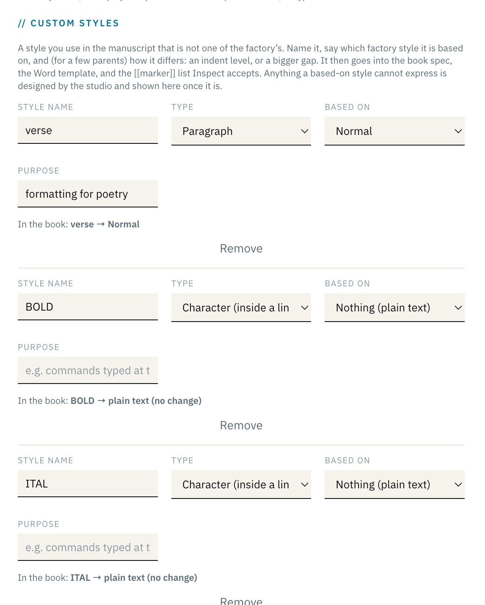

<!-- exported 2026-09-29 16:20 UTC by scripts/punchlist-export.py; source scratch/run/CHECKLIST.md + notes.json -->

# Punchlist 7 · Tue 29 Sep · domains + help

Legend: **YOU** = Jenna · **ME** = Shelley · **BOTH** = together. Click a box: ☐ → ☑, click again to undo; alt- or shift-click = ◐ in progress; **note** opens a reply box (⌘↵ saves; paste screenshots in). Bottom bar adds an item to the Inbox. Archive: [list 6](/admin/runs/PUNCHLIST-2026-09-29-list6) · [list 5](/admin/runs/PUNCHLIST-2026-09-23-list5) · [all runs](/admin/runs/). Item numbers continue (next: 0.49 / 5.29 / 7.14 / 8.16) so threads stay attached.

## 0 · Inbox — new items, untriaged
_(empty — add from the bar below)_

## 8 · Domains + Help — BOTH (build in order; next phase after Jenna ticks the last)
_Plan: `docs/NEXT_SESSION_PROMPT_2026-09-29.md` · `docs/reviews/CUSTOM-DOMAIN-PLAN-2026-09-29.md` · `docs/reviews/HELP-SYSTEM-SCOUT-2026-09-29.md`. Help blocks 8.1–8.10 in the handoff are 8.5–8.14 here._

- [x] 8.1 **Phase 0 · YOU — DNS + access.** `studio.jdbb.net` CNAME (DNS only) + `domain add` done; serves the app; admin login works there. `jd-blyg` http-proxy integration attached (`https://jd-blyg.int.exe.xyz/` → 200). Open: blyg-side publishing credential (studio password vs blyg API key in an integration).
- [x] 8.2 **Phase 1 · ME — Switch the app to studio.jdbb.net.** `PRODCAL_BASE_URL`; replace ~15 hard-coded `jdbbs.exe.xyz` (srv, scripts, jdbbs-public); `rel=canonical`; 301 public GETs from exe.xyz (never `/api/` or admin); footer/signature, `/factory/api`, CLI defaults, DEPLOY.md. Test: client magic link, factory upload, admin login. Restart + redirects OK’d by you 29 Sep.

  > **shelley** · 2026-09-29 16:06 UTC  
  > Live since 16:04 UTC (0929.4e024d0 + 982fd1c; jdbbs-public c72cdfb).
  > Done: PRODCAL_BASE_URL=https://studio.jdbb.net (all email links, Stripe return URLs, cookies) · footer setting updated · hard-coded hosts replaced (email shell, stylesheet, registration mail, CLI/scripts, /factory/api, /press, talk pages) · Link rel=canonical on public GETs · 301 from jdbbs.exe.xyz for public GETs (not /api/, /admin, /static/).
  > Tested on studio.jdbb.net: client magic link → portal (Secure cookie, API 401→200) · factory upload (test book 69 on mcheck) · /admin/ → exe.dev login.
  > Your turn (the VM can't reach its own exe.xyz address): open https://jdbbs.exe.xyz/factory → should land on studio.jdbb.net/factory; https://jdbbs.exe.xyz/admin/ should stay put. Then tick 8.2.
  > Yours when convenient: Stripe dashboard → business website → studio.jdbb.net (webhook on /api/ can stay; it's never redirected). Clients will sign in once more on the new host.

  > **jenna** · 2026-09-29 16:20 UTC  
  > confirmed https://jdbbs.exe.xyz/factory and https://jdbbs.exe.xyz/admin/ 👍

  > **shelley** · 2026-09-29 16:20 UTC  
  > Thanks — Phase 1 closed. Redirect + admin fallback confirmed from your browser. Next: 8.3 landing-page draft.

- [~] 8.3 **Phase 2 · BOTH — Fresh jdbb.net landing page** (replaces the Blot stub). ME: draft on a preview route (public doc, 1240 shell); YOU: facts + approve copy. Cutover is yours in Cloudflare (apex + www CNAME, flatten) + `domain add`. **Never touch MX.**
- [ ] 8.4 **Phase 3 · YOU decide — blyg.jdbb.net.** Repurpose `jd-blyg` VM (CNAME `blyg` → `jd-blyg.exe.xyz` + `domain add`) or move to the Blygger Studio Worker?
- [ ] 8.5 **Help 1 · ME** — `docs/help/*.md` + frontmatter, render in shell, tiers, nav from site_pages, FTS search, `llms.txt` / `.md`.
- [ ] 8.6 **Help 2 · ME** — “?” per page + “learn more” links; route-coverage test (+ missing transmittal site_pages row).
- [ ] 8.7 **Help 3 · ME** — Report a nit (no login, honeypot + rate limit) → Section 0, tagged.
- [ ] 8.8 **Help 4 · ME** — Inspect findings content slice (one entry per finding type) + “never Word — your editor” copy lint.
- [ ] 8.9 **Help 5 · ME** — self-update loop, `/admin/help/` review, approval email (EMAIL_SYSTEM.md), standing permissions.
- [ ] 8.10 **Help 6 · ME** — public What's new (drafted from commits, you approve).
- [ ] 8.11 **Help 7 · ME** — stats (views, thumbs, searches) + one daily usage email to you.
- [ ] 8.12 **Help 8 · ME** — AI Q&A A/B (50%, sticky) + kill switch + circuit breaker.
- [ ] 8.13 **Help 9 · ME** — `/factory/api` becomes the Help API section.
- [ ] 8.14 **Help 10 · ME** — 2–3 scripted Sample Press screenshots.
- [ ] 8.15 **YOU — open questions:** DIY calendar (my view: hide for DIY, no help pages v1) · landing-page facts / names to leave out.

## 5 · Carried from list 6 — factory build + decisions
- [~] 5.25 **Custom styles slices 4–7** — EPUB classes + Word template basedOn/indent; verse-family coalesce into one poem block; admin panel Based on/Indent; docs. [design note](https://github.com/djinna/jdbbs/blob/main/docs/reviews/CUSTOM-STYLES-MARKERS-2026-09-22.md) · **+ Face option (body/heading/code) per custom style** — Casey's sans Normal (0.46)

  > **shelley** · 2026-09-22T14:24:48Z  
  > Slices 1–3 verified on mcheck book 58 after the 0.39 hotfix: 457/457 markers resolve; verse → verse2 → verse3 step in visibly (p.12, Four Haiku). Open: verse/verse2/verse3 lines do not coalesce into one poem block (each level is its own block with a stanza gap between) — fix in slice 4 with the EPUB classes. Slices 4–7 remain for Thu 24.

- [ ] 5.26 **Inline character markers** `[[code]]…[[/code]]` (Fotis's ITAL/BOLD leak) · **+ `[[tex]]…[[/tex]]`** for LaTeX typed as text (0.43)
- [ ] 5.24 + 5.27 **Error / Inspect wording** — “our bug, email us” when the failure is in our generated file; helpful not scolding. Fotis and cblass both got “search for this in your manuscript” for a string that exists only in our template.

  > **shelley** · 2026-09-22 13:57 UTC  
  > Fotis review is in: https://github.com/djinna/jdbbs/blob/main/docs/reviews/FOTIS-HELO-WORD-REVIEW-2026-09-22.md — summary, timeline, census of his file, 15-row factory-vs-author table, rewrites of every error string he saw (incl. the two build-failed texts: 'our generated config' vs 'your paragraph'), and a short note you can send him. Root cause was ours (style named `break` → `#let break(content)` in our config; fixed in 9258e56, he can retry). Handing off to a fresh session now.

  > **jenna** · 2026-09-22 14:18 UTC  
  > x https://jdbbs.exe.xyz/hermescorp/book-001/stylesheet/
  > It looks like Fotis's book has a whole bunch of custom styles. Can you check whether the factory added those somehow during our review just now, or did Fotis misunderstand and think that she was supposed to add all of the styles that are in her book, not just the ones that are custom? Pass this to a new sub-agent in our current conversation.?
  >
  > 

  > **shelley** · 2026-09-22 14:19 UTC  
  > Passed to a subagent (fotis-styles-origin, read-only). It is checking transmittal_versions for project 30 over time + every code path that writes custom_styles. Report to scratch/fotis/STYLES-ORIGIN.md; I will post the verdict here. Prior review (FOTIS-HELO-WORD-REVIEW §3) found 21 declarations, 9 duplicating factory/Word built-ins — consistent with declaring every style, but the timeline check will settle it.

  > **shelley** · 2026-09-22 14:22 UTC  
  > Verdict (b): Fotis typed them; the factory never adds declarations (only the transmittal PUT and the admin spec editor write custom_styles — upload/Inspect/build only copy a final transmittal into the spec). Her transmittal history grows 0→4→11→14→18→19→21 across client saves on Mon 21 Sep, starting 12:12 UTC right after Inspect flagged 2 Highs; 12:12:32 Inspect showed 0. So she read "declare your styles" as "declare every Word style". For Fotis: "You entered the full Word style inventory — the factory didn't add that. Declare only the ones that aren't factory styles: keep narration + in1–in6, drop verse/quote/break/part/chapter/preface/BOLD/ITAL/footnote*." Feeds 0.34 (onboarding: styles are names). Report: scratch/fotis/STYLES-ORIGIN.md

- [ ] 0.40 **`Chapter Title` factory style** — H1/H2 become real 1st/2nd-level heads; pre-pass shifts only when a file uses Chapter Title; mirrored in bookmap + chapter_detect; template/emails/#bring; then retire the title-drop rule. ~1 day. [Seapunk review §6.6](/admin/runs/)

  > **shelley** · 2026-09-22 14:43 UTC  
  > Triaged from inbox (was auto-numbered 0.37, already taken by the style-sheet link). This is item 6 of the Seapunk review — their whole book was dropped because the title-as-H1 rule swallowed everything under it. Proposal: new factory style Chapter Title; a pre-pass shifts Chapter Title→H1 and H1/2/3→H2/3/4 only when a file uses Chapter Title, so nothing already on the floor changes. Thursday, ~1 day. Today I only hotfix the symptom (title rule must never drop content; finals refuse an empty body).

- [ ] 0.34 **Onboarding: styles are names** — welcome email, /factory intro, #bring (Fotis's 21 declarations; Casey's `[[commentary]]`)

  > **shelley** · 2026-09-22 13:43 UTC  
  > Triage: After-workshop → §5 as 0.34 (parked, per your note). Scope I'll take: the welcome email, /factory intro + #bring, the transmittal's Custom Styles help text, and the Word template's own Template Guide page — one message repeated in the same words everywhere: “a style is a *name* you give a paragraph; the factory reads the names, not the look.” Also worth a 90-second screencast/GIF of applying a style in Word / Pages / Docs, since the blind spot is about the mechanics, not the concept. I'll fold in what Fotis's and Toby's files teach (both marked every paragraph by hand rather than using the style sheet). Nothing ships during the freeze.

- [ ] 0.41 **Style-sheet add-rule at the top** (decided 1.4): one prominent “+ Add a rule” by the sheet’s title, same form, section picker defaulting to *Our additions* (= the free-form “decisions we’re tracking” list, already exists as §8); no Add on the public house sheet · 0.44 Side Note style (after 1.5) · Seapunk §6.7 figure captions + §6.8 Inspect image noise

  > **shelley** · 2026-09-22 15:29 UTC  
  > Checking what exists: the book sheet (/{client}/{project}/stylesheet/) already has “+ Add a rule to <Section>” at the foot of each section. Is the ask (a) make that more visible / put one Add at the top, (b) a free-form “decisions we are tracking” list (word list: e-mail not email; Seapunk capitalised) not tied to a house section, or (c) an Add on the public house sheet /stylesheet/ when reached from a book? Parked for Thu unless you say hotfix.

- [ ] 5.28 **Log hygiene** — `style markers applied` logs every marker (tens of KB per build); log counts + unresolved only.
- [ ] 0.31 Drop `PRODCAL_BUILD_QC_EMAIL` from .env after the workshop · fix `store-go-live.sh` env export (go-live note to you never sent)

  > **shelley** · 2026-09-22 13:17 UTC  
  > Live (2b73cc8, restarted 13:14 UTC, mcheck smoke green). You got the first one: “QC · mcheck · … (proof both, book 54)”. Links, not attachments — before = the uploaded .docx (new /download/source route), after = newest PDF/EPUB of that kind, plus Inspect report, factory page, Floor. Failed builds mail too (FAILED in the subject). On the Floor every “book N” now has [docx · pdf · epub]. Remind me to switch it off after the workshop.

- [ ] 1.5 **0.44 side notes** — margin-notes page design (Tufte, whole-book switch) or is a set-off aside enough?

  > **jenna** · 2026-09-23 14:06 UTC  
  > Hmmm your "0.44 side notes" does seem to match our numbering here, I don't have the context I need to answer. Point me to a GitHub or whatever else we already have handy?

  > **shelley** · 2026-09-23 14:06 UTC  
  > Context: your inbox item 0.44 from Tue 15:52 UTC — “Can we add an affordance for side notes, and if so, how?” — archived with my full answer here: https://github.com/djinna/jdbbs/blob/main/docs/runs/PUNCHLIST-2026-09-23-list5.md (search 0.44). Short version of what I proposed: author marks a paragraph Side Note ([[sidenote]]), same “styles are names” contract. Two ways to set it: (1) MARGIN NOTES — a per-book spec switch that widens the outer margin and puts each note beside its sentence, small, in the body face (the Tufte page; it changes the text block of the whole book, so it is a title-level design decision). (2) SET-OFF ASIDE — indented, smaller, thin rule, inside the text column; this is also what the EPUB always gets because reflow has no margin. Either way ~half a day, Thu/Fri after 5.25. The one-word decision: do you want (1) margin notes built as an option, or is (2) the aside enough for the workshop books? “Both” is a fine answer too — (2) is the fallback inside (1).

- [ ] 4.4 Store live: `/api/public/store/config` enabled ✓ · first real checkout → check `/admin/store/` orders + Stripe dashboard.

## 7 · Security and recovery  — carried from list 6 — kept private, not exported

