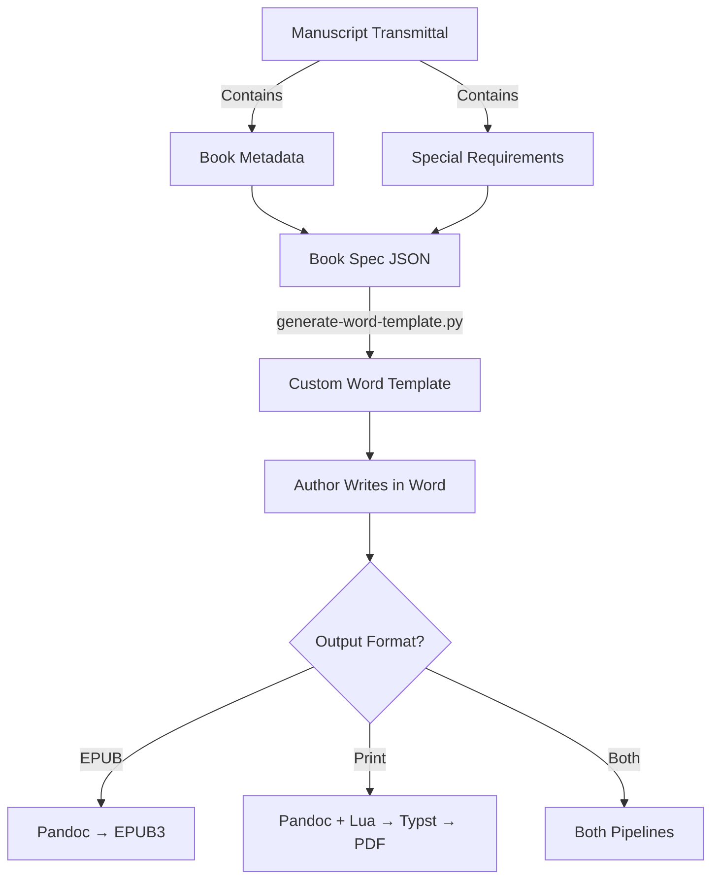

# Transmittal → Template → Output Flow

## Overview

This document describes how manuscript transmittals connect to Word template generation and the dual output pipelines (EPUB and Print).

## Current Status

✅ **Implemented:**
- Transmittal data structure with book metadata
- Word template generator from book specs
- Pull transmittal → populate spec (in prodcal backend)
- Dual pipelines (Word→EPUB and Word→Typst→PDF)

🚧 **To Be Tested:**
- End-to-end flow from transmittal → custom Word template
- Custom styles defined in transmittal → template generation
- Author feedback loop for template refinement

## Data Flow



## Transmittal Fields → Template Mapping

### Metadata (Direct Mapping)

| Transmittal Field | Spec Field | Template Usage |
|-------------------|------------|----------------|
| `book.title` | `metadata.title` | Document title, headers |
| `book.subtitle` | `metadata.subtitle` | Document subtitle |
| `book.author` | `metadata.author` | Copyright page, headers |
| `book.publisher` | `metadata.publisher` | Copyright page |
| `book.isbn_paper` | `metadata.isbn_paper` | Copyright page |
| `book.isbn_cloth` | `metadata.isbn_cloth` | Copyright page |

### Design (Influences Typography)

| Transmittal Field | Spec Field | Template Effect |
|-------------------|------------|-----------------|
| `design.trim` | `page.trim_size` | Page size (if standard) |
| `design.est_pages` | — | Influences base font size |
| `design.complexity` | — | May add custom styles |
| `editing.special_characters` | `custom_styles[]` | Generates special styles |

### Custom Styles from Transmittal

The `editing.special_characters` and `editing.instructions` fields can trigger custom style generation:

```json
// Example transmittal excerpt
{
  "editing": {
    "special_characters": "Letters, emails, text messages",
    "instructions": "Need distinct styles for character texting vs emails"
  }
}
```

This would generate custom paragraph styles:
- `Letter` - for letter excerpts
- `Email` - for email quotations  
- `Text Message` - for SMS/chat logs

## Template Generation Process

1. **Load Transmittal**
   ```go
   // GET /api/specs/pull-transmittal/{projectID}
   // Maps transmittal fields → spec fields
   ```

2. **Merge with Defaults**
   - Start with default spec (base typography, standard styles)
   - Override with transmittal data
   - Add custom styles based on requirements

3. **Generate Template**
   ```bash
   python3 generate-word-template.py \
     --spec-file spec.json \
     --output custom-template.docx
   ```

4. **Template Contains:**
   - All standard styles (Normal, Headings, etc.)
   - Custom styles from transmittal
   - Typography settings from spec
   - Sample content demonstrating each style

## Custom Style Detection

The system should parse `editing.special_characters` for keywords:

| Keywords | Generated Style | Type | Formatting |
|----------|----------------|------|------------|
| letter, correspondence | Letter | paragraph | Indented, different font |
| email, e-mail | Email | paragraph | Monospace, gray background |
| text, SMS, message | Text Message | paragraph | Sans-serif, bubble style |
| newspaper, article | News Excerpt | paragraph | Narrow columns, serif |
| handwriting, note | Handwritten | character | Script font |
| computer, terminal | Terminal | paragraph | Monospace, black background |
| foreign language | Foreign | character | Italic + language tag |

## Testing Plan

### 1. Test Transmittal → Spec Mapping
```bash
# Create test transmittal with all fields
# Pull into spec via API
# Verify all fields mapped correctly
```

### 2. Test Custom Style Generation
```bash
# Transmittal with special_characters = "letters and emails"
# Generate template
# Verify Letter and Email styles exist
```

### 3. Test Round-Trip
```bash
# Generate template from transmittal
# Author uses template
# Convert to EPUB + PDF
# Verify custom styles preserved/handled
```

## API Endpoints

### Pull Transmittal into Spec
```
GET /api/specs/pull-transmittal/{projectID}
```
- Loads transmittal data
- Maps to spec fields
- Returns populated spec

### Generate Word Template
```
POST /api/templates/generate
Body: { "project_id": 123 }
```
- Loads project spec
- Runs generate-word-template.py
- Returns .docx file

## Next Steps

1. **Implement custom style keyword parsing**
   - Add to `pullTransmittalHandler` in bookspecs.go
   - Parse special_characters field
   - Generate custom_styles array

2. **Add template generation endpoint**
   - New handler in prodcal
   - Call Python script
   - Return generated .docx

3. **Create test suite**
   - Sample transmittals
   - Expected templates
   - Conversion tests

4. **Author documentation**
   - How to request custom styles
   - Style naming conventions
   - Examples of each style type